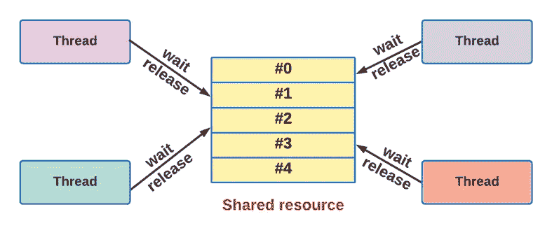

# 互斥体和信号量是为了把我们从 80 年代的回归中拯救出来

> 原文：<https://blog.devgenius.io/mutex-and-semaphores-are-here-to-save-us-from-the-return-of-the-80s-fa6c242d015e?source=collection_archive---------3----------------------->

## 回到可怕发型的快乐时代，在一台机器上重复运行一个程序的几个实例是可能的:多个窗口无休止地一个接一个地打开。今天，在大多数情况下，我们希望确保我们的程序在每台机器上运行一次。互斥或信号量在这里提供非递归语义，所以你的程序将只运行一次——不需要发胶。

最好的 80 年代——我们在想什么？？

**互斥**和**信号量**、**信号量**和**互斥**——虽然这两个名字听起来有点像你的医生可能会开的处方，但互斥和信号量是计算机编程中的两个基本概念。但在我们解释这些概念是什么之前，让我们从头开始——当我们说“开始”时，我们指的是计算机程序的早期:可怕的发型、大量发胶和稀薄的臭氧的时代。

你可能知道，或者，如果你是一个老前辈，甚至还记得，在 80 年代和 90 年代初的快乐时光里，在同一时间在一台机器上一次又一次地运行一个程序是可能的:多个窗口一个接一个地打开，并且你可以继续打开同一个程序的越来越多的窗口。有时会因为缺乏计算机资源而导致系统崩溃。

在早期，程序可以在多个实例上运行

今天，在大多数情况下，我们希望确保我们的程序在每台机器上运行一次。例如，想象一下，同一个 Excel 文档在同一台计算机上打开了两次，两个人分别处理每一个文档。

显然，除非我们重命名一个文档，否则我们如何管理同一个文件的两个实例中的更改呢？因此，MS Office 只允许您一次运行文档的一个实例。让我们也假设我们拥有一个由办公室人员运行的会计软件。没有理由在同一台机器上多次运行它。这也是一个人性化设计的问题。如果用户没有意识到软件正在运行，并启动了它的一个新实例，它将不会运行，而是将焦点转移到已经运行的实例上。

这还有另一个方面:有时我们需要确保代码的各个部分不会同时访问共享资源。把你的代码想象成你在运行一个铁路网:你不希望两列火车同时在同一条轨道上运行——我们希望它们是同步的，并且每列火车都按照自己独特的时间表运行。我们的程序需要所有组件和资源同步运行(尽管有些程序运行不同步)。

> 在我的新书《学习 C++》(与 T2 合著，由曼宁出版社出版)中，我们教授你需要知道的关于互斥和信号量的一切，以及更多。

现在你明白了问题所在，我们可以介绍其中一种解决方案:*互斥*，代表*互斥对象*。C++标准库提供了 ***std::mutex*** ，它拥有一种用于保护共享资源不被多个线程或实例同时访问的机制。

互斥体是一种基本类型，它提供了排他的、非递归的所有权语义:

拥有互斥体的程序或程序中的线程以及代码块受到保护，因此其他实例或线程将无法运行相同的程序、线程或代码块——它们将被*锁定*,这将确保在任何给定时间运行一次。

当另一个资源已经锁定该互斥体时，试图获得该互斥体的所有权将返回一个 false 值，因此调用方知道它已经被锁定。回到我们的例子，如果我们的会计软件的互斥锁被锁定，我们将找到已经运行的软件的实例，并将焦点转移到它。

把互斥体想象成一个语音邮件——当有人拨打你的座机并开始在你的语音邮件中记录信息时，其他人无法同时拨打电话并留言——语音邮件被*锁定*。一个人录完信息，另一个人就可以打电话来留言。在这种情况下,“互斥体”位于您的语音邮件中。您可以给其他人留言，但当有人正在录制留言时，您的特定语音邮件会被锁定。当然，你可以设计一个可以一次记录多达五到十条信息的语音邮件，但是大多数语音邮件都允许一次记录。这是互斥的基本概念——在这一点上你不需要知道更多。

# 信号量——这一切都始于火车信号

另一种控制资源访问的方法是使用**信号量**，它帮助我们同步我们的程序。这种方法是由荷兰计算机科学家埃德格·w·迪克斯特拉 发明的，他最初在 1965 年设计了信号量作为火车信号的一种方法。信号量是线程间共享的变量，可以简化为一个*队列*和一个*计数器*的数据结构。计数器被初始化为 0 或大于 0 的值。使用这种结构。信号量运行两个非常简单的核心操作:

**wait** —当信号量获得等待时，如果计数器不为 0，其他线程仍可使用它。因此，如果初始值是 10，这意味着我们允许 10 个线程使用这个资源，当每个线程都获得信号量时，计数器就递减，直到达到 0。

**信号** 或**释放***——*一旦一个线程使用完资源，信号或释放操作被用来释放信号量，那么在那种情况下，计数器就会增加。

如果这一切都太令人困惑，只要想想新冠肺炎时代信号量作为便利店的警卫:在任何给定的时刻，只有少数人被允许呆在封闭的场所内。有一个队列，然后有人被允许进入。在信号量中，“等待”意味着让某人进入，并将允许进入的人数的计数器减 1，如果该计数器现在为 0，则没有人可以进入。在有人离店的那一刻(“放行”)，柜台被一个人提升，那么另一个人就可以进去了。你也可以把它比作火车信号机制，这是它最初的设计。

信号量在等待释放的基础上工作。代码块的不同线程以同步方式一次执行一个

你可能会问自己互斥和信号量之间的区别是什么。简单的答案是互斥体使用锁定机制，而信号量使用信号机制。当然，还有其他的区别，关于互斥和信号量还有很多要学的，我无法在一篇文章中介绍。

> C++对于重要的软件来说是一种严肃的编程语言，30 年来一直是顶尖的编程语言之一——而且它的速度并没有减慢。到处都是 C++的指纹。学习它从来都不是一个糟糕的时间，我与[迈克尔·海弗拉蒂](https://www.linkedin.com/in/michaelhaephrati/)合著并由曼宁出版社出版的新书将帮助你做到这一点——即使你没有任何编程或计算机科学经验。