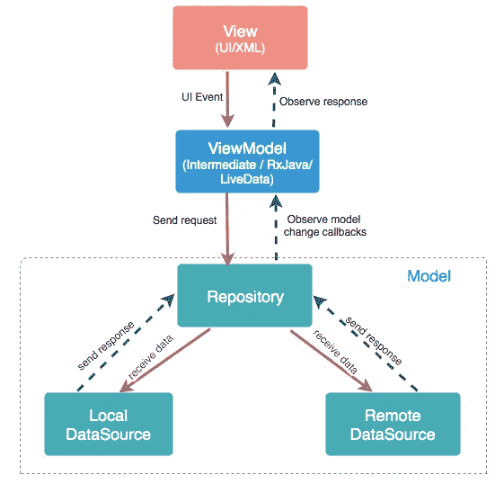
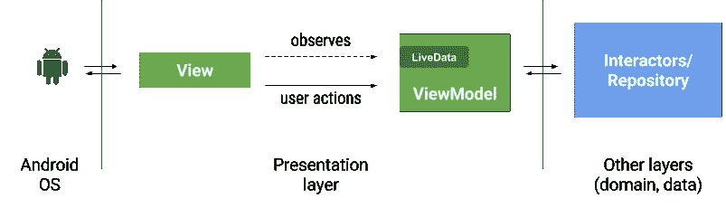
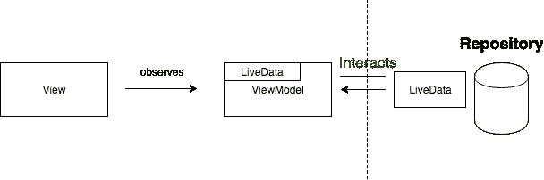

# MVVM 建筑、ViewModel 和 LiveData

> 原文：<https://blog.devgenius.io/mvvm-architecture-viewmodel-and-livedata-d6c74ef45728?source=collection_archive---------1----------------------->

# 什么是 MVVM？


模型-视图-视图模型(MVVM)是一种软件设计模式，旨在分离程序逻辑和用户界面控件。

MVVM 基本上由三层组成:

模型:它保存了应用程序的数据。它不能直接与视图对话。通常，建议通过 Observables 向 ViewModel 公开数据。

视图:它表示应用程序的 UI，没有任何应用程序逻辑。它观察视图模型。

ViewModel:它充当模型和视图之间的链接。它负责转换模型中的数据。准备可由视图观察到的可观察对象..它还使用挂钩或回调来更新视图。它将从模型中请求数据。

在下面的简单图表中，我们可以很容易地看到这三个部分之间存在什么样的相互作用。



MVVM

# LiveData

`[LiveData](https://developer.android.com/reference/androidx/lifecycle/LiveData)`是一个可观察的数据持有者类。与常规的可观察对象不同，LiveData 具有生命周期意识，这意味着它尊重其他应用程序组件的生命周期，如活动、片段或服务。这种意识确保 LiveData 仅更新处于活动生命周期状态的应用程序组件观察者。

> 使用 LiveData 的优势

1.  **确保你的用户界面与你的数据状态相匹配**
2.  **没有内存泄露**
3.  **没有因停止活动而导致的崩溃**
4.  **不再需要手动处理生命周期**
5.  **总是最新数据**
6.  **适当的配置变更**
7.  **共享资源**

现在让我们看看我是如何在我的消息应用程序中使用它的。

# 将 LiveData 用于域层或存储库层



我们必须使用不同的图层来获取数据。

存储库可以有以下实例:

1.  远程即网络
2.  数据库ˌ资料库
3.  缓存或共享首选项。

# 贮藏室ˌ仓库

有一个为消息传递定义任务的接口和一个使用该接口的类。



示例存储库接口

```
interface UserRepositoryI {
    fun showListOfUser(userList : ArrayList<Users>)
}
```

我用 firebase 做仓库。

```
class UserRepository(UserRepositoryI: UserRepositoryI) {

    private var userRepositoryI : UserRepositoryI ?= UserRepositoryI
    private  var userList = ArrayList<Users>()

    fun getUserFirebase(){
        val ref = FirebaseDatabase.getInstance().getReference("/users")
        ref.addListenerForSingleValueEvent(object : ValueEventListener {
            override fun onDataChange(snapshot: DataSnapshot) {
                userList.clear()
                snapshot.children.forEach{
                    val user = it.getValue(Users::class.java)

                    if (user!=null && user.uid != FirebaseAuth.getInstance().uid){
                        userList.add(user)
                        userRepositoryI?.showListOfUser(userList)

                    }
                }

            }
            override fun onCancelled(error: DatabaseError) {
                Log.d("ViewModel",error.message)
            }
        })
    }
}
```

# 模型

让我们创建一个数据模型类

```
@Entity
@Parcelize
class Users(
    @PrimaryKey(autoGenerate = false)
    var uid : String ,
    @ColumnInfo(name = "username")
    var username:String,
    @ColumnInfo(name = "profileImageURL")
    var profileImageURL:String,
    @ColumnInfo(name = "status")
    var status : String,
    @ColumnInfo(name = "Email")
    var Email : String,
    @ColumnInfo(name = "activeState")
    var activeState : String ,
    @ColumnInfo(name = "token")
    var token : String?) : Parcelable{

    constructor() : this("","","","","","offline","")

    companion object{
        private val addition = Addition()
        @JvmStatic
        @BindingAdapter("imageUrl")
        fun loadImage(view : CircleImageView , imageUrl : String?){
            imageUrl?.let {
                addition.picassoUseIt(imageUrl,view)
            }
        }
    }
}
```

*   **Room** —它是 Google 提供的一个 ORM，以对象的形式在 SQLite 数据库和我们的数据之间提供了一个抽象层。它在编译时给我们错误，这比难以跟踪和调试的运行时错误好得多。为了使用房间，定义我们的模式非常重要。我们通过创建一个数据模型类并添加一个 [@entity](http://twitter.com/entity) 注释来做到这一点。我们还必须给实体的 id 添加一个 [@PrimaryKey](http://twitter.com/PrimaryKey) 注释。

# 视图模型

ViewModel 对象充当视图和模型之间的中介，这意味着它为片段或活动等 UI 组件提供数据。它还包括一个名为 LiveData 的可观察数据容器，允许 ViewModel 在数据更新时通知或更新视图。这是非常关键的，主要是为了防止我们的应用程序在方向改变时重新加载。这最终提供了出色的用户体验。这里有一个例子，

```
class UserListViewModel(application: Application) : BaseViewModel(application), UserRepositoryI {
    private var userRepository = UserRepository(this)
    val users = MutableLiveData<List<Users>>()
    val userLoading = MutableLiveData<Boolean>()
    val informationMessage = MutableLiveData<Boolean>()

    private val specialSharedPreferences = SpecialSharedPreferences(getApplication())
    private var updateTimeValue = 0.1 * 60 * 1000 * 1000 * 1000L
    fun getAllUsers() : LiveData<List<Users>>{
        return users
    }
    fun getUser(){
        val getTime = specialSharedPreferences.getTime()
        if (getTime !=null && getTime!=0L && System.nanoTime()-getTime<updateTimeValue){
            //get SqLite
            getDataSQlite()
        }
        else{
            //get Firebase
            userRepository.getUserFirebase()
            getAllUsers().value?.let { saveSQLite(it) }

        }

    }
    private fun getDataSQlite(){
        launch {
            val userList = UsersDatabase(getApplication()).usersDao().getAllUser()
            if (userList.isEmpty()){
                userRepository.getUserFirebase()
                getAllUsers().value?.let { saveSQLite(it) }
            }
            users.value = userList
            informationMessage.value = userList.isEmpty()
            userLoading.value = false
        }
    }
    override fun showListOfUser(userList: ArrayList<Users>) {
        users.value = userList
        informationMessage.value = userList.size==0
        userLoading.value = false
    }
    private fun saveSQLite(userList : List<Users>) {
        launch {
            val dao = UsersDatabase(getApplication()).usersDao()
            dao.deleteAllUser()
            dao.insertAllUser(*userList.toTypedArray())
        }
        specialSharedPreferences.saveTime(System.nanoTime())
    }
}
```

# 视角

我们在视图端观察来自视图模型的可观察的实时数据。

```
 private fun observeLiveData(){
        viewModel.users.observe(viewLifecycleOwner, Observer {
            it?.let {
                binding.newInformationTV.visibility = View.GONE
                binding.recyclerView4.visibility = View.VISIBLE

                adapter.UsersListUpdate(it)
            }

        })
        viewModel.informationMessage.observe(viewLifecycleOwner, Observer {
            it?.let {
                if (it){
                    binding.newInformationTV.text = "Kullanıcı Listen Boş"
                }
                else{
                    binding.newInformationTV.text = ""
                }
            }
        })
        viewModel.userLoading.observe(viewLifecycleOwner, Observer {
            it?.let {
                if (it){
                    binding.newLoadingBar.visibility = View.VISIBLE
                }
                else
                {
                    binding.newLoadingBar.visibility = View.GONE
                }
            }
        })
    }
```

# 回收器视图适配器

我们用适配器在视图端显示我们观察到的实时数据。

```
class NewMessagesRVAdapter(private val userList: ArrayList<Users>) : RecyclerView.Adapter<NewMessagesRVAdapter.NewMessageViewHolder>(),Filterable{
    var userFilterList = ArrayList<Users>()
    lateinit var mContext: Context

    init {
        userFilterList = userList
    }
    private val addition = Addition()
    class NewMessageViewHolder(itemView: View): RecyclerView.ViewHolder(itemView){
        var itemImage : ImageView = itemView.findViewById(R.id.message_imageView)
        var itemTitle : TextView = itemView.findViewById(R.id.message_TV)
        var itemStatus: TextView = itemView.findViewById(R.id.status_TV)
        var itemProgressBar : ProgressBar = itemView.findViewById(R.id.new_messages_progressBar)
    }
    override fun onCreateViewHolder(parent: ViewGroup, viewType: Int): NewMessageViewHolder {
        val view = LayoutInflater.from(parent.context).inflate(R.layout.user_row_new_message,parent,false)
        return NewMessageViewHolder(view)
    }
    override fun getItemCount(): Int {
        return userFilterList.size
    }
    override fun onBindViewHolder(holder: NewMessageViewHolder, position: Int){
        holder.itemTitle.text = userFilterList[position].username
        holder.itemStatus.text = userFilterList[position].status
        addition.picassoUseIt(userFilterList[position].profileImageURL,holder.itemImage,holder.itemProgressBar)
        holder.itemProgressBar.visibility = View.GONE
        holder.itemView.setOnClickListener {
            val action = NewMessagesFragmentDirections.actionNewMessagesFragmentToChatLogFragment(
                position,
                userFilterList[position].uid,
                userFilterList[position].username,
                userFilterList[position].profileImageURL,
                userFilterList[position].status,
                userFilterList[position].activeState,
                userFilterList[position].Email,
                userFilterList[position].token!!
            )
            Navigation.findNavController(it).navigate(action)
        }

    }

    @SuppressLint("NotifyDataSetChanged")
    fun UsersListUpdate(NewUserList : List<Users>){
        userList.clear()
        userList.addAll(NewUserList)

        notifyDataSetChanged()
    }

    override fun getFilter(): Filter {
        return object : Filter() {
            override fun performFiltering(constraint: CharSequence?): FilterResults {
                val charSearch = constraint.toString()
                if (charSearch.isEmpty()) {
                    userFilterList = userList
                } else {
                    val resultList = ArrayList<Users>()
                    for (row in userList) {
                        if (row.username.lowercase(Locale.ROOT).contains(charSearch.lowercase(Locale.ROOT))) {
                            resultList.add(row)
                        }
                    }
                    userFilterList = resultList
                }
                val filterResults = FilterResults()
                filterResults.values = userFilterList
                return filterResults
            }

            @SuppressLint("NotifyDataSetChanged")
            @Suppress("UNCHECKED_CAST")
            override fun publishResults(constraint: CharSequence?, results: FilterResults?) {
                userFilterList = results?.values as ArrayList<Users>
                notifyDataSetChanged()
            }

        }
    }
}
```

# 结果

一个人可以不遵循这种架构而轻松地制作 android 应用程序，但是如果我们想要制作健壮、可测试、可维护和易读的应用程序，那么我们必须利用这一点。

感谢阅读，如果你喜欢这篇文章，记得给鼓掌。