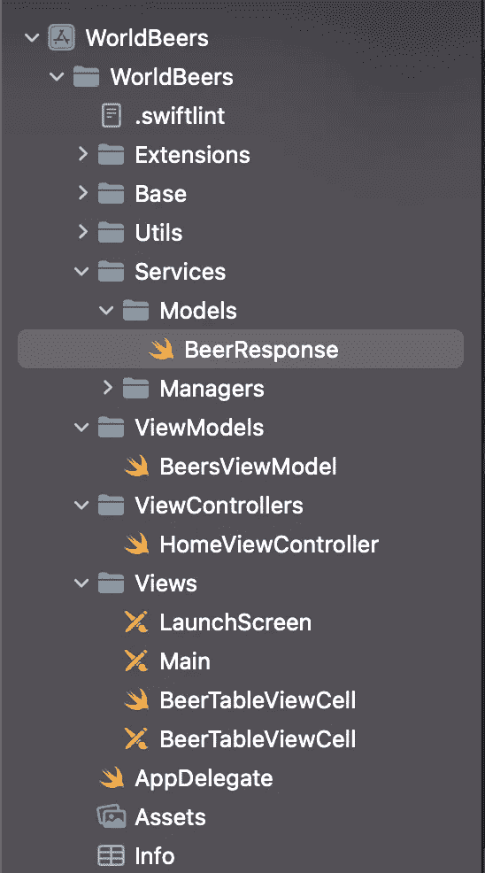

# MVVM 用一个简单的 iOS 应用解释道

> 原文：<https://blog.devgenius.io/mvvm-explained-with-a-simple-ios-app-abdb944bb18?source=collection_archive---------2----------------------->

## 一个简单的 MVVM 架构的例子，用于在 UITableView 中加载项目并处理信息

照片由来自[佩克斯](https://www.pexels.com/photo/person-holding-smartphone-while-using-laptop-1181244/?utm_content=attributionCopyText&utm_medium=referral&utm_source=pexels)的[克里斯蒂娜·莫里洛](https://www.pexels.com/@divinetechygirl?utm_content=attributionCopyText&utm_medium=referral&utm_source=pexels)拍摄

在本教程中，我们将解释如何使用 MVVM 架构创建一个简单的应用程序。在我们的演示中，我们将创建一个应用程序，在 UITableView 中加载啤酒列表。

## 什么是 MVVM

MVVM 代表模型视图-视图-模型，是一种使用这三种不同对象的简单逻辑架构:

*   **视图控制器**:应该对我们的 UI 执行唯一的操作。应该只获取和显示信息。
*   **视图模型**:View controller 会向视图模型发送信息。视图模型将处理它们，完成所有的业务逻辑，并将输出返回给视图控制器
*   模型:这只是一个简单的模型，通常包含来自服务响应的解析数据。这将仅在视图模型中使用。

## 设置项目

在解释架构之前，我们需要设置我们的新项目。我们就叫它世界啤酒吧。您可以在此处找到该项目:

 [## GitHub-psima/世界啤酒公司

### 此时您不能执行该操作。您已使用另一个标签页或窗口登录。您已在另一个选项卡中注销，或者…

github.com](https://github.com/psima/worldBeers) 

让我们看看如何组织我们的文件夹。在我们的项目中，它看起来像这样:

我们现在只关注三个文件夹。模型、视图控制器和视图模型。其他文件夹只是为了创建我们的 Api 管理器，我们需要调用服务来给我们啤酒(https://api.punkapi.com/v2/beers)的列表

如果您想了解如何调用 http 服务(api ),可以查看我的文章:

 [## 无需使用 Swift 中的 Alamofire 即可创建自己的服务经理

### 调用 swift-iOS 项目中任何 API 的简单方法，无需使用第三方库

blog.devgenius.io](/create-your-own-service-manager-without-using-alamofire-in-swift-1af5d5440461) 

既然我们已经建立了我们的项目，让我们把重点放在我们需要的 3 个文件上。

## 模型

该模型应该是简单的东西，没有任何业务逻辑在里面。在这个例子中，这是我们需要的关于啤酒的信息。我们有名字，标语，形象 ur，abv，ibu，这些都是啤酒的价值。

## 视图模型

这是我们建筑中最重要的部分。该文件应该可以访问模型，并包含所有的业务逻辑、字符串连接、数字运算等。让我们看看代码应该是什么样子:

正如您在这个模型中看到的，我们已经创建了需要调用 beers api 的函数和将响应返回给 ViewController 的块。如您所见，ViewModel 存储了模型(ViewController 不应该知道这一点)。除了 api 调用，我们还创建了 viewController 需要的两个函数。一个是啤酒的数量，另一个是检索啤酒信息。

如果你注意到我们这里没有任何 UI 操作。ViewController 应该处理这个问题。在这个类中，你还可以添加你正在对模型进行的其他操作(例如，更改名称、标语等)。

现在是时候查看 ViewController 并将所有元素连接在一起了:

## 视图控制器

在视图控制器中，我们需要一个带有单元格的 UITableView 来显示图像、标题和啤酒的其他一些信息。视图控制器应该非常“愚蠢”，因为它不应该获取和显示信息。

如您所见，我们只需要访问 ViewModel 文件并执行 UI 操作。ViewController 没有任何关于 Api 管理器和如何调用服务的知识，这就是为什么它只是“监听”ViewModel 的 beerLoaded 块。

视图控制器没有访问模型的权限，所以如果您看到 UITableViewDelegate 函数，它会询问它需要从视图模型中得到什么。在这个项目中，我们需要啤酒的数量(这样我们就知道要显示多少个项目)和每行要显示的单个啤酒的信息。

## 结果

最后，让我们看看我们的应用程序会是什么样子:

如果你需要给你的 UITableViewCell 添加阴影和边角，你可以查看这篇文章:

 [## Swift 5 中带有圆角和阴影的 UITableViewCell

### 这是一个使用 swift 5 在 UITableViewCell 中添加圆角和阴影的教程。

simaspavlos.medium.com](https://simaspavlos.medium.com/round-corners-and-shadow-in-uitableviewcell-swift-5-8eb903bf38a1) 

为了支持我，如果你想加入 medium，你可以通过我的推荐链接:

 [## 用我的推荐链接加入媒体

### 作为一个媒体会员，你的会员费的一部分会给你阅读的作家，你可以完全接触到每一个故事…

simaspavlos.medium.com](https://simaspavlos.medium.com/membership)