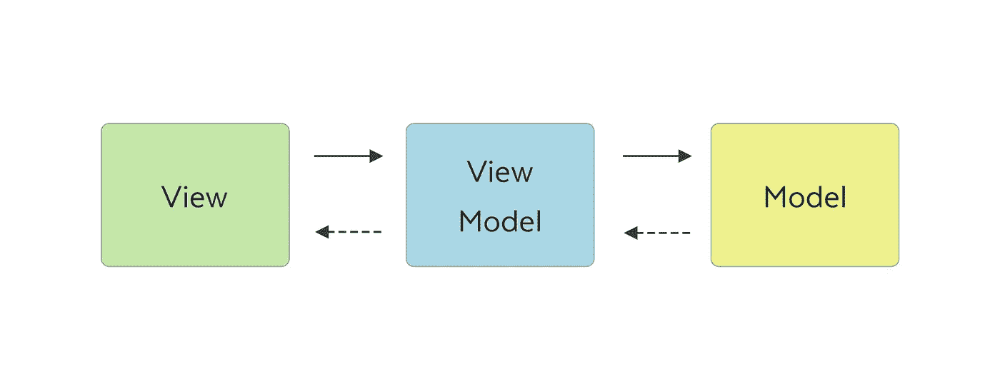

# SwiftUI 中的 MVVM 模式:一个实例

> 原文：<https://blog.devgenius.io/mvvm-pattern-in-swiftui-a-practical-example-c79c5cc44f74?source=collection_archive---------2----------------------->

## 学习使用 MVVM 模式在 SwiftUI 中构建一个简单的应用程序

照片由来自[佩克斯](https://www.pexels.com/it-it/foto/foto-del-primo-piano-della-persona-che-scrive-sul-computer-portatile-1181675/?utm_content=attributionCopyText&utm_medium=referral&utm_source=pexels)的[克里斯蒂娜·莫里洛](https://www.pexels.com/it-it/@divinetechygirl?utm_content=attributionCopyText&utm_medium=referral&utm_source=pexels)拍摄

在今天的文章中，我将向您展示如何在 SwiftUI 框架上使用著名的模型-视图-视图模型模式，构建一个非常简单的应用程序。我将指导您完成该模式中使用的所有步骤和术语。

# 介绍

在命令式 UIKit 的古代时代，苹果围绕模型视图控制器或 MVC 模式构建了所有的应用程序。随着时间的推移，应用程序变得越来越大，开发人员开始使用控制器作为各种代码的巨大容器。UI 逻辑进入控制器内部，业务逻辑进入控制器内部，其他控制器的表示进入控制器内部……控制器很快变成了巨大的怪物。MVC 的首字母缩略词很快成为著名的大规模视图控制器。为了避免这个问题，开发人员开始应用不同的模式。其中之一是模型-视图-视图模型或 MVVM。
当苹果决定从头开始为用户界面创建一个新的声明式框架 SwiftUI 时，它选择了 MVVM 作为其技术的主要模式，并采用了一些非常简洁的解决方案，让人们可以轻松地使用它。

首先，我们来看看 app 本身。我们将建立一个能够在 iTunes 商店搜索音乐的应用程序。用户将输入艺术家或乐队的名字，点击搜索按钮并获取一些数据。数据将被解码，并以列表的形式显示在屏幕上，包括歌曲名称、专辑图片和商品价格。

为了简单起见，我设计了一个超级简单的 UI。没有加载视图，没有错误弹出窗口，没有哨声和铃声…

# MVVM——一些理论

什么是 MVVM 模式？如果你正在阅读这篇文章，你可能已经有一个模糊的想法，但请允许我解释一下。让我们从维基百科的定义开始:

> ***模型:*** *模型*或者指[域模型](https://en.wikipedia.org/wiki/Domain_model)，表示真实状态内容(一种面向对象的方法)，或者指[数据访问层](https://en.wikipedia.org/wiki/Data_access_layer)，表示内容(一种以数据为中心的方法)。
> 
> ***视图*** :在[模型-视图-控制器](https://en.wikipedia.org/wiki/Model%E2%80%93view%E2%80%93controller) (MVC)和[模型-视图-演示者](https://en.wikipedia.org/wiki/Model%E2%80%93view%E2%80%93presenter) (MVP)模式中，*视图*是用户在屏幕上看到的结构、布局和外观。它显示模型的表示，并接收用户与视图的交互(鼠标点击、键盘输入、屏幕点击手势等)。)，并通过[数据绑定](https://en.wikipedia.org/wiki/Data_binding)(属性、事件回调等)将这些处理转发给视图模型。)被定义为链接视图和视图模型。
> 
> ***视图模型:****视图模型*是公开公共属性和命令的视图的抽象。代替 MVC 模式的控制器，或者 MVP 模式的呈现者，MVVM 有一个*绑定器*，它自动化了视图和它在视图模型中的绑定属性之间的通信。视图模型被描述为模型中的数据状态。在 MVP 模式中，视图模型和表示者之间的主要区别在于，表示者有对视图的引用，而视图模型没有。相反，视图直接绑定到视图模型的属性来发送和接收更新。为了高效运行，这需要一种绑定技术或者生成[样板代码](https://en.wikipedia.org/wiki/Boilerplate_code)来进行绑定。
> 
> ***绑定器*** :声明性数据和命令绑定隐含在 MVVM 模式中。在微软[解决方案栈](https://en.wikipedia.org/wiki/Solution_stack)中，绑定器是一种叫做 [XAML](https://en.wikipedia.org/wiki/XAML) 的[标记语言](https://en.wikipedia.org/wiki/Markup_language)。绑定器使开发人员不必编写锅炉板逻辑来同步视图模型和视图。当在微软堆栈之外实现时，声明性数据绑定技术的出现使这种模式成为可能，如果没有绑定器，人们通常会使用 MVP 或 MVC，并且必须编写更多的样板文件(或者用其他工具生成它)。

嗯，这个定义相当冗长，所以也许一张图片和一些简单的单词会有所帮助:

让我们解释一下。我们有三个主要组成部分。视图将负责创建所有用户界面小部件，并在屏幕上显示。模型将保存所有要在屏幕上显示的原始数据，视图模型将负责所有的业务逻辑，并处理模型中的数据，以便根据需要在屏幕上显示它们。

每个组件*可以与其他一个或两个*通信，如下所示:

*   视图将只与视图模型对话。
*   视图模型将直接与模型对话，并间接地与视图对话，以某种方式通知它(我们将在后面看到)其状态的变化。
*   模型将与视图模型间接对话，通知其状态的变化。

每个组件*都知道*遵循这些规则的其他组件:

*   视图确切地知道谁是它的视图模型。视图对模型一无所知。
*   视图模型确切地知道谁是它的模型。视图模型与某些视图对话，但它并不确切知道它是谁。
*   该模型与一些视图模型对话，但它并不确切知道它是谁。模型对视图一无所知。

模型将与视图模型对话，视图模型将使用活页夹与视图对话。我们可以用委托、闭包、联合来创建一个绑定器……但是 SwiftUI 和联合联系紧密，很难知道一个何时结束，另一个何时开始。

# 编写代码

为了对我将要处理的数据有一个概念，我从唯一需要的 REST 服务开始，从 iTunes 的[搜索 API](https://developer.apple.com/library/archive/documentation/AudioVideo/Conceptual/iTuneSearchAPI/index.html#//apple_ref/doc/uid/TP40017632-CH3-SW1)开始，并且分析了响应以便为模型创建一个结构。

## **型号**

这是一个 JSON 响应的例子:

如您所见，响应有一个根对象，该根对象具有两个属性:**结果计数**和一个**结果数组**。结果对象有很多属性，但是对于我们的例子，我们只需要其中的几个。

使用 JSON 作为参考，我为响应编写了模型:

这很容易解释，但是看看第 18 行发生了什么。我已经创建了一个带有静态计算 var 的扩展，我将在我的项目中使用它来准备一个**示例**。这一点非常有用，尤其是在 SwiftUI 中，您需要现成的模型在**画布预览**中为您的 UI 制作原型。如果您将实施**单元测试**，为每个模型创建一个例子以便做好准备也是一件好事。
有时您不希望您的示例在生产版本中被发送到 AppStore，所以只需添加**活动编译条件**以在需要时排除这部分代码。

## 视角

我们的模型完成后，下一步将是为我们的应用程序创建一个简单的 UI。一个搜索字段、一个动态图标、一个列表和一个搜索按钮就足够了。

这将是我们应用程序的主要视图。

*   第 3 行:我为我们的视图模型**创建了一个`@StateObject`。属性包装器允许您在您的一个视图中创建一个引用类型，并确保它保持活动状态，以便在该视图以及您与之共享的其他视图中使用。它将负责使用 ViewModel 的`@Published`包装器刷新视图的`body`属性，执行绑定器的角色……我们稍后会看到。**
*   第 11、13、37 行:我将视图的不同部分和行为绑定到 ViewModel 持有的属性。视图本身将根据这些变量的实际状态来创建。
*   第 31 行:`Button`在 ViewModel 中触发一个函数，该函数将从我们的后端获取数据……我们稍后会看到。
*   第 23 到 25 行:创建了一行的视图。我们将很快看到这个结构的实现，但是请注意它的 init。如前所述，一个视图无法知道一个**模型**的存在，它只能与一个包装视图并相应地显示其数据的视图模型对话。为了遵守 MVVM 模式，创建了一个视图模型，并在其初始化器中将其赋予新创建的行视图。

如第 25 行所述，我们使用第二个视图在屏幕上呈现结果。让我们看看我是如何编码的。

*   第 8 行:我使用了 iOS15 中引入的新的惊人的`AsyncImage`视图。它让异步加载变得异常简单。正如您所看到的，图像 URL 是由另一个包装了结果模型的 viewModel 给出的。视图不能与模型对话。
*   第 16 行和第 26 行:这里使用了相同的方法。这些属性来自视图模型。我们稍后将看到，全价转换了原始模型中的数据。
*   第 33 行:如前所述，我已经使用之前编写的示例模型创建了画布预览。超级得心应手！

请注意视图如何确切地知道谁是它们的视图模型。

## 视图模型

是时候编写我们的小应用程序的引擎了，主视图模型。为了在视图和视图模型之间创建所需的**绑定**，在 Swift 中我们需要创建一个符合`ObservableObject`协议的对象。然后我们必须用 SwiftUI 属性包装器`@Published`声明绑定变量，以便允许我们在绑定视图中重新计算`body`属性。

*   第 3–7 行:这里声明了所有的`@Published`属性。视图需要所有这些东西来根据实际状态创建 UI 本身。
*   第 5 行:一旦属性改变了它的值，就会触发一个属性观察器。该函数更新另一个属性的值，该属性又向相关视图发送消息以更新自身。
*   第 19 行:对于 web 服务，我使用了新的`Await Async` api。
*   第 25 行:与第 5 行类似，results 属性被更新，if 触发相关视图的刷新。

正如您所看到的，代码非常简洁，易于理解。请注意，如前所述，**视图模型对绑定视图**一无所知，它只是向某人发送消息，并不关心谁在监听。这使得这些对象之间的耦合度极低。

现在让我们看一下第二个较小的 ViewModel，它包装了结果模型并用于创建列表行。

*   第 3 行:ViewModel 用一个模型初始化。
*   第 5、9、13 行:三个计算变量被暴露给相关视图。请注意这些值是如何被相应地操作的，一些属性被修改、组合，一些被转换成提供默认值的非可选变量。

当然，即使这个 ViewModel 也对相关视图一无所知。

# 最后的话

如您所见，SwiftUI 实际上是由 MVVM 模式组成的。苹果做了很多构造，以便很容易地实现这种模式，有时很难注意到它，所以如果你喜欢它，就开始在你的项目中使用它。你甚至可以在应用程序的一小部分中使用 MVVM 来增强信心。

你是不是对那些`@Published`、`ObservableObject`、`@StateObject`都很迷茫？看看这本很棒的互动书籍:

 [## 在 SwiftUI 中使用数据

### 在 SwiftUI 中处理数据令人困惑！我听到了！这就是为什么我做了一个指南给你指明正确的道路。

www.bigmountainstudio.com](https://www.bigmountainstudio.com/data/jz1m0) 

本教程的视频版本也可在此处获得:

请订阅我的 YouTube 频道😉

我希望你喜欢这篇文章，如果你喜欢，请鼓掌。
如果这篇文章对你有用，请随意[给我一杯咖啡](https://www.buymeacoffee.com/dy59tqxn794)并允许我创造更多酷的内容和文章。

享受你的编码！