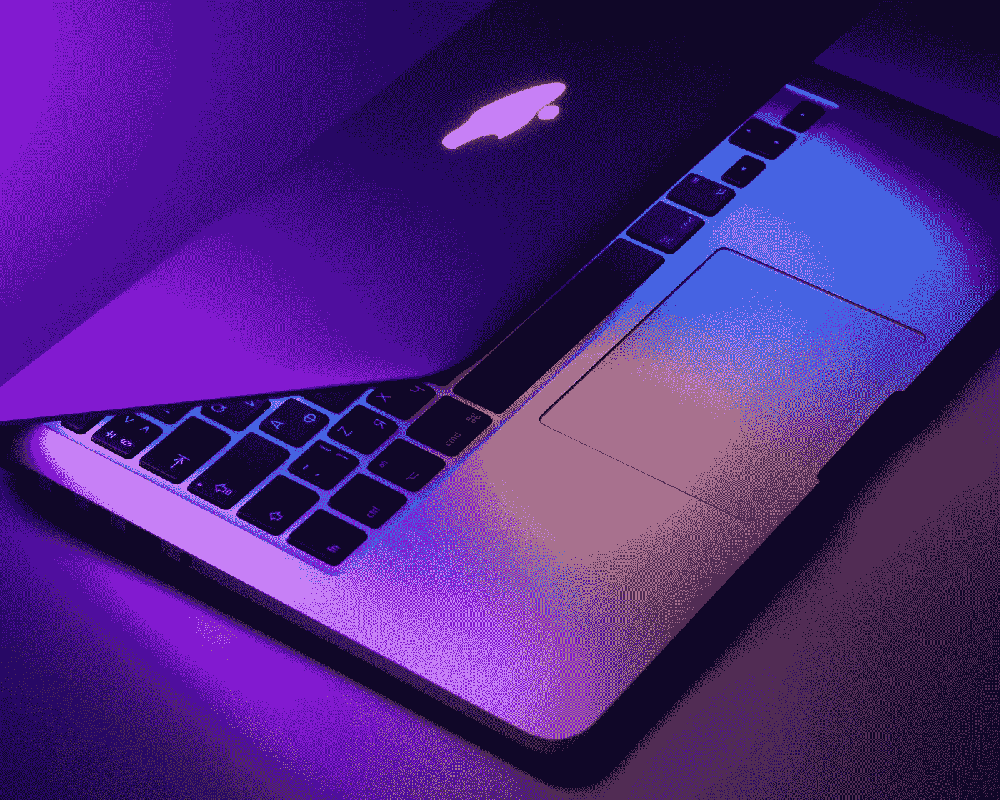

# 我的 SwiftUI 天从这里开始

> 原文：<https://blog.devgenius.io/my-100-days-of-swiftui-begin-here-ed5b24b51c60?source=collection_archive---------18----------------------->

Dmitry Chernyshov 在 Unsplash 上拍摄的照片

我在这里，写我的第一篇博客。

我将写一篇关于从 web 和前端开发转向 iOS 开发的日志，分享主题和我的学习过程，以及我的理解和观点。

我为什么要这么做？为什么会有人开始写博客？
我也用谷歌搜索了这个，出现了大量的答案:

*   名气还是创造个人品牌
*   赚取额外收入
*   在线展示
*   分享你的知识
*   成为你所在行业的权威
*   这个清单还在继续…

然后，几天前我跑着听 [Syntax](https://syntax.fm/) ，这是一个关于 Web 开发的播客，由[韦斯博斯(@韦斯博斯)](https://twitter.com/wesbos)和[斯科特托林斯基(@斯托林斯基)](https://twitter.com/stolinski)主持，他们正在谈论它。

总而言之，如果你想开始写博客、YouTubing 或播客，你需要问自己“为什么？”否则很难跟上它。

所以我这样做了，答案是我想记录我旅程的每一步，以加强我的学习过程和关于该主题的知识，但也激发其他初学者对学习新事物感到自豪和快乐。

在这个领域很容易产生挫败感，尤其是看教程或者上课的时候。我们很容易将自己与该领域的主要专家相比较，或者在看完教程后打开编辑器却不知道从哪里开始时感到“无能为力”。

事实是，我们迈出的每一小步，都是我们昨天没有的大量知识，这就是成功。

这就是我的原因，这就是为什么我开始写博客记录我的旅程。巩固我的知识，并在每篇博文中直观地展现我的进步。

**现在，为什么是 iOS，为什么是 Swift？**

苹果永远在我的生命中，以不同的形状和颜色。
我一直在苹果高级经销商、苹果商店、公司工作，成年后的大部分时间里我都是苹果爱好者。

大约一个半月前，我决定第一次调查 Swift，并爱上了它。在 [Udemy](https://www.udemy.com/course/ios-13-app-development-bootcamp/) 买了 [Angela Yu(@yu_angela)](https://twitter.com/yu_angela) 的一个很棒的课程，每天学习到一半课程。

我觉得我已经掌握了基础知识，但是我没有做任何事情去保留和使用这门语言。

在那里，我决定需要从头开始开发一个应用程序，因为在这个过程中，我遇到了太多的概念，要跟上这些概念感觉太难了。

(我目前正在设计的应用程序，将开始建设，一旦我完成线框！)

我暂时搁置了那个课程，开始了 [#100DaysOfSwiftUI](https://www.hackingwithswift.com/100/swiftui/) ，这是一个由[保罗·哈德逊(@twostraws)](https://twitter.com/twostraws) 创建的 100 天旅程/承诺，每天学习和练习 Swift 和 SwiftUI 1 小时，从基础开始。

这就是我在构建我的第一个应用程序时将要做的事情！

任何反馈，评论或建议都非常感谢，事实上，这是鼓励。

我们连线吧！
网站:[jonathangiardino.com](https://jonathangiardino.com/)
推特: [@jonathan_gardn](https://twitter.com/jonathan_gardn)
Dev 社区: [@jonathan_gardn](https://dev.to/jonathan_gardn)