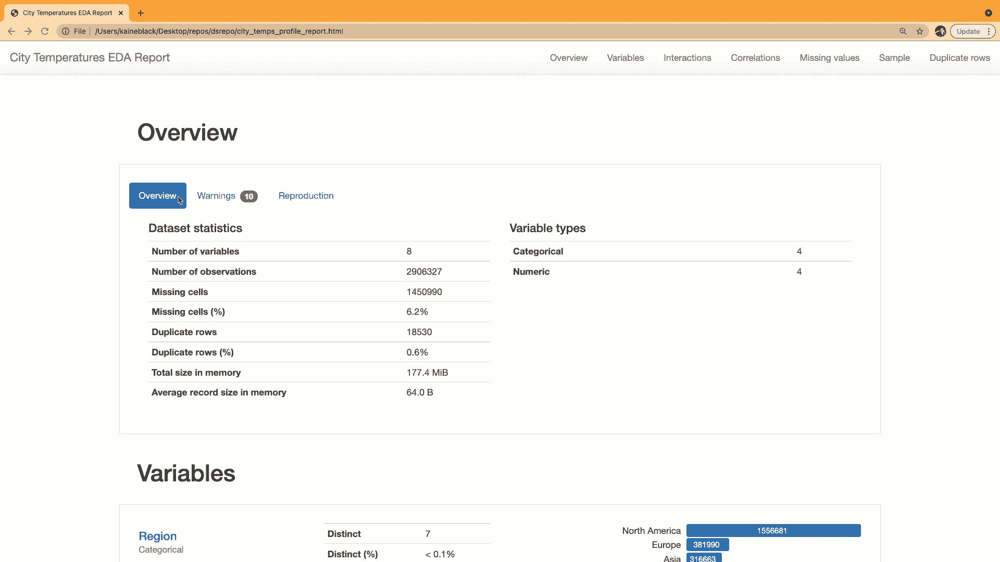
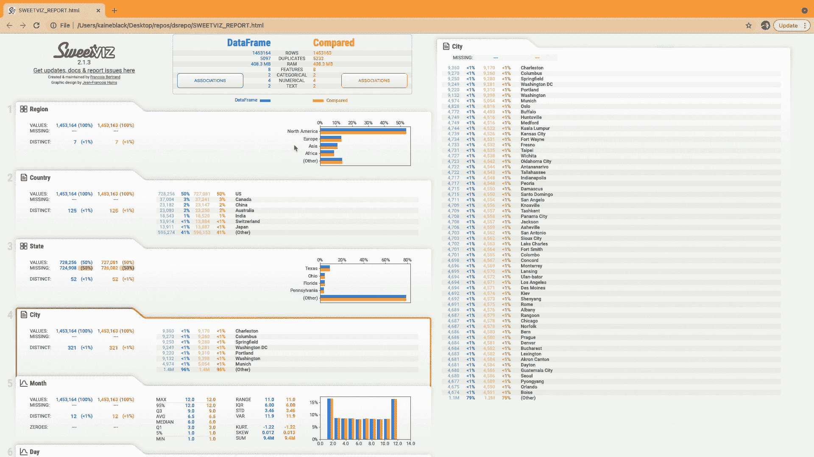
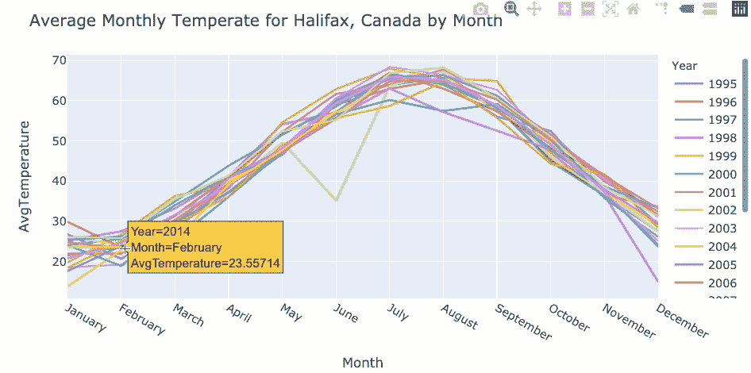

# 我最喜欢的 3 个 Python 包

> 原文：<https://blog.devgenius.io/my-3-favourite-eda-packages-in-python-d6935ad8af7c?source=collection_archive---------4----------------------->

由[卢卡斯·布拉塞克](https://unsplash.com/@goumbik?utm_source=medium&utm_medium=referral)在 [Unsplash](https://unsplash.com?utm_source=medium&utm_medium=referral) 上拍摄

您的团队正在进行一个新项目，是时候深入一些新的和不熟悉的数据了。您已经准备好开始探索数据集的所有细节，以便更好地理解您正在处理的内容。

在这个过程中，哪些 Python 包可以帮到你？

嗯…这里有一些我最喜欢的！

# 1.熊猫简介

Pandas profiling 是一个超级易用的 python 库，可以用来为您的数据生成 EDA 分析报告。

例如，我有一个从 Kaggle 下载的[数据集，其中包含世界各地不同城市多年来的每日气温数据。我可以用 pandas 将这些数据读入 python，并生成一个 HTML EDA 报告，只需几行代码:](https://www.kaggle.com/sudalairajkumar/daily-temperature-of-major-cities)

生成 html 配置文件

然后我们可以打开刚刚创建的`city_temps_profile_report.html`来查看 pandas profiling 生成的报告；其中包括对我们数据集的非常有用和详细的分析！

Pandas 分析输出示例

# 2.Sweetviz

[Sweetviz 是另一个伟大的 python 库](https://pypi.org/project/sweetviz/)，它为数据集生成 EDA 报告。Sweetviz 对于*比较数据集*特别有用。这个特性对于比较训练和测试数据以检查数据中的任何偏差非常有用。

让我们看看 city_temp 数据是什么样子的。我们将数据集一分为二，从数据集中随机选择以生成模拟*训练*和*测试*数据集。然后，我们将应用 sweetviz 的`compare()`函数生成一份关于这些数据集比较的报告:

sweetviz 生成的报告如下所示:

# 3.熊猫&情节快递

有时候经典真的是最好的。我经常发现结合使用 [*熊猫*](https://pandas.pydata.org/) 和 [*plotly.express*](https://plotly.com/python/plotly-express/) 库对于研究数据非常有用。与上面提到的工具不同，它更加灵活，可以根据您的需要和您想要调查的内容进行调整。当然，这需要稍微高一点的学习曲线。

我经常喜欢构建自己的函数来生成感兴趣的图形。例如，下面的函数查看给定城市在不同年份中每个月的平均值`AvgTemperature`。这将使我们能够比较同一城市每年的平均温度。

如果我们通过提供一个`dataframe`、`country`和`city`来执行这个函数，那么我们可以生成一个图:

我们的情节应该是这样的:

# 结论

Python 中有大量优秀的包来帮助分析和探索数据。这个列表中的包只是我最喜欢的几个，我发现它们非常有用并且易于使用。

你最喜欢 EDA 的哪些包？📊

感谢阅读，希望你喜欢！👍

[在 LinkedIn 上联系我](https://www.linkedin.com/in/kaine-black-50b583168/)💡👤