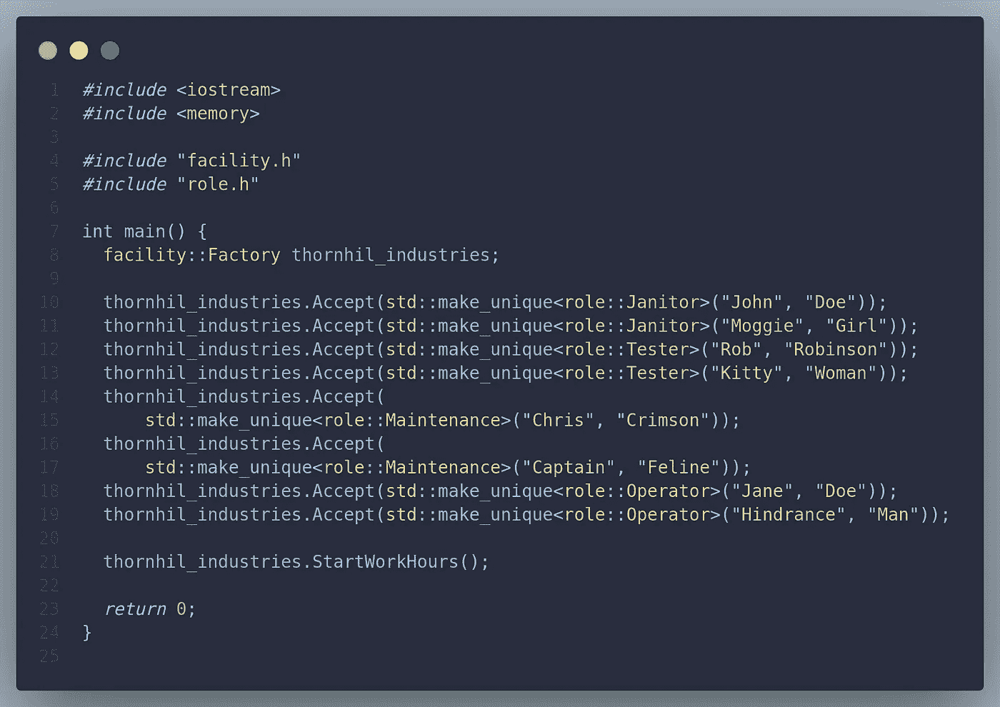
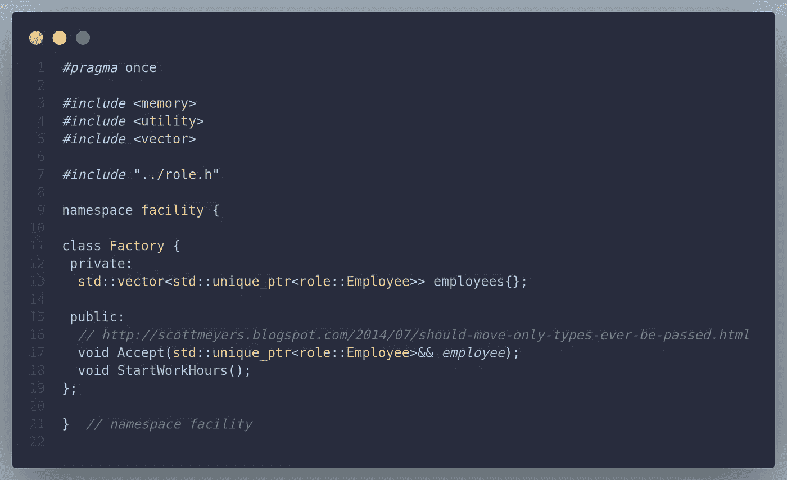
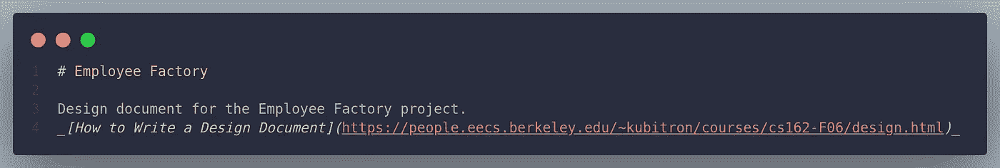
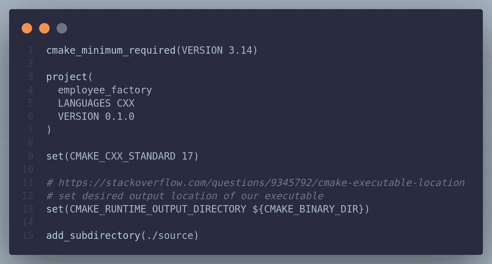
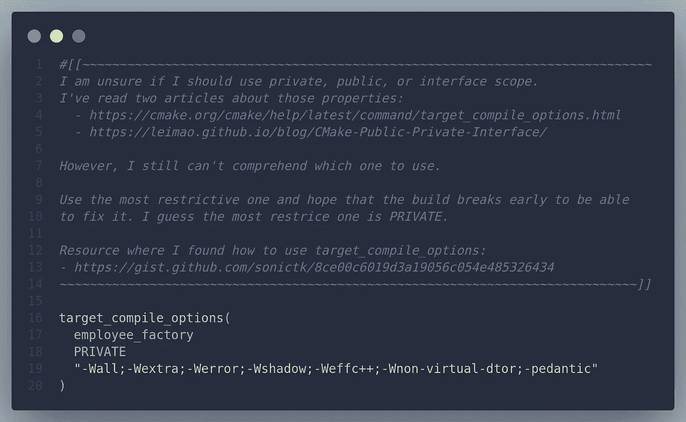
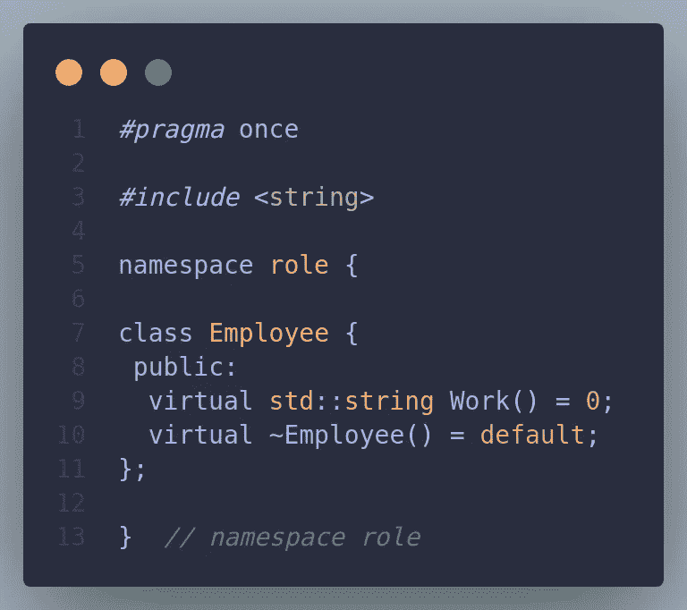
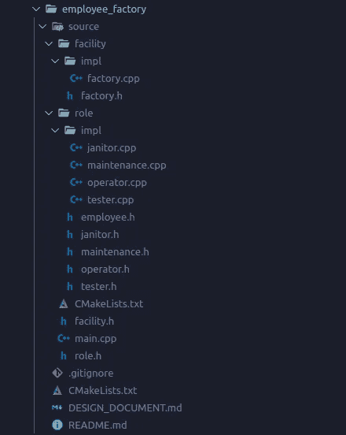
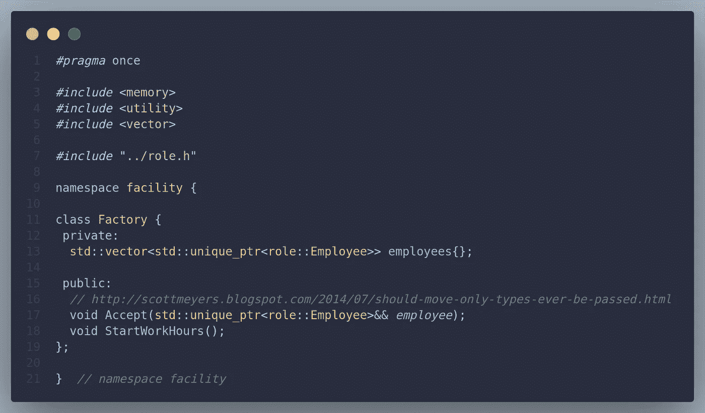

# 我学习 C++运行时多态性的方法

> 原文：<https://blog.devgenius.io/my-approach-to-learning-c-runtime-polymorphism-526192dc49b8?source=collection_archive---------10----------------------->

我的简短故事和实现原因。我希望你能知道我做了什么。我创建了一个设计文档。希望这能帮助其他人理解我的解决方案。这里是[员工工厂源代码](https://github.com/srele96/sk-experiments/tree/21369c9c2f84f8ea357456471fecf1577485a4f1/cpp/experiments/employee_factory)的链接。

员工工厂的源代码 Thornhil Indrustries 接受员工并开始工作时间

# 前言

我建议先查代码。但是，没有它也可以继续。

我在 C++书上学到了运行时多态性。这个概念很陌生，但很有趣。为了消除这种感觉，我创建了一个解决方案是运行时多态性的故事。除此之外，我想吸收好的 C++实践。

# 具有质量上下文的拉式请求

这里是[我对员工工厂](https://github.com/srele96/sk-experiments/pull/113)的拉取请求，比这篇文章有更多的上下文。

# 我的方法

我了解了运行时多态性。为了学习它，我不得不花一些时间来研究它。我相信这就是大家所说的体验。我清楚地记得每一个困扰了我几天的问题。就好像它们被刻在了我的脑海里。所以我有了这个想法，我找到了解决问题的方法。然后我用那个解决方案解决问题。

C++工厂源代码

工厂可以雇佣任何员工。它不关心员工执行。

# 问题是

这家工厂雇佣了许多员工。员工的角色之一是:清洁、检查产品质量和测试样品、维护设备、操作叉车和校准工件。每个员工的工作职责不同，但都是在工作时间工作。

# 解决方案

我们将实施工厂设施。这样的设施将容纳所有员工，一旦每个人都准备好了，就开始工作。

工厂不需要知道员工的角色。工厂的每个员工都应该工作。他所做的是由他的角色决定的。工厂可能有许多名字不同的门卫。他们有不同的财产价值，但他们做同样的工作。

Employee 类是一个接口，它声明一个雇员做什么。

看门人、测试员、维护员和操作员定义了员工的行为。

# 实施决策

## 使用设计文档

设计文档标题和描述

我想尝试设计第一的方法。我相信使用代码实现现有的解决方案要容易得多。代码优先的方法会造成混乱。我从经验中可以看出这一点。

## 使用 CMake 生成系统

根 CMakeLists 文件

使用构建系统是现实工作流的一部分。当然，我必须使用构建系统。CMake 是一个跨平台的构建系统。它帮助我使用 Linux 和 Windows 来完成这个项目。

## 使用严格编译标志

C++严格编译标志

我在某处读到过建议使用严格编译标志。他们帮助我学习新概念。

## 使用 employee 作为纯接口

员工界面

语义上，接口声明了什么是可能的，而不是如何声明的。数据应该在别处。因此，我重构了解决方案。使用接口来声明什么是可能的。使用 Person 类来声明共享属性。

## 使用虚拟析构函数

编译器警告我基类必须有一个虚析构函数。这是有意义的，因为当我们使用指针时，我们不会把它放在 vtable 中。我用默认的虚析构函数解决了这个问题，因为我没有在内部使用堆分配。默认的析构函数应该足够了。

## 包括用过的标题

我了解了 IWYU——包括您使用的内容。
[https://Google . github . io/style guide/CPP guide . html # Include _ What _ You _ Use](https://google.github.io/styleguide/cppguide.html#Include_What_You_Use)

## 使用目标编译选项

我使用 add_compile_options 为所有目标添加它们。使用 target_compile_options 允许对每个目标使用不同的选项。例如测试。

## 使用#pragma 一次

我用#ifndef 是因为 Google C++风格指南。一个朋友看了我的代码，说 pragma once 在实践中使用。我替换了#ifndef，因为我没有好的理由不这样做。

## 移除类别人员

唯一的类 person 用例是属性继承。如果我自上而下地观察层级结构，这是有意义的。我和一个朋友谈过，从一个新的角度来看，这没有意义。更明智的方法是定义一个接受员工的工厂。之后，当我需要一个新员工时，我可以实现一个员工接口。

## 更新员工的实施

删除类 Person 并更新员工实现。每个 employee 实现继承 Person 和 Employee。个人允许共享属性，员工是一个接口。看待这个问题的新方法是，实现一个角色来履行员工承诺要履行的义务。

## 使用模块化结构反映解决方案

代码结构

通过将解决方案分成模块，使其更具表现力。对于读者来说，解决方案应该更明显。代码结构应该帮助我们表达我们的解决方案。停止污染全局名称空间和模块化逻辑。使用名称空间，我们不会污染全局名称空间。

## 将文件拆分到接口和实现

将每个头视为一个接口。我发现这比给员工提供一个界面目录要干净得多。我这样做是因为 Employee 是一个抽象类。然而，使用“impl”目录实现并将所有头文件视为接口是一种更干净的方法。

## 将 unique_ptr 作为右值引用

工厂类接受匿名的唯一指针

接受雇员作为消费他们的右值。我想消费匿名物品。我不能使用匿名对象，因为我不知道右值是如何工作的。