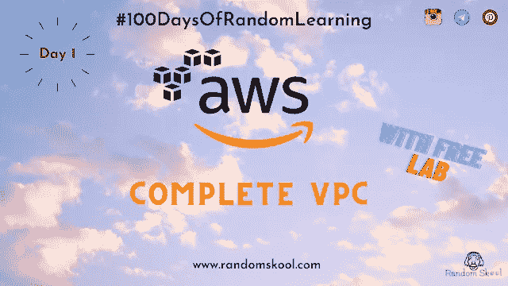

# 我糟糕的旅程

> 原文：<https://blog.devgenius.io/my-awsome-journey-5e4effe3f69a?source=collection_archive---------6----------------------->

我已经开始了我的 AWS 之旅，目前我正在深入研究 AWS 服务的三个主要概念—

*   VPC
*   弹性负载平衡
*   自动缩放

到目前为止，在我随机学习的 100 天中，我只完成了 3 天的旅程...所以我觉得值得分享。

我的 AWS 学习尚未完成……随着时间的推移，我将把我的日常学习张贴在[randomskool.com](https://www.randomskool.com)上，欢迎在那里分享您的宝贵反馈。

# 第一天—

# [VPC 零到英雄| AWS VPC |动手|认证小技巧](https://www.randomskool.com/2020/10/day-1-vpc-zero-to-hero-aws-vpc-hands-on.html)

今天，在我们的 100 天随机学习系列中，我们将讨论完整的端到端 AWS VPC(虚拟私有云)。

网络是任何基础设施的重要组成部分，因为系统的安全性真正取决于公司当前的网络配置。为了保持配置最新，需要投资购买重型硬件(如路由器、防火墙、网关等等)。然而，为了实现如此大的网络设置，公司必须投入大量的运营成本。

为了避免任何进一步的运营成本，如今该公司迁移到了云中，在那里他们可以以更低的价格使用按需实例、预留实例和许多其他服务。

但主要问题是如何在云中实现安全的基础设施——每秒钟有数以百万计的公司使用 AWS 服务，那么如何实现隔离的基础设施——

答案是 AWS VPC(虚拟私有云)

*亚马逊虚拟私有云(亚马逊 VPC)让你提供一个
AWS 云的逻辑隔离部分，你可以在你定义的虚拟网络中启动
AWS 资源。*

更多信息，请访问[randomskool.com](https://www.randomskool.com/)

# 第二天-

# [AWS 弹性负载平衡器 Zero to Hero | AWS VPC |动手操作|认证技巧](https://www.randomskool.com/2020/10/day-2-aws-elastic-load-balancer-zero-to.html)

今天，我们将讨论 100 天随机学习系列中的完整端到端 AWS ELB(弹性负载平衡器)。

## AWS 中的负载均衡器是什么？

*“负载平衡器将传入的应用流量分布在多个可用性区域中的多个 EC2 实例上。”*

## AWS 支持多少种负载平衡器？

Aws 支持三种类型的负载平衡器

*   *经典负载平衡器*
*   *应用负载平衡器*
*   *网络负载平衡器*

更多信息，请访问 randomskool.com

# 第三天-

# [AWS Auto Scaling Zero to Hero | AWS ASG |实践|认证技巧](https://www.randomskool.com/2020/10/day-3-aws-auto-scaling-zero-to-hero-aws.html)

今天，我们将在 100 天随机学习系列中讨论完整的端到端 AWS ASG(自动缩放和自动缩放组)。

**AWS 中的自动缩放是什么？**

Auto-scaling 是 Amazon Web Services 提供的一项服务，其中实例的扩大和缩小将根据指定的启动配置/模板自动处理。

自动伸缩是 AWS 提供的最佳服务之一。

**最佳实践:**

***为了顺利地使用自动伸缩，还需要部署一个负载平衡器。***

让我们投入到**动手**中，不要浪费更多的时间

我们将同时讨论理论(定义、概念等等)。

更多信息，请访问[randomskool.com](https://www.randomskool.com/)

请继续关注 randomskool.com 第四天

问候，

随机队