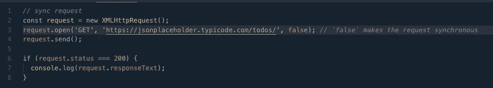
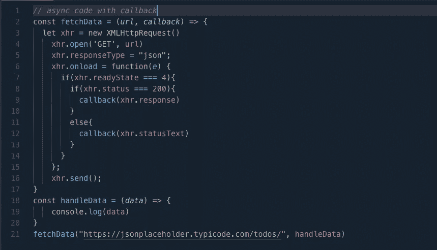
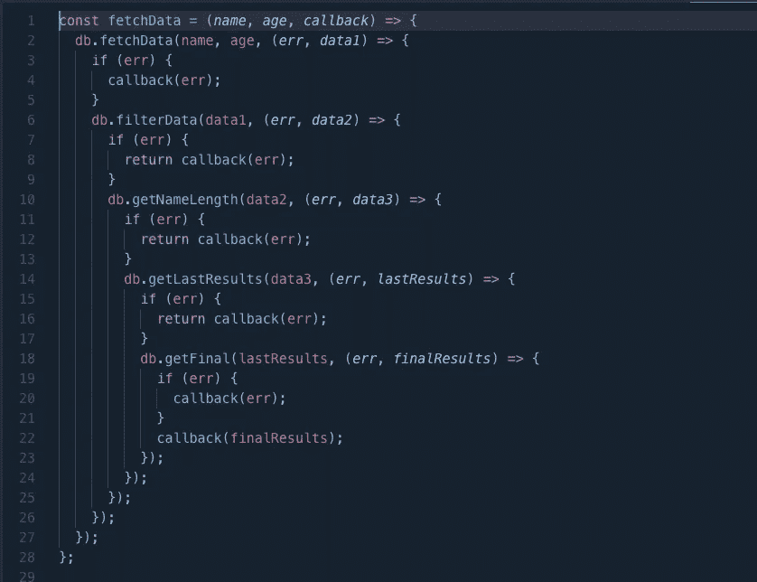
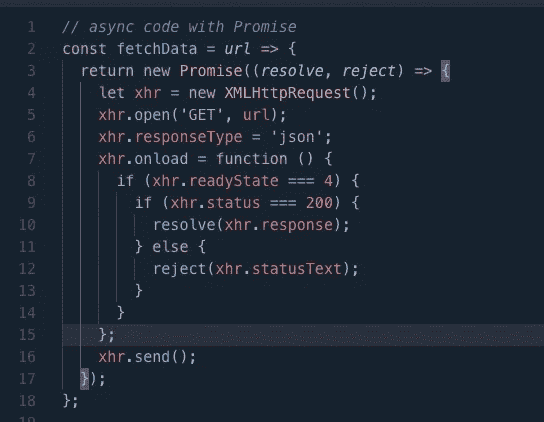
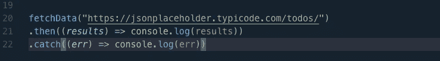
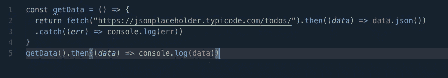
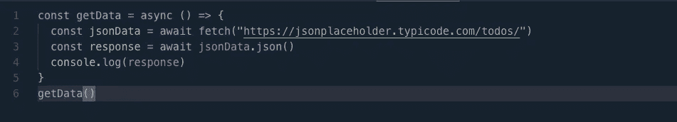
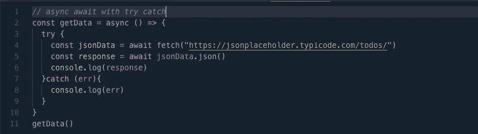

# 我的训练营之旅:异步编程

> 原文：<https://blog.devgenius.io/my-bootcamp-journey-asynchronous-programming-36e07e6bc88c?source=collection_archive---------27----------------------->

## 了解回调、承诺和异步/等待(Javascript)

由 [Max Duzij](https://unsplash.com/@max_duz?utm_source=medium&utm_medium=referral) 在 [Unsplash](https://unsplash.com?utm_source=medium&utm_medium=referral) 上拍摄的照片

在我的上一篇文章中，我谈到了我是如何了解 DOM(文档对象模型)的，你可以在这里找到那篇文章。今天的主题是异步编程，所以让我们开始吧。

# 同步 Javascript

默认情况下，Javascript 是单线程的，这意味着一个代码块只能一个接一个地执行，这就是它同步的原因。同步编码会阻止程序的其余部分执行，直到一段代码完成，这造成了糟糕的用户体验。我们不知道这段代码需要多长时间才能执行。可能需要 5 秒钟，或者 10 秒钟，或者 15 秒钟。最终，我们的程序会被搁置很久，这并不好。示例→

这是正在进行的同步编程。主要是因为我们传递了“false”标志来使请求同步。

我不会详细讨论 XHR 是如何工作的，只知道我用它来请求 JSON 占位符 API，这将是另一个主题:)。

但是，让我们进入异步编程，这是科技界强烈推荐的。

# 异步 Javascript

异步 Javascript 运行多个线程，这允许我们在后台运行代码，而另一段代码正在执行，而不会阻塞主线程。一般的流程是创建一个函数，该函数需要发出请求以获取某些东西(通常是数据),然后传入回调函数以便在数据返回时调用。然后，回调函数将处理这些数据(做你想做的)。这是一幅大图，让我们看看如何使用回调、承诺和异步&等待以不同的方式实现这一点。

# 复试

当您获取数据并想要处理该数据时，作为参数传递的函数(此代码将在后台运行)。看起来和这个差不多→

在这种情况下，当我们调用我们的`fetchData`函数时，`handleData`是我们的回调函数，它对数据做一些事情。然而，回调函数的缺点是它可能成为嵌套的，难以维护和读取。被称为回调地狱，看起来像这样

这是一个假演示，向您展示“回调地狱”可能是什么样子。这是承诺出现的另一个原因。

# 承诺

承诺是解决回调和回调地狱的一个办法。承诺将异步任务的状态从挂起处理为失败或解决。(用一个对象表示)。Promises 内置了两个回调函数，分别是 Resolve 和 Reject。创造承诺是这样的→

promises 所做的是跟踪异步任务的状态。当数据成功返回时，(状态等于 200，表示 ok)它被传递到`resolve`中，这就是返回的数据。或者，如果有一个错误(状态不是 200 ),它将被调用并返回该错误。但同样，这只是记录它是否准备好了。如果数据准备好了，我们仍然需要获取数据并对其做一些事情(`console.log`它，循环通过它，过滤它，等等)。在这种情况下，Promises 还带有另外两个回调函数来获取数据。`.then()`和`.catch()`哪个长这样

我正在调用上面使用的同一个函数。你也可以链接这些方法，如果你想用这些数据做其他事情，它会返回另一个承诺。然而，大多数时候你不会手动创建一个承诺，你使用的 API 很可能会返回一个承诺，要么为你解决，要么不为你解决，然后你只需要使用`.then`对数据做一些事情，或者使用`.catch`对错误做一些事情。

这就是 Fetch API 的用武之地，它在向 API 发出任何请求时默认返回一个承诺。然而，对于获取，您需要在获取数据之前将其转换成 JSON。没有手动创建承诺的简单获取请求可能如下所示→

`.then`和`.catch`比我们之前使用的回调更加优雅，但是你仍然可以使用`.then`和`.catch`体验回调地狱。幸运的是，Async & Await 前来救援。

# 异步和等待

我们讨论了回调和承诺，现在我们将讨论处理异步代码的最新方法，即 Async & Await。它在语法上更容易，读起来更优雅。这就是如何使用异步和等待

让我们来分析一下这里发生了什么，`async`关键字让我们声明我们的函数是异步的。`await`关键字实际上是等待数据可用，然后当数据可用时，它将值存储在我们的`const jsonData`变量中。记住，当我们使用 fetch 时，我们必须将数据转换成 JSON，JSON 也返回一个我们需要`await`的承诺。一旦返回，它将被存储在我们的`const response`变量中。这就是你在使用`async & await`时看到的基本流程。这种方式更容易，更干净，可读性更好。🙌

但是等等，如果有错误的话，我们如何捕捉呢？我们可以使用 try & catch 错误处理方法来捕获错误，这看起来也很简单。

在“try”块中，是您执行所有数据提取操作的地方。“catch”块在“try”块失败时捕获您的错误。

这就是我从这个话题中学到的💪希望你们也学到了一些东西。

尽情享受吧！👍

附注(阿诺德·施瓦辛格的声音)我会回来的😎

~ ***爱活着，活着为了代号***