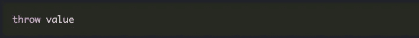
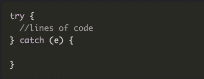
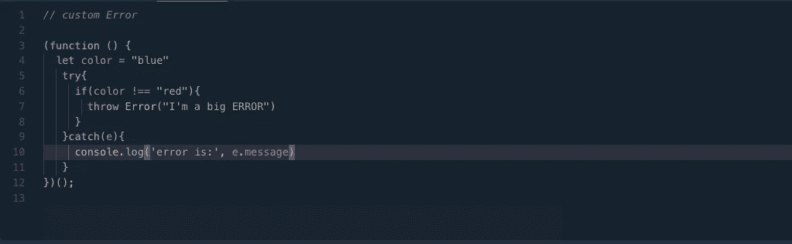
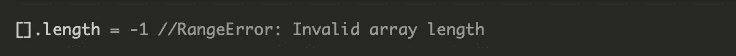
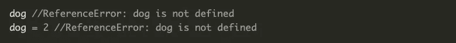
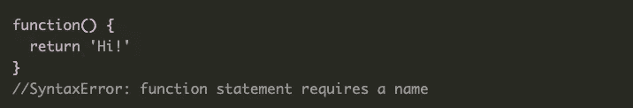
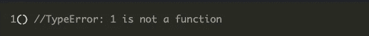

# 我的训练营之旅:错误和错误处理

> 原文：<https://blog.devgenius.io/my-bootcamp-journey-errors-and-error-handling-40b2b28b5b45?source=collection_archive---------25----------------------->

## 了解错误和错误处理

照片由[视觉效果](https://unsplash.com/@visuals?utm_source=medium&utm_medium=referral)在 [Unsplash](https://unsplash.com?utm_source=medium&utm_medium=referral) 上拍摄

在我的上一篇文章中，我讨论了异步编程。你可以在这里找到那篇文章。让我们深入到错误和错误处理的主题。

错误和错误处理在编程中非常重要。为了让我们在错误发生时不害怕，我们需要知道它为什么会发生，它们意味着什么，以及如何解决它们。**异常**是错误的另一种说法，我们可以抛出许多不同类型的异常。

然后，我们可以在“尝试-捕捉”块中捕捉它们。

catch 块中的“e”将与您抛出的错误相关。然而，您抛出的错误不一定是 Javascript 错误。这可能是你自己造成的错误。

在这种情况下，如果颜色不是红色，我会抛出一个自定义错误。这个错误是在我们的`catch`块中捕获的。

让我们回顾一下可能抛出的不同类型的“JS”错误。我提到的所有错误类型都继承自主错误对象类。我们将讨论 8 个对象错误。

*   **错误** —所有其他错误都继承的一般性错误，您不会直接看到该错误实例。有些人会创建一个自定义错误，如上图所示。
*   **Eval Error**——不常使用，它不是由 Javascript 抛出的，其目的是检查全局 Eval 函数是否被正确使用。它是在 ES3 中引入的，但从 ES5 开始就没有了。
*   **范围错误** —根据允许值，当数字超出范围时，会出现此错误。👇

*   **引用错误** —当你试图读取一个不存在的变量时，就会出现这种情况。👇

*   **语法错误**——这个很简单，但是很容易被忽略。当程序在您的代码中发现语法错误时，就会出现这种情况。例如，语法错误是没有函数名。👇

*   **类型错误** —当一个值的类型与预期的不同时，就会出现这种情况。我们调用了一个数字，它抛出了 TypeError。👇

*   **URI 错误**——当你调用这些全局函数之一(这适用于 URI)传入一个无效的 URI 时，就会发生这种情况。(`decodeURI()`、`decodeURIComponent()`、`encodeURI()`、`encodeURIComponent()`)

现在，如果你遇到这些错误，你就会知道它们为什么会发生，并且有可能找到解决它们的方法。

这是所有的这一个，希望这能帮助一些人。干杯！

尽情享受吧！👍

附注(阿诺德·施瓦辛格的声音)我会回来的😎

~ ***爱活着，活着要代号***