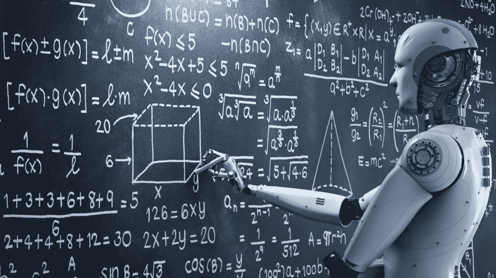

# 迄今为止我的职业生涯

> 原文：<https://blog.devgenius.io/my-career-journey-so-far-ce865cb7959d?source=collection_archive---------30----------------------->

嗨，我叫布兰登。我最近刚刚从俄亥俄州立大学的博士项目退学，获得了硕士学位，目前正在向大会的数据科学领域过渡。虽然我发现我的物理教育很有收获，但我不喜欢它的研究方面。最重要的是，我从来没有在学术界的职业生涯的任何计划，所以我所学的很多东西都是面向职业道路的。我觉得我没有真正为未来努力，所以我离开了。这不是我轻率做出的决定，现在回想起来，我可以自信地说这是正确的决定。

我第一次对数据科学感兴趣是在我必须写一篇关于高功率激光实验中的机器学习技术的研究领域的文献综述时。我的导师的研究重点是通过使用进化算法来确定最佳参数，从而优化激光输出。我开始阅读论文，发现自己对机器学习技术比对激光物理更感兴趣。当我在我的部门询问可能的职业道路时，我发现了数据科学。事实证明，许多物理学毕业生都相当成功地过渡到了数据科学领域，这可能是因为他们拥有相似的技能。

当我离开 gad 学校的时候，我知道我想要的教育是更加面向我感兴趣的职业的。我认为我在大会的教育是我教育生涯的自然发展。我希望将我作为一名物理学家学到的技能应用到工业中，就像许多物理专业的学生在学业结束时所做的那样。由于学术界之外很少有头衔为“物理学家”的工作，许多物理专业的学生往往会成为工程师、教师、程序员或技术人员等。我选择数据科学作为职业，因为我喜欢问有趣的问题，进行批判性思考，解决与数学和编程相关的问题。对我来说，这似乎是最自然的选择，因为我作为物理学家学到并喜欢做的许多技能都可以转移到数据科学中。这也有助于数据科学在这个现代计算机时代非常重要，需求量很大，报酬也相当可观。

除了数学和编程之外，我作为研究生的角色教会了我如何更好地与我领域之外的人沟通，这是作为一名数据科学家非常有用的技能。在教了几年物理实验和背诵课之后，我发现我常常认为解决我认为简单的物理问题的直觉是理所当然的。第一次给本科生上课时，我很好地认识到，我很难解释我为什么以这种方式处理问题，或者我是如何从一个步骤跳到另一个步骤的。诸如此类的经历让我学会了思考如何向他人传达我原本不会用语言表达的想法或思维方式。我学到的最后一个重要的软技能就是学会如何学习。当你在做研究的时候，你是在研究一个从来没有人见过或解决过的问题，所以你必须挖掘互联网上的相关资源。这真的教会了我要坚持不懈，充分利用我所拥有的有限资源。我认为这对于任何数据科学家来说都是一项非常有用的技能，因为即使是知名的数据科学家也有很多东西需要学习。

我现在知道我想成为什么样的人，但我不确定我想用数据科学做什么，因为有太多的行业可以应用它。我知道科技公司以雇佣大量数据科学家而闻名，所以我想我可能会从那里开始。然而，目前我对大型科技公司的感觉有些复杂。像谷歌、网飞和亚马逊这样的公司确实做了一些令人惊叹的事情，但是让技术对消费者来说稍微方便一点并不是我真正的梦想。社会中的一切都在朝着更加便利的方向发展，我不确定这是否让我们更加幸福。我知道这听起来有点老套，但我有点想通过以某种有意义的方式改善人们的生活来帮助他们。我还不知道那是什么工作，但我一定会找到它的。