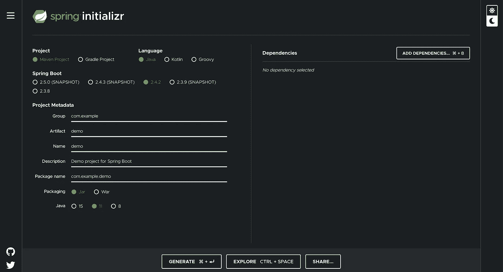

# 我设置 Java Web 项目的清单

> 原文：<https://blog.devgenius.io/my-checklist-for-setting-up-a-java-web-project-e03ffcbab268?source=collection_archive---------0----------------------->


## 介绍

尽管现在有很多工具和特性可以帮助你轻松地设置一个项目，但是要正确地设置它还有很多工作要做。当我开始一个新的 Java 项目时，我肯定会遇到这种情况。如今，构建一个新的 Java 项目似乎很容易，没有痛苦(参见下面关于 Spring 的部分),但是要使项目处于一个非常好的可用状态，即可发布、可部署、生产就绪，并且有良好的测试设置，肯定需要做一些额外的工作。

在这篇文章中，我将详细介绍我的个人清单，上面列有我确保在新的 Java 项目中完成和包含的所有内容。

没有进一步做，这是:

## 1.创建您的 GitHub Repo

遵循最佳软件开发实践，您应该始终将源代码存储在版本控制系统(VCS)中。现在大多数人使用的一个普通 VCS 是 GitHub，因为它是世界上最大的在线源代码管理服务提供商。


这方面其他常见的 VCS 有 GitLab、BitBucket 等。

但我倾向于在工作和个人项目中大量使用 GitHub，所以我确保在开始任何类型的新项目时，我做的第一件事就是在 GitHub 上为它创建一个新的源代码库。

## 2.用弹簧？安装弹簧！—不用弹簧？然后用弹簧

如果你正在用 Java 开发，你肯定想使用一个应用程序框架。目前最主要的 Java 应用程序框架之一是 Spring。所以需要确保设置好 Spring！

现在这很容易做到。如今，大多数人使用 Spring Boot 来构建 Java web 应用程序，每当我需要启动一个新的 Java web 应用程序时，我也不例外。

不需要像以前一样在 Maven `pom`文件中手动配置 Spring 依赖项，但是如果你真的想使用 Spring 框架而不是 Spring Boot，没有什么可以阻止你。

因此，假设您还想将 Spring Boot 用于您的 Java 项目，您可以通过使用 Spring 的 Spring Initializr 轻松创建一个 Spring Boot 项目的基本设置。

[](https://start.spring.io/) [## 弹簧初始化 r

### Initializr 生成的 spring boot 项目正好是你快速启动所需要的！

start.spring.io](https://start.spring.io/) 

Spring Initialzer 使您能够轻松地创建一个新的 Spring Boot 项目。



当你在 **Spring Initializr** 中为你的 Spring Boot 应用程序选择完你想要的特性后…

点击“生成”按钮下载项目。

**项目目录结构**

这是您解压缩下载的 zip 文件时的项目目录结构。

```
colinbut@colins-mbp-2 $ /demo tree                                                                                                                                          
.
├── HELP.md
├── mvnw
├── mvnw.cmd
├── pom.xml
└── src
    ├── main
    │   ├── java
    │   │   └── com
    │   │       └── example
    │   │           └── demo
    │   │               └── DemoApplication.java
    │   └── resources
    │       ├── application.properties
    │       ├── static
    │       └── templates
    └── test
        └── java
            └── com
                └── example
                    └── demo
                        └── DemoApplicationTests.java
```

从上面可以看到；你已经有一个“现成的”项目让你去做。

此外，它可以在本地轻松启动，您可以直接将其投入生产。虽然它没有太多的东西，因为它只是一个样本框架项目。

## 3.设置单元测试

要用 Java 进行单元测试，您需要 JUnit 框架。在一个基于 Maven 的项目中，您使用一个`pom`文件来管理您的依赖项，您可以很容易地将 JUnit 依赖项添加到依赖项列表中。

*注意 1: Spring Boot 已经包含了 JUnit 依赖项，作为它自己的一个 Spring 模块的可传递依赖项，所以你不需要添加上面的内容。然而，如果你出于某种原因不使用 Spring Boot，那么你可以添加上述内容。此外，无论出于什么原因，如果您要覆盖一个特定的 JUnit 依赖版本，那么请确保您从包含它的现有 Spring 依赖中排除了 JUnit 依赖。*

*注 2:作为个人偏好，我喜欢使用 JUnit 版本 4，因为它已经稳定了很多年，是我最喜欢的版本。然而，最新的 Spring Boot 依赖包括 JUnit 5，虽然 JUnit 5 已经公开发布了好几年，但在我个人看来，它仍然不太稳定。*

此外，我喜欢使用 Mockito 进行模仿，所以我也包含了 Mockito 依赖项。

同样，Spring Boot 属地也包括莫奇托。

有时，我可能需要使用 Powermock 库来帮助我模仿私有和静态方法。因此，如果我需要这些库，我也会包括它们。

然而，作为一个读者，你可能会想，我究竟为什么要用 Powermock 来模仿私有和静态方法，因为模仿私有和静态方法暗示着低质量的编码和糟糕的代码设计。这是真的，我当然不能和你争论，因为我也有同样的信念。

但是，有时会出现这种特殊情况，您需要模仿私有和静态方法来帮助您进行单元测试(或集成测试)。

无论如何，关于是否模仿私有和静态方法的讨论不在本文的范围之内。

## 4.设置集成测试

总的来说，集成测试非常广泛，因为它可以跨越和覆盖许多不同的维度。例如，我将在接下来的两节中谈到的 E2E 测试和 API 测试也可以归类为集成测试，或者至少是集成测试的一个子集。

如果您正在使用 Spring Boot(如果您没有，我鼓励您这样做)，那么您可以使用 Spring 附带的 Spring 测试框架。它有许多很酷的特性，可以让你用基于 Java 的 Spring Boot 应用程序进行集成测试。

我做的第一件事就是确保添加了 Spring Test 依赖项:

我已经写了一篇关于 Spring 集成测试的文章，对此做了更多的解释:

[](https://colin-but.medium.com/integration-testing-in-spring-3c5cdcadf65e) [## 春季集成测试

### 首先，集成测试是一个非常广泛的话题，因为构成集成测试的总是…

colin-but.medium.com](https://colin-but.medium.com/integration-testing-in-spring-3c5cdcadf65e) 

## 5.设置 E2E 测试

这个步骤可以根据你决定使用什么样的工具来做“结束 2 结束”(E2E)测试而有所不同。也要看你打算怎么做。毕竟，E2E 是上述更广泛的集成测试的一个子集。正如你刚刚看到的，根据你决定使用什么工具、技术、软件库、框架，集成测试可能真的很难设置。

对我来说，我喜欢将 E2E 测试具体分类，因为我主要喜欢将特定的 E2E 测试与更广泛的通用集成测试(位于传统测试金字塔中间的测试)分开。

我常用的框架是黄瓜🥒。

Cucumber 是一个行为驱动设计(BDD)测试工具。我不会过多地讨论 BDD，但简单地说，BDD 旨在解决 TDD 给出的问题，BDD 是一种更广泛、更高级的测试优先方法，它旨在编写 E2E 测试作为验收标准，并结合以人类可读的类似英语的语言编写这些测试规范(即使是业务分析师— BA 也可以编写)—也就是黄瓜世界中的小黄瓜。

黄瓜源于红宝石。但是由于我的项目是 Java，所以我使用 Cucumber 的 Java 端口—即 Cucumber-JVM。注意，对于其他编程语言也有许多其他的端口。

就像包含 JUnit 库的单元测试一样，在使用 Cucumber-JVM 的 E2E 测试中，您也可以包含 Cucumber-JVM 依赖项。

下面是一些向 Maven `pom`文件添加依赖项的例子:

如果您使用的是 Java 8:

就是这样。

## 6.设置 API 测试

在微服务时代，您很可能正在开发一个基于后端 Java web 的微服务，它公开了一组 API 端点，使微服务能够充当 web 服务。然而，即使您不是，并且您只是在构建一个简单的基于 Java web 的应用程序，进行 API 测试总是好的(如果您的应用程序公开 API 的话)。

至此，我们应该已经有了单元测试、集成测试和端到端系统测试所需的设置。

因为您的 API 是您提供给最终用户的接口，所以测试它们也是一个好主意。

要在 Java 中做到这一点，您可以使用放心库。

 [## 放心

### 用 Java 测试和验证 REST 服务比用 Ruby 和 Groovy 等动态语言更难。放心吧…

放心吧 io](https://rest-assured.io/) 

我非常喜欢这个库，因为它通过使用编程技术(如 Java 中的方法链接和使用 Fluent 接口)提供了一种非常描述性的测试编程方式。

## 7.设置 UI 测试— selenium

如果你纯粹是开发一个后端 Java Spring Boot 微服务，那么你可以跳过这一步。此步骤仅适用于包含 UI/视图的 Java web 应用程序。例如，如果您正在开发一个包含静态资源(如嵌入在 Java 代码库中的 HTML/CSS/JS)的整体 Java web 应用程序，那么进行 UI 测试可能是一个好主意。

我过去使用的一个常见的 UI 软件测试工具是 Selenium。

硒很重。正确设置 Selenium 可能非常繁琐和复杂。

我倾向于用 FluentLenium 来代替:

[](https://fluentlenium.com/) [## 氟碲酸盐

### FluentLenium 是一个 React ready 网站自动化框架，它扩展了 Selenium 来编写可读的、可重用的、可靠的…

fluentlenium.com](https://fluentlenium.com/) 

并包含所需的依赖关系:

## 8.具有静态代码分析的高质量代码

作为一名开发人员，我喜欢我的代码质量好。

所以我也为我的 Java 项目启用了静态代码分析。这个领域的工具多种多样，但最流行的可能是使用 SonarQube 的声纳。

[](https://www.sonarqube.org/) [## 代码质量和代码安全性| SonarQube

### 数以千计的自动化静态代码分析规则，在多个方面保护您的应用程序，并指导您的团队。接住…

www.sonarqube.org](https://www.sonarqube.org/) 

我不会详细说明如何准备声纳，因为有几种方法可以剥这只猫的皮。毕竟，声纳是一个相当重型的工具。

但是一般来说，我确保我选择的 CI 工具可以运行 Sonar。使用 Maven 运行 Sonar 非常容易，因为您只需要这个命令(假设您的 Sonar 配置都设置正确):

```
mvn sonar:sonar
```

## 9.实施 CI/CD

持续集成(CI)是一个庞大的话题。有如此多的 CI/CD 解决方案，我无法一一介绍。

我通常只选择一个(或者两个，如果这是我的个人项目，或者当我想在以后灵活地切换到另一个 CI 解决方案时)CI 解决方案，然后进行必要的配置。

如今，随着每个人都采用管道作为 CI(以及 CD)的代码，您所需要的配置仅仅是一个配置管道定义文件。

我通常为我的 Java 项目选择 Jenkins，所以我会放入如下的`Jenkinsfile`:

对于我的其他一些更现代的项目，我喜欢尝试 GitHub 动作，因为它与 GitHub(我使用的 VCS)捆绑在一起，易于集成。

我将添加一个 GitHub 操作工作流文件，如下所示:

注意，从上面的例子中，我将我的应用程序管道建模为传统的“DevOps 管道”,就像 Jenkins 的`Jenkinsfile`例子一样。

GitHub Actions 的最佳实践可能是将您需要作为 SDLC 管道的一部分运行的每个任务定义为单独的工作流。

底线是每个 CI/CD 解决方案都有自己的做事方式，因此相应地改变您的 CI/CD 配置/管道代码。

## 10.配置日志记录

任何好的应用程序都需要就地登录。你应该使用日志记录器来记录消息，而不是在 Java 中使用`System.out.print`。事实上，这适用于任何编程语言，而不仅仅是 Java。例如，不要在 Python 中使用`print`，而是使用 Python 的`logging`核心库。

如果你使用 Spring Boot，那么日志是免费的，因为 Spring Boot 会导入日志依赖项。

如果您不是，或者您想要使用特定的日志库或框架，那么您可以直接将依赖项添加到 Maven `pom`文件中。例如，我非常喜欢使用 SLF4J 作为 Log4J 的抽象，因为它允许我在将来的某一天，如果我想使用不同的日志库(比如说，LogBack)，可以很容易地交换掉 Log4J。

 [## SLF4J

### Java 的简单日志门面(SLF4J)作为各种日志框架的简单门面或抽象…

www.slf4j.org](http://www.slf4j.org/) 

以下是我将添加到我的 Maven `pom`文件中的依赖项:

有时您可能需要覆盖或提供自定义日志记录设置。为此，例如，如果您使用 Log4j，那么您可以将`log4j.properties`配置文件插入到您的项目中。

设置日志记录器来记录消息的好处之一是，您可以配置您的应用程序，将您的日志推送到一个集中的日志记录解决方案，如 Elastic (ELK) Stack、Splunk、Sumo Logic 或任何其他解决方案…

## 11.配置指标和监控

除了日志记录，为您的应用程序设置指标和监控功能也很重要。这是朝着“生产就绪”方向迈出的一步。

当使用 Spring Boot 时(如果你不是的话，我也鼓励你这样做)，我总是将弹簧执行器依赖项添加到我的弹簧依赖项列表中，纯粹是因为执行器为你提供了大量现成的度量和监控功能，而根本不需要太多(或任何)配置。例如，您可以轻松地免费获得 Java Spring Boot 应用程序的健康检查，而无需手动设置健康检查。

## 12.设置 Docker

至此，您已经基本上设置好了 Java 项目所需的大部分东西。此外，它也可以投入生产。使用 Spring Boot，您可以构建一个可执行的 runnable jar，可以在任何安装了 JVM 的服务器上运行。

但我觉得还有最后一步是必须的，那就是让你的应用程序可发布，或者更具体地说:可部署。

要做的事情之一是将您的应用程序打包到 Docker 映像中，其中包含运行 Java 应用程序所需的操作系统(OS)和运行时库(JVM)。这使您能够将应用程序作为 Docker 容器运行。

Docker 允许您在任何地方轻松地构建、发布和运行您的应用程序(嗯……支持 Docker 的任何地方，但实际上任何地方都支持像 Docker 这样的容器技术作为应用程序平台)。

另一个额外的好处是，通过使用 Docker，您可以将您的容器发送到任何环境，并可以确保它运行相同。例如，如果您只是将您的应用程序部署为可执行的 runnable jar，那么您不能确保它在不同的服务器上运行是相同的(您需要确保每个环境都是相同的，如果不小心的话，这可能会很痛苦)。

当我为我的 Java 应用程序设置 Docker 时，我只是放入了一个`Dockerfile`，它包含了构建 OS +运行时+将 Java 应用程序捆绑在其中的指令。

下面是我在几乎所有 Java 项目中使用的一个常见的`Dockerfile`的例子:

这很简单。其实根本不需要那么复杂。当然，我会根据每个项目的需要做出相应的改变。

您真正需要的是找到一个基本的 Docker 映像作为它的基础，并将您已经构建好的 Java 工件(`.jar`)复制到该映像，再加上运行 Java 的命令`.jar`，当您从这个构建好的 Docker 映像中分离出一个 Docker 容器时。

## 摘要

原来如此。这是我通常从零开始设置一个全新的 Java 项目的所有步骤。

当然，您将需要一些额外的工作来设置外部系统，以便与您的 Java 项目集成(例如，您选择的 CI 工具、您选择的集中式日志记录解决方案、您选择的度量和监控解决方案等等)。

**我的清单步骤:**

1.  创建您的 GitHub Repo
2.  设置弹簧
3.  设置单元测试
4.  设置集成测试
5.  设置结束 2 结束测试
6.  设置 API 测试
7.  设置 UI 测试
8.  静态代码分析
9.  实施 CI/CD
10.  设置日志记录
11.  设置指标和监控
12.  设置 Docker

所以记住…

每当您下一次设置一个新的 Java 项目时(不管它是传统的单一 Java Web 应用程序还是现代的 Java 后端 Web 微服务),请确保遵循我的清单中的这些步骤，很快您就拥有了一个可随时部署和发布的生产就绪 Java 项目的所有要素。

它附带了所有必需的监控和日志记录设置，以及您的开发人员、工程师、SDETs 等可以开始编写代码的底层测试应用程序基础架构…