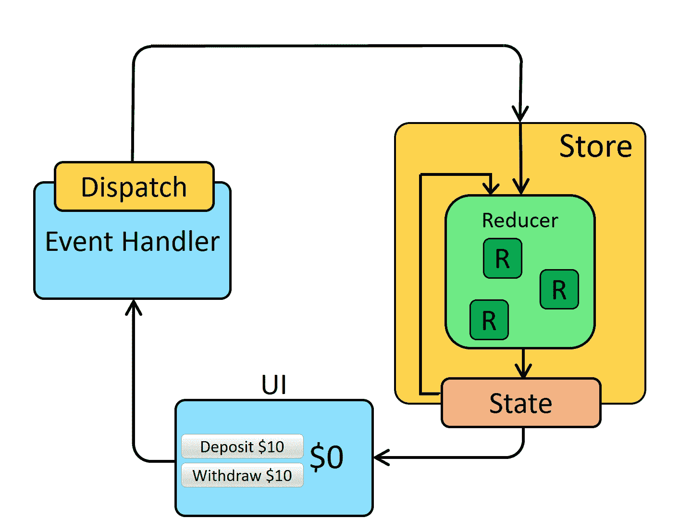

# 我对 2022 年 React 全球状态管理的选择

> 原文：<https://blog.devgenius.io/my-choice-of-global-state-management-for-react-in-2022-84b6f25008e9?source=collection_archive---------4----------------------->


照片由[海燕](https://unsplash.com/@petrebels?utm_source=medium&utm_medium=referral)在 [Unsplash](https://unsplash.com?utm_source=medium&utm_medium=referral) 上拍摄

Redux 不错，但这个更好

Redux 作为 React 的全局状态管理经过了反复测试。它有很多特性，redux 的完整生态系统经过了微调，使开发和状态管理变得更加容易。

我已经在 react 工作了 5 年多，在这个过程中，许多事情都发生了变化，但有一点是不变的，那就是 redux。

但是有一件事我们没有注意到，直到它变得很明显，那就是为了实现最简单的功能而要做的大量样板文件。

一个正常的 redux 架构包括一个动作和缩减器，它修改状态作为函数式编程启发的 redux。



来自官方网站

# **Redux 工具包**

Redux toolkit 是一款**电池供电的 Redux。**

官方的、固执己见的、包含电池的高效 Redux 开发工具集

redux 工具包的好处。

## 简单的

将你的应用程序连接到 redux，创建动作，并以定制钩子的形式使用这些动作，非常简单。

## 固执己见的

它给了你一个使用 redux 的标准，因此减少了犯错的空间。

## 强大的

你的动作无缝地像定制钩子一样工作，你有 **immer** 的能力，所以你不需要担心保持你的状态功能正常，没有隐藏的错误，因为不可变或者状态没有像预期的那样改变。根据你的用例，你有懒惰和正常的钩子，并且给你一个编写 API 的标准。

## 有效的

它们的亮点都是用更少的代码做更多的工作，因为所有的东西都已经为你配置好了，而且 actions/reducer 的样板文件也减少了一半。

# Redux 工具包配置

商店. js

```
import { configureStore } from '[@reduxjs/toolkit](http://twitter.com/reduxjs/toolkit)'
import counterReducer from '../features/counter/counterSlice'export const store = configureStore({
  reducer: {
    counter: counterReducer,
  }
)
```

主 app.js

```
import React from 'react'
import ReactDOM from 'react-dom'
import './index.css'
import App from './App'
import { store } from './app/store'
import { Provider } from 'react-redux'ReactDOM.render(
  <Provider store={store}>
    <App />
  </Provider>,
  document.getElementById('root')
)
```

计数器切片(动作+减速器)

```
import { createSlice } from '[@reduxjs/toolkit](http://twitter.com/reduxjs/toolkit)'const initialState = {
  value: 0,
}export const counterSlice = createSlice({
  name: 'counter',
  initialState,
  reducers: {
    increment: (state) => {
      // Redux Toolkit allows us to write "mutating" logic in reducers. It
      // doesn't actually mutate the state because it uses the Immer library,
      // which detects changes to a "draft state" and produces a brand new
      // immutable state based off those changes
      state.value += 1
    },
    decrement: (state) => {
      state.value -= 1
    },
    incrementByAmount: (state, action) => {
      state.value += action.payload
    },
  },
})// Action creators are generated for each case reducer function
export const { increment, decrement, incrementByAmount } = counterSlice.actionsexport default counterSlice.reducer
```

使用这些操作的组件

```
import React from 'react'
import { useSelector, useDispatch } from 'react-redux'
import { decrement, increment } from './counterSlice'export function Counter() {
  const count = useSelector((state) => state.counter.value)
  const dispatch = useDispatch()return (
    <div>
      <div>
        <button
          aria-label="Increment value"
          onClick={() => dispatch(increment())}
        >
          Increment
        </button>
        <span>{count}</span>
        <button
          aria-label="Decrement value"
          onClick={() => dispatch(decrement())}
        >
          Decrement
        </button>
      </div>
    </div>
  )
}
```

就像您拥有 redux 的强大功能和轻松/优化的体验一样简单。

参考资料:

[](https://redux-toolkit.js.org/tutorials/quick-start) [## 快速入门| Redux 工具包

### 欢迎来到 Redux Toolkit 快速入门教程！本教程将简要介绍你 Redux 工具包，并教…

redux-toolkit.js.org](https://redux-toolkit.js.org/tutorials/quick-start) 

2022 年，我认为 RTK 是在 React 应用中编写状态管理的方式。

继续努力学习。和平！！