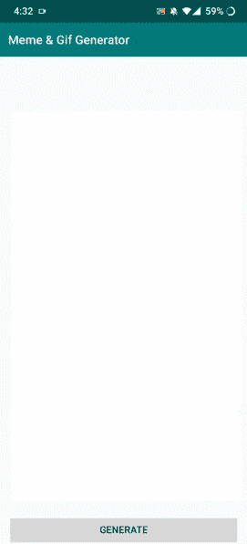
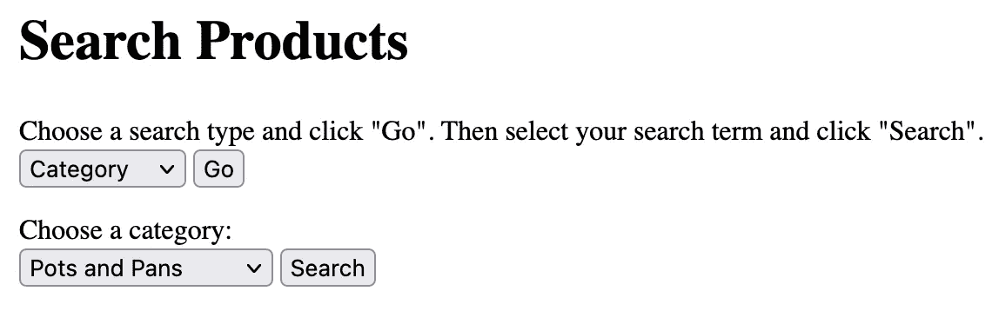

# 12 分钟后我的计算机科学学位

> 原文：<https://blog.devgenius.io/my-computer-science-degree-in-12-minutes-6f0e9b048bdc?source=collection_archive---------3----------------------->

马库斯·斯皮斯克在 [Unsplash](https://unsplash.com/s/photos/code?utm_source=unsplash&utm_medium=referral&utm_content=creditCopyText) 上的照片

我从小就对科技着迷。在我模糊的记忆中，一切都是从游戏开始的。我从一个家庭成员那里收到了一个黄色的游戏男孩颜色，还有一个口袋妖怪红色的副本。沉浸在游戏中之后，我发现自己在我的第一台通用掌上电脑 iPod Touch(第二代)上浏览互联网。从那时起，在 2012 年创建了我的第一个 YouTube 帐户后，我开始有兴趣了解更多关于 iOS 和 Android 设备的信息。

我想从事技术方面的工作，但编程似乎很可怕，所以我最初避开了计算机科学。经过几天的思考，我决定把信息技术作为我大学的专业。我将回顾我的本科旅程，攻读计算机科学学位。我住在校园里，并于 2017 年至 2021 年参加了新泽西州蒙特克莱尔的一所名为[蒙特克莱尔州立大学](https://www.niche.com/colleges/montclair-state-university/)的四年制公立大学。

# 大学一年级

## 2017 年秋季

在我大一的时候，我花时间去适应大学。在我的大学里，全日制学生必须至少修 12 个学分(一学期大约 4-5 门课)。每门课通常是 3 个学分，所以全日制学期通常是 12-15 个学分。编程基础 I 是一门用 Java 讲授的入门编程课程。学习了基本的数据类型(int，double，array，ArrayList 等。)和核心概念([面向对象编程](https://www.educative.io/blog/object-oriented-programming)，测试，错误类型，[静态关键字](https://www.javatpoint.com/static-keyword-in-java)等等)。

在计算概念中，我学到了更多的基本计算机科学概念，如二进制和十六进制系统、计算机的部件、程序执行、操作系统的用途，并对计算机网络做了简要介绍。该课程还包括 Python 编程。我无法相信这种语言与 Java 相比是如此简单。新生研讨会是我所在的大学要求所有新生参加的一门课程，目的是学习技能(时间管理、自我意识)和利用资源(写作中心、学术咨询)以取得成功。

总的来说，我喜欢我的第一个学期。我教授的程序设计基础激发了我对计算机科学的热情，所以我转了专业，只学了一个学期。我喜欢技术，经常学习新事物，解决问题，所以我的目标是成为一名软件工程师。

在一次令人惊讶的跌倒后，我专注于通过实习获得工作经验，并在专业上发展自己。我在寒假期间调整了我的简历，并开始申请暑期实习。为了学习如何找工作，我使用了 Reddit、YouTube 和 LinkedIn，它们都教会了我很多。

我还决定申请一个名为 an [REU](https://www.nsf.gov/funding/pgm_summ.jsp?pims_id=5517) (本科生研究经历)的夏季本科生研究项目作为后备。该项目包括与其他本科生和一名教授在各个领域进行研究，尽管我只针对计算机科学项目。它需要推荐，所以我用了两个志愿者工作的同事和我的高中老师。我很晚才申请，只提交了三份申请。

## 2018 年春季

我当前学期的 GPA 看起来更高了，因为我重修了微积分(当时 GPA 大约是 3.0)

这学期主要集中在建立我在秋天学到的东西上。编程基础 II 在面向对象编程(继承、封装、多态和抽象)和更高级的 Java 编程的支柱中进行了更深入的划分。我通过使用接口和抽象类创建程序，加强抽象，将先修课程的概念付诸实践。

注册迫使我进入一个众所周知的困难微积分 I 类。毫不留情，因此我的平均绩点跌落悬崖。我从没想过我会挂掉一门课，所以它肯定留下了一些疑问。我被 REU 的三个项目都拒绝了，尽管考虑到我必须重修微积分，反正不会有好结果。

一封来自我申请的一个 reu 的拒绝邮件

## 2018 年夏季

整个夏天，我和一位更容易的教授重修了微积分 I，但这门课仍然非常难。那么难，教授弯所以你只需要一个 **50%通过** **拿个 C-** 😬。那是我大学计算机科学专业的“淘汰班”。我以 C+活着出来了。

我选修了考古学导论作为额外课程，以符合我大学夏季经济资助的资格(六个或更多学分)。

# 大二的时候

## 2018 年秋季

我这学期的目标是最终找到一份暑期实习。编码面试的准备一开始很强，但是学校打败了我。我优先考虑学校和我的平均绩点，以发展坚实的计算机基础，我认为这将是最有用的。在数据结构和算法中，我学习了新的数据结构，如散列表、树、图和堆。这门课是用 Java 讲授的，我们花时间了解了时间复杂性和每种数据结构的优缺点。虽然很有见地，但这还不足以让我为编码面试做好准备。所以我稍微涉猎了一下 LeetCode(一个编码面试网站)。

想知道谷歌地图是如何工作的吗？我们学习了 [Dijkstra 算法](https://www.freecodecamp.org/news/dijkstras-shortest-path-algorithm-visual-introduction/)，这是一种寻找图中两个节点间最短路径的算法。该课程强调通过精细的步骤和巧妙的思考将问题分解成更小的部分。

在计算机系统方面，我的大学让我们探索计算机的深层内部工作原理。我们学习了布尔代数和逻辑、电路设计和计算机架构([RISC vs CISC](https://www.guru99.com/risc-vs-cisc-differences.html))。[寄存器](https://techterms.com/definition/register)是 CPU 中的一个临时高速存储单元。我学习了 MIPS，这是一种汇编编程语言，用于存储(将寄存器数据写入内存)和加载(读取内存数据并复制到寄存器)整数、小数和字符串到寄存器中。

我在下面留下了一个使用 Mars 编写的 MIPS 程序的例子，Mars 是一个 MIPS 软件模拟器。

这一次，万一我找不到实习机会，我一定要申请更多的实习单位作为替代。我一共申请了 14 份，其中 7 份申请用了我以前的两位推荐人，其余的用了我大学的两位教授。

## 2019 年春天

离散数学把春天变成了“饥饿游戏”。它侧重于与计算机科学领域更相关的基本数学概念，如数据结构和算法、计算机网络、操作系统和数据库。我们涵盖了[命题逻辑](https://www.tutorialspoint.com/discrete_mathematics/discrete_mathematics_propositional_logic.htm)，谓词，集合，函数，图形，等价关系等等。总的来说，这是我上过的最难的计算机科学课。

计算机网络是我最喜欢的计算机科学课程之一，也是迄今为止对我最有用的课程之一。该课程讨论了计算机如何相互交流，并涉及一些编程项目，在这些项目中，我们可以使用 Java 或 Python。其中一个项目涉及创建一个字符串转换服务，客户机和服务器在同一台机器上。然后，在它们之间建立网络连接后，一个字符串将从客户机发送到服务器，服务器将把它发送回客户机。在另一个项目中，我使用名为 [WireShark](https://www.wireshark.org/) 的网络监控应用程序分析了一个网站上代表 HTTP 消息的网络数据包。总的来说，这门课程激起了我对计算机网络的兴趣，并进一步拓宽了我在计算机科学领域的视野。

我的求职很艰难，最终我没能通过几次面试。谢天谢地，今年 3 月，我收到了密歇根州罗彻斯特市奥克兰大学网络安全 REU 的邀请，所以我接受了。不久之后，我参加了蒙特克莱尔州立大学主办的 HawkHack，这是我的第一次黑客马拉松。我开发了一个安卓应用，与校友们建立了联系，并愉快地学习了更多关于开发的知识。尽管如此，我还是染上了熬夜的坏习惯。…

我在[黑客马拉松](https://hawkhack.devpost.com/)期间制作的一个 gif/热图生成器应用程序(Android)

我收拾好行李，飞了大约 600 英里，来到密歇根州一个生机勃勃、环境友好的小镇罗切斯特，在那里呆了 10 周。在这里，我学到了很多关于网络安全的知识，主要是在密码学领域。我发展了我的编程技能，通过学习使用包，避免在一个包中有一堆 Java 类，把复杂的方法分解成更小的方法。通过与另一名本科生、一名博士生和一名教授合作一个大型物联网(IoT)项目，我学到了关键的软件工程概念，如[耦合和内聚](https://www.javatpoint.com/software-engineering-coupling-and-cohesion)，线程同步和设计模式。这些概念，很多我还在用！在整个项目中，我更加努力，这样我就能学到尽可能多的东西。我获得了对工作的所有权，我可以自由地花时间学习安全知识，这是令人难以置信的。我从来没有像现在这样有动力去做任何事情。

事后看来，离散数学是我上过的最相关的数学课。图论，出现在我的计算机网络课上，当我学习网络拓扑时。我发现等价关系、布尔代数和许多其他离散的数学概念是密码学的核心。

为了掌握全局，我在五月初开始找工作。在我加入[internX](https://internx.org/)(一个求职网站)后，一位思科的招聘人员找到了我，然后在一个温暖而活跃的六月中旬，我参加了两次很棒的面试。

# 高三

## 2019 年秋季

这个学期更加轻松，因为在学期开始前的一两天，我得到了一份在思科实习的软件工程师实习机会。我的大学要求学生上一门语音基础课，我一直拖到现在才上。《软件工程》向我们介绍了重要的软件开发概念，并且不涉及编码。这些主题包括软件开发生命周期、测试类型、需求收集、软件设计和软件开发问题。

在一个项目中，我们必须对软件工程领域的研究论文做一个 10-12 分钟的陈述。在另一个项目中，我们在 5-6 名学生的团队中设计了一个餐厅自动化系统，我们将在软件工程 II 中实现。

操作系统处理操作系统的设计和实现，包括进程管理(线程、进程、死锁)、内存管理(分段、分页)、[I/o](https://techterms.com/definition/io)和文件存储。我们在这门课上学习了编程语言 C，创建了几个程序。下面是我简历中对其中一个项目的描述。

## 2020 年春天

春天带着全球性的疫情四处滚动。新冠肺炎缩短了学期，所以我在三月下旬搬出了宿舍，在家上网上了所有的课。

我的学位课程“理科学士”让我们选择三门课程中的一门:生物、化学或物理。我们不得不上三门科学课，尽管后来改为只有两门，并为新生开设了一门计算机安全必修课。我选修了生物课，以避开众所周知的难学的化学课。

在《编程语言基础》中，我学习了编程语言设计和评估。字符串应该是静态的(固定)还是动态的？数组分配何时发生？这些都是课程中讨论的问题，其中还包括一个数学密集型的 Haskell 编程项目来寻找一个秘密数字。软件工程 II 主要是学习更多关于测试和质量保证的知识，同时实现上学期的餐厅自动化系统的设计。

最后，我们学校要求学生选修两门计算机科学。这可能是传统的计算机科学课程、合作项目或本科生研究。为了一石三鸟，我参加了本科研究 I，以获得更多的经验，挣钱和获得信贷。我的研究重点是云计算，这是我和一位教授一起做的。没有考试，也没有正式的作业，只有偶尔的聚会，这是典型的课程作业的一个很好的休息。我甚至在 19 年前就在这个位置上远程工作了。

# 大四

## 2020 年秋季

在大学的最后一年，我专注于毕业和全职找工作。我在思科度过了一个美妙的暑期实习，在那里我获得了对行业软件开发过程的宝贵见解，在团队中工作，提高了我的编码和 Linux 技能。

计算机科学理论，深入研究计算机科学的理论方面。想象一台机器接受一些输入，允许它根据特定的标准相应地改变状态并接受输入。我已经描述了一个[有限自动化](https://www.cs.rochester.edu/u/nelson/courses/csc_173/fa/fa.html)，一个重要而抽象的计算模型。总的来说，这门课着重于理解计算机能解决和不能解决的问题，以及解决这些问题的可行性。自从我决定优先为面试而学习后，我在这门课上落后了。因此，我在第一次考试前放弃了学业，开始钻研数据结构、算法和其他一些我在此过程中学到的概念。

在《哲学导论》中，我对许多哲学观点产生了兴趣。在上这门课之前，我觉得哲学很无聊，很混乱，不再需要。我们讨论了诸如什么是“真实”之类的想法。一位名叫乔治·贝克莱的哲学家声称头脑和想法是唯一真实的现实。进一步说，我们看到的东西不是实际的物体，而是想法本身。这是一个罕见的性别教育，挑战我的观点。**哲学提醒我永远不要停止学习和思考。**

我还在努力平衡学校作业和找工作，所以我做出了另一个牺牲。我要求我的教授在冬天完成我的研究，以便腾出时间。作为回报，我们同意在此期间我的本科研究 II 会得到一个不完整的分数。

## 2021 年冬季

为了弥补放弃计算机科学理论而失去的学分，我选修了 1876 年以来的美国历史作为基础课程。整个冬天，我花时间用 Java 编写和设计研究场景，并经常向我的教授寻求建议。在我的研究经历中，我承担了很多责任，这是我喜欢的。我设法在还剩一周的时候完成了。

## 2021 年春天

我不得不承认，我非常后悔这么晚才使用数据库系统😅。该课程涵盖了与数据库相关的所有内容，数据库只是一个有组织的数据集合。每当在技术面试中不时出现数据库话题时，我通常都毫无头绪。这门课教我们如何使用计算机硬件和软件来存储和管理数据。大学通常有计算机科学的学生，在他们本科期间完成一个大项目。在这个班里，我独自建立了一个网站，在那里你可以购买自制的厨房用具。

我们不允许接受卡信息，而是模拟订单，这使事情变得更容易。我还在忙于学校的面试准备，有几门课我落后了。我在截止日期前两周用 PHP、HTML、CSS 和一些教程把项目的大部分内容都塞进去了。整个类需要使用 PHPMyAdmin(一个关系型 DBMS (RDBMS))。除了主屏幕，我保留了基本的用户界面(UI ),以节省时间并专注于添加所有功能。我能够实现几乎所有的东西，尽管有一个特性在我演示的时候坏了。这一点和一个古怪的基于文本的用户界面为我赢得了 B+

我建的一个自制厨具网站的主屏幕截图

我静下心来，通过了计算机科学理论。总的来说，这门课是我上过的第二难也是最独特的 CS 课。在《线性代数导论》中，我们学习了向量空间、线性变换、行列式等等。这是我最喜欢的数学课之一，因为它感觉更适用于现实世界。我们有一个项目，在这个项目中，我们学习了三维图像如何以二维形式呈现(在计算机屏幕上)。使用 Python 和一些像 NumPy 这样的库，我们绘制了矩阵中的点，从而在二维空间中绘制了一辆三维汽车。

然后，我们会使用数学运算来做一些事情，比如沿着 z 轴旋转汽车，并通过放大来增加尺寸，使用矩阵乘法。

线性代数项目的 Python (NumPy)输出

谢天谢地，我熬过了最后一个学期。虽然我还在找工作，所以我不能休息，并立即开始学习亚马逊的面试，但我在一个职位重新开放后的几周前收到了通知。在回顾了一些网络安全概念和编码问题后，我最终接受了一份安全工程师的工作。

# 结论

我希望这能让你对典型的计算机科学课程有所了解。总的来说，我的学校很好地教会了我许多 CS 领域的基础知识。虽然，我认为大学和学校总体上更倾向于理论和概念，而不是实践学习。用实习和研究来补充课程，给了我两全其美的机会。如果你对计算机科学感兴趣并且有足够的资源，我会选择大学🎓一针。或者，你可以在不同的环境中学习📚🏠。不管走哪条路，希望你能为改变我们所知的行业和生活做出贡献。

# 链接

我的计算机科学四年计划:[https://www . Montclair . edu/csam/WP-content/uploads/sites/202/2019/03/Computer _ Science _ 14 . pdf](http://catalog.montclair.edu/programs/computer-science-bs/#programrequirementstext)