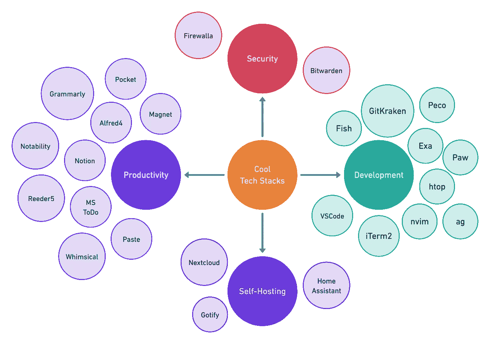

# 我的每日 25 个技术堆栈

> 原文：<https://blog.devgenius.io/my-daily-25-tech-stacks-616e1c51471b?source=collection_archive---------0----------------------->

这些应用中的每一个都让我的生活变得更容易、更高效，所以我想如果你也想这么做，我会分享它们。我将这些应用程序分为四个不同的类别:

1.  发育
2.  生产率
3.  自我托管
4.  安全

那么，什么是技术堆栈呢？**技术堆栈**或*技术堆栈*是公司用来构建和运行应用程序或项目的技术组合。



# 发育

*   [**Exa**](https://the.exa.website/) :是一个改进的文件列表器，有更多的功能和更好的默认值。它使用颜色来区分文件类型和元数据。它知道符号链接、扩展属性和 Git。它很小，很快，只有一个二进制文件。这是我的别名:

```
alias ls "exa --icons --oneline --binary"
alias ll "ls -l -g --icons --git --header --modified --sort=mod --reverse"
alias lll "ll --accessed --created"
alias lt "ll --tree --level=2"
alias lla "lll -a"
```

*   [**徐伟贤**](https://github.com/peco/peco) :简单的交互式过滤工具，太棒了！这里是用来处理历史命令的`fish`片段:

```
function peco_select_history
  if test (count $argv) = 0
    set peco_flags --layout=bottom-up
  else
    set peco_flags --layout=bottom-up --query "$argv"
  end
  history|peco $peco_flags|read foo
  if [ $foo ]
    commandline $foo
  else
    commandline ''
  end
end
```

*   [**Fish**](https://fishshell.com/) : Fish 是 Linux、macOS 和家庭其他软件的一个智能且用户友好的命令行外壳。一旦你开始在鱼壳中工作，你可能不喜欢切换到另一个壳或者回到 bash。它拥有开发人员需要的一切，如自动建议、正常脚本、VGA 颜色和许多方便的内置工具。
*   [**VSCode**](https://code.visualstudio.com/) :我敢肯定，这不需要进一步描述为什么很多开发者在 2015 年发布后突然转而使用它。因为它是免费的，轻量级的，有巨大的插件支持和许多现成的内部特性。
*   [**nvim**](https://neovim.io/) :当你在 shell 中时，快速浏览一下 shell 中的文件。这是一个基于 Vim 的超扩展文本编辑器。您可以用它覆盖您的`vim`别名，即`alias vim nvim`
*   [**ag/the _ silver _ searcher**](https://geoff.greer.fm/ag/):类似于`ack`的代码搜索工具，但是速度更快。

```
alias f "ag --ignore='/usr/local*' -i --column --silent --stats -a -m=100"
alias grep f
alias ff "f -g"
alias fff "f --context=1"
```

*   [**htop**](https://htop.dev/) :跨平台交互式流程查看器。它是一个文本模式的应用程序(用于控制台或 X 终端),需要 ncurses。现有`top`命令的高级版本，因此您可以用`htop`覆盖它，即`alias top "htop -H"`
*   [**GitKraken**](https://www.gitkraken.com/invite/utYkxNcF) :它让你复杂的 git 相关管理(重定基础、合并、冲突等)变得非常简单。这是有偿的，但物有所值。
*   [**iTerm2**](https://iterm2.com/) :比默认的`Terminal` app 好多了。
*   [**Paw**](https://paw.cloud/) : Paw 是一个全功能的 HTTP 客户端，可以让您测试和描述您构建或使用的 API。它有一个漂亮的本机 macOS 界面来编写请求、检查服务器响应、生成客户端代码和导出 API 定义。我喜欢它强大的插件支持、会话和变量管理——比`postman`更好。

# 生产力

1.  [**概念**](https://www.notion.so) :一款简单但功能丰富的笔记应用。我增加了对写作的兴趣，因为这个想法很有吸引力。；)
2.  [**显著性**](https://apps.apple.com/gb/app/notability/id360593530) :当你拿着铅笔做笔记，不打字的时候。:)
3.  [Magnet](https://magnet.crowdcafe.com/) :通过拖动、可定制的键盘快捷键或通过菜单栏激活，Magnet 通过将窗口捕捉到有组织的磁贴来清理屏幕。沉默的英雄`Ctrl + Option + Enter`是我的关键。
4.  [你可以在你的剪贴板中无缝搜索。再次强调，物有所值。](https://pasteapp.io/)
5.  [**异想天开**](https://whimsical.com/) :异想天开是思考和协作的统一工作空间。上瘾就像概念，用很少的键盘快捷键，你可以快速创建任何图表。
6.  [**Alfred 4**](https://www.alfredapp.com/) : Alfred 是一款屡获殊荣的 macOS 应用程序，它通过热键、关键字、文本扩展等提高了您的效率。我喜欢它对工作流管理的巨大支持。我为自己的工作效率定制了一些工作流程。
7.  [**口袋**](https://getpocket.com) :轻松阅读优质帖子的绝佳工具。:D 只需点击浏览器扩展，将链接添加到你的口袋账户，瞧！我也喜欢离线阅读和音频支持。
8.  [**Grammarly**](https://www.grammarly.com/) :使用 Grammarly 的人工智能写作助手撰写大胆、清晰、无错误的文字。在语法上投资[是显而易见的。Grammarly 是一个基于云的写作助手，可以实时检查拼写、语法、标点、清晰度、参与度和交付错误。](https://app.grammarly.com/)
9.  [**Reeder 5**](https://reeder.app/) :在一个应用程序中使用 Reeder、RSS 阅读器和 read later 客户端控制您的新闻阅读。我用它只是为了 RSS 和无广告体验。
10.  [**待办事项**](https://todo.microsoft.com/tasks/) :任何其他待办事项 app。没什么特别的，免费，可靠，跨平台。

# 自托管

1.  [**Nextcloud**](https://nextcloud.com/) :一个空间存储我所有的文档，无论我在哪里都可以轻松访问，并在家庭成员之间共享。
2.  [](https://www.home-assistant.io/)**:用酷炫的自动化管理我的智能家居设备。**
3.  **Gotify:我在互联网上传播了许多里程，Gotify 帮助我利用这些里程。:D**

# **安全性**

1.  **[**Firewalla**](https://firewalla.com/) :我有一个黄金的！来加强你的家庭安全。**
2.  **[**Bitwarden**](https://bitwarden.com/) :管理密码，就是这样！**

**是的，我每天都使用这些应用程序。他们中的大多数都在我的日常活动中默默地扮演着角色，如 Grammarly，Gotify，Alfred 4，Magnet 等。**

**就这样，我结束了这次学习；我希望你今天学到了一些新东西。请与更多的同事或朋友分享。最后，考虑成为[中等会员](https://zonito.medium.com/membership)。谢谢大家！**