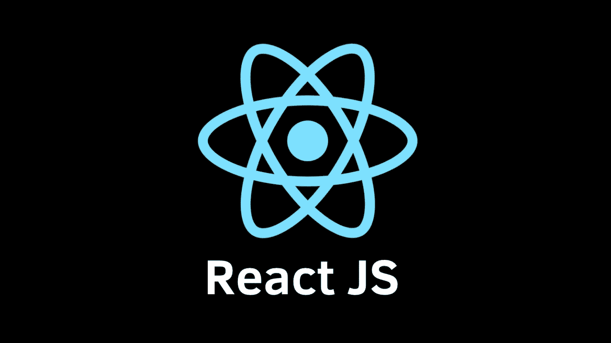

# 基本反应概念的我的 ELI5:提升状态

> 原文：<https://blog.devgenius.io/my-eli5-for-basic-react-concepts-lifting-state-up-b4b9865a35c3?source=collection_archive---------8----------------------->

像大多数偶然发现这一点的人一样，我正在自学 React 和前端开发。虽然学习有时会令人难以置信地兴奋，但如果一开始就遇到障碍，感觉自己没有理解某个关键概念，那会令人沮丧。我的一部分想让火车继续前进，但我知道充分理解基础知识是至关重要的。



我一直在遵循由 Maximilian Schwarzmüller 在 Udemy 上写的“完整的反应指南”,并发现对我来说解决一些较难的概念的最好方法是写一步一步的指南，尽可能简单地分解。我分享这些，希望至少还有一个像我一样的白痴可以帮助到他们。

我的第一次重大学习危机发生在第 59 课，关于**提升状态的讲座。**查看评论，我不是一个人。让它变得如此困难的是所有这些部分相互反馈，使得很难跟踪什么在进行，在哪里进行以及为什么进行。我的头脑需要的是某种清晰的秩序。因此，我用 Udemy 课程的例子写了这个指南。

# 第一部分

## 使用 useState 保存表单数据

在这一步中，我们正在处理一个表单，并希望保存用户输入到对象中的任何数据，这样我们就可以在第二部分中将数据发送到父组件。

**第一步**

在子组件中，选择要从中收集数据的 HTML 元素(如输入字段)并添加事件处理程序。事件处理程序是以“on”开头的特殊属性。在这个例子中，我们的事件处理程序将是`onChange`。

```
<input type=”text” onChange={}>
```

**第二步**

我们刚刚添加的事件处理程序想要接收一个函数。因此，我们将在 return 上方的同一个组件中创建一个箭头函数。根据不同的情况，有不同的方法来构建这些函数，现在，我们让它为空。

```
const titleChangedHandler = () => {};
```

现在最重要的是函数保存在一个变量中，并且在第一步中添加的事件处理程序指向这个函数。命名约定是以“Handler”结束变量名，所以我们将这个命名为`titleChangedHandler`。

```
<input type="text" onChange={titleChangedHandler};
```

**第三步**

下一步是实现一个`useState`挂钩。首先，我需要`import 'useState from 'react'`，这样我就可以在这个组件中使用钩子。

**第四步**

接下来，为了实现 useState，我使用数组析构创建了一个常量。第一个变量是我们的“状态变量”,它的值是在赋值操作符另一侧的 useState 的括号内确定的。所以我声明了一个状态变量，并设置了它的初始值(在本例中，是一个空字符串)，我将它命名为`enteredTitle`。

```
const [enteredTitle, ] = useState("")
```

数组中的第二个变量是一个更新状态的函数。标准的命名约定是以“set”开始命名。这里我将其命名为`setEnteredTitle`。

```
const [enteredTitle, setEnteredTitle] = useState("")
```

**第五步**

回到我在第二步中创建的箭头函数，我将在函数中使用`setEnteredTitle`函数，并给它一个新值。

将它放在这个箭头函数中意味着它将更新`onChange`，因为这个函数是由我作为输入元素的属性放入的`onChange`事件处理程序调用的。

所以，我返回到空的`titleChangedHandler`函数并填充它。

```
const titleChangedHandler = (event) => {
  setEnteredTitle(event.target.value);
}; 
```

当发生变化时，我放入 arrow 函数的任何参数都会自动创建一个合成事件对象。

在 event 对象中有一个`target`对象，它显示了一个键-值对的列表，这些键-值对表示发生变化的 DOM 元素(输入)的当前状态。`value`属性(在`target`属性内)保存事件发生时输入的当前值(在本例中为`onChange`)。

**第六步**

对所有表单元素重复这些步骤。

**第七步**

如果表单有一个带`type="submit"`的按钮，那么在`form`元素上我可以添加事件处理程序`onSubmit`。

```
<form onSubmit={}>
```

**第八步**

然后我可以继续添加处理函数，我称它为`submitHandler`，暂时保留为空。

```
const submitHandler = () => {};
```

**第九步**

我回到表单元素，将`onSubmit`事件处理程序指向处理程序函数。

```
<form onSubmit={submitHandler}>
```

**第十步**

需要记住的一件重要事情是，当提交表单时，默认的浏览器行为是刷新页面并向服务器(在本例中是 react 开发服务器)发送请求。但是这里我想做的是使用 JavaScript 处理表单提交，并手动使用我从表单中收集的数据，而不刷新 apge。

在 React 中实现这一点的方法是在`submitHandler`函数中访问合成事件对象，并使用`preventDefault()`方法，该方法阻止发送请求，因此我们可以继续使用 JavaScript，而无需重新加载页面。

```
const submitHandler = (event) => {
  event.preventDefault();
```

**第 11 步**

现在，在`submitHandler`函数中，我想创建一个对象，包含单击提交按钮时表单中的所有数据，我将其命名为`expenseData`。

它看起来会像这样:

```
const submitHandler = (event) => {
  event.preventDefault();
  const expenseData = {
    title: enteredTitle,
    amount: enteredAmount,
    date: new Date(enteredDate),
  };
};
```

现在我有了一个当用户点击提交时创建的对象。但是我也希望当用户单击 submit 时表单被清空。我该怎么做？

**第 12 步**

我们可以通过使用**双向绑定**将新值传递回输入。我们通过向输入元素添加`value`属性来实现这一点。我想将值设置为`enteredTitle`以将其反馈到状态中。

```
<input type="text" **value={enteredTitle}** onChange={titleChangedHandler}>
```

第十三步

现在我已经创建了输入和状态之间的双向绑定，我可以在提交时通过调用`setEnteredTitle()`并将其设置为空字符串来清除输入字段，从而清除用户输入的内容。

这仅在`value`道具已添加到输入中时有效，否则输入不能改变。因此，在`submitHandler`函数中，在`expenseData`对象之后，我将调用`setEnteredTitle("");`并对其他输入字段进行同样的操作。

```
const submitHandler = (event) => {
  event.preventDefault();
  const expenseData = {
    title: enteredTitle,
    amount: enteredAmount,
    date: new Date(enteredDate),
  };
  **setEnteredTitle("");
  setEnteredAmount("");
  setEnteredDate("");** };
```

# 第二部分

## 提升数据

好了，到目前为止，我已经在我的子组件中构建了状态，我还收集了数据并将其保存在一个对象中，并且在按下提交按钮后清除了输入字段。下一步是将数据带到父元素，我将在那里使用它。

**第一步**

在父组件中，转到正在渲染子组件的`return`,添加一个新道具。我将道具命名为`onSaveExpenseData`以明确道具的值是一个函数。

**第二步**

然后，我照常工作，将处理程序变量声明为一个箭头函数。我还将传递给它一个参数，`enteredExpenseData`，我将用它来收集子组件中的数据。

```
const saveExpenseDataHandler = (enteredExpenseData) => {}
```

**第三步**

现在，回到子组件，我必须使用`onSaveExpenseData`道具作为参数。因此，第一步是告诉`ExpenseForm`函数接受道具。

```
const ExpenseForm = **(props) => {**
```

**第四步**

现在，在`submitHandler`上，我访问`props.onSaveExpenseData`并执行它。

```
const submitHandler = (event) => {
  event.preventDefault();
  const expenseData = {
    title: enteredTitle,
    amount: enteredAmount,
    date: new Date(enteredDate),
  };
  **props.onSaveExpenseData();** setEnteredTitle("");
  setEnteredAmount("");
  setEnteredDate("");};
```

这就是奇迹发生的地方！！

我们正在执行一个位于**父组件**中的函数，因为函数的一个指针被`onSaveExpenseData`属性传递给了子组件。

**这是一个非常重要的模式！**

**第五步**

当我调用`submitHandler`函数中的`onSaveExpenseData`时，我可以将`expenseData`对象(我在上面生成的)作为参数传递。

```
props.onSaveExpenseData(**expenseData**);
```

这是给我一个`expenseData`作为父组件的参数，在`saveExpenseDataHandler`函数中。

因此，在父组件中:

```
const saveExpenseDataHandler = (**enteredExpenseData**) => {}
```

`**enteredExpenseData**` **可以**可以叫任何东西，它永远是我在子组件中设置`onSaveExpenseData`的值为的`expenseData`。

道具名`onSaveExpenseData`是我在子组件中使用的。这就是我如何在那里访问它，并把值设置为我想要提升的任何数据。当我想调出该信息并在父组件中使用它时，我就使用处理函数，在本例中是`saveExpenseDataHandler`。在处理函数中，我可以传递一个参数，它将自动包含我刚刚在子组件中设置的数据。

# 结论

希望这对某人有用。将这些步骤按逻辑顺序排列对我来说非常有用，这是我在谷歌上很难找到的。

总的来说，我是 React 和 JS 的新手，所以这篇文章中肯定会有一些语义错误，如果你注意到了，请在评论中指出来，这样我就可以修复它们。

让我们继续学习。