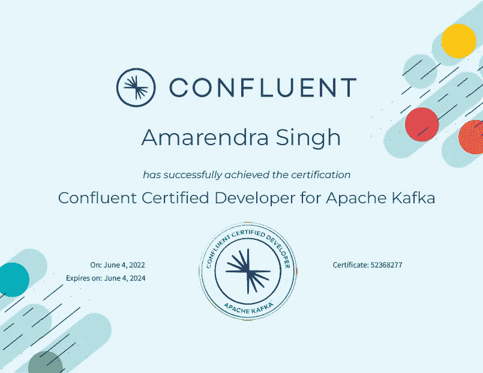

# 我获得 Apache Kafka(CCDAK)认证的融合认证开发人员的经验

> 原文：<https://blog.devgenius.io/my-experience-in-getting-the-ccdak-confluent-certified-developer-for-apache-kafka-certification-2bd6089c599c?source=collection_archive---------1----------------------->

它始于 2022 年 4 月底，当时我第一次想到给予 CCDAK 认证，因为这是除 CCAAK(Apache Kafka 的汇合认证管理员)之外唯一可用的 Kafka 认证，由[汇合](https://www.confluent.io/)进行。我在使用 Kafka 产品方面有着丰富的经验，包括 Kafka Core、Kafka Connect、basic Kafka Streams，并在生产环境中成功地创建、部署和管理了几个基于 Kafka 的项目。当我开始的时候，我没有找到任何提供与认证内容、准备工作、重要主题、考试细节等相关的所有细节的内容。在这篇博客中，我将尝试在一个地方捕捉所有这些细节，以指导您在第一次尝试中获得该认证。

我将按照一步一步的过程来构建这个博客，以获得 CCDAK 认证。这适用于所有人，无论你是 Kaka 的新手，有一些经验，还是接触过 Kaka 的许多产品，只是想通过这个认证来验证你的知识-

1.  检查认证内容
2.  验证你已经知道的和你的立场
3.  计划你的准备工作
4.  安排您的考试
5.  考试期间
6.  考试后

**查看认证内容:** 首先也是最重要的是查看考试内容。你可以在[汇合网站](https://www.confluent.io/certification/#prep-for-certification)上查看，虽然它提到了如何准备，对 CDAK 有什么要求，但没有提供涵盖哪些主题的确切细节(因为你需要了解所有内容:)。这里有一份你应该知道的卡夫卡产品清单

*   核心卡夫卡(生产者，消费者，消费者群体，经纪人，动物园管理员，主题，分区，压缩，交付保证，配置等。)
*   卡夫卡连接
*   卡夫卡溪流
*   KSQL 和 KTable
*   模式注册和 Rest 代理

**验证你已经知道的和你所处的位置:** 你可以通过参加 [Confluent 的基础认证](https://training.confluent.io/learningpath/confluent-fundamentals-accreditation)考试来验证这一点。这个考试一旦通过，会提供一个 [**数字徽章**](https://www.credential.net/c6881b48-cffd-428a-9990-0d11a8a5543b#gs.yb79cx) ，可以用来反映你对卡夫卡有了基本的了解。

计划你的准备工作:
这显然是这个过程中最重要的部分。你会对 Kafka 有一些基本的了解，并会在你的项目中使用，但要通过 CCDAK 认证，你应该准备所有的主题，因为我们不知道通过率(你只能获得通过状态或失败)。关于准备工作，我强烈推荐 Udemy 上的[夏羽·马瑞克的](https://medium.com/@stephane.maarek)阿帕奇·卡夫卡系列。

*   [阿帕奇卡夫卡系列—初学阿帕奇卡夫卡 v3](https://www.udemy.com/course/apache-kafka/)
*   [Apache Kafka 系列— Kafka Connect 动手学习](https://www.udemy.com/course/kafka-connect/)
*   [Apache Kafka 系列—用于数据处理的 Kafka 流](https://www.udemy.com/course/kafka-streams/)
*   [Apache Kafka 系列 ksqlDB 上的 KSQL 进行流处理！](https://www.udemy.com/course/kafka-ksql/)
*   [Apache Kafka 系列—融合模式注册表& REST 代理](https://www.udemy.com/course/confluent-schema-registry/)

推荐这些课程的一些原因是-

*   你可以在同一个地方由同一个老师教授所有的考试内容，所以你可以很容易地适应他的教学技巧、速度等。
*   这些课程非常清晰，并提供了关于每一种卡夫卡产品的深入信息

如果你学习了这些课程，并且做了实践练习，你应该准备好参加考试，但是我建议你详细阅读《卡夫卡权威指南》中的概念，这本书是由卡夫卡的创作者写的。

如果你从卡夫卡开始，考虑花足够多的时间(至少 2-3 个月)完成这些课程，包括实践练习和理解概念。如果你已经在用卡夫卡，写生产者，消费者，卡夫卡连接等等。你可以跳过其中的一些课程(你仍然可以这样做来提高你的技能)。

完成培训材料后，您需要一些好的测试来验证您的学习。不幸的是，没有太多的模拟测试可用，但夏羽再次来拯救这里:)他的 3 套 50 个独特的问题在每一套。这让你对自己的准备工作充满信心，也为你的回答提供了主题分析。然后，您可以专注于这些特定的领域，并再次重试测验。

*   [CCDAK Confluent Apache Kafka 测试认证开发人员](https://www.udemy.com/course/confluent-certified-developer-for-apache-kafka/)

**安排考试:** 您可以将 CCDAK 考试安排在[考试](https://prod.examity.com/Confluent/)。我把我的考试安排在我做好准备后的第一天，但是你可以为你的准备设定一个时间表，甚至可以在开始准备前安排。

你可以在考试前 48 小时重新安排考试时间。要在接下来的 24 小时内安排考试，你需要支付一些额外的费用。

CCDAK 监考考试的费用——150 美元+适用的地方税

印度 CCDAK 的费用——我将考试安排在 2022 年 6 月 3 日，必须支付大约 14，440 印度卢比(含税)

查看 https://www.confluent.io/certification/的常见问题解答

**考试期间:** 在你的考试日，尽量保持平静，放松。如果你准备好了，你会做得很好，很容易获得认证。
您需要在在线监考人的监督下，在 90 分钟内通过笔记本电脑(带网络摄像头)回答 60 道选择题。没有负面评分，所以请尝试回答所有问题。
confuent 并没有为了通过考试而指定正确的题数或分数百分比。考试结束时将立即显示结果(通过或失败)。没有提供分数或百分比。

**考试后:** 一旦你完成了考试，你会立即在屏幕上看到结果，你也会在你的电子邮件上看到结果。
如果你通过了考试，你将从 Confluent 的电子邮件中获得[证书和徽章](https://www.credential.net/7f1e8041-a332-4002-bde2-3e22095f23a3)。这封邮件还列出了加入这个排外团体要做的以下事情

1.  **加入**汇流的专属 [LinkedIn 汇流认证群](https://www.linkedin.com/groups/8967626/)
2.  **在[社区 Slack](https://join.slack.com/t/confluentcommunity/shared_invite/zt-rsph55gh-ayipVttndzQtWnWPGAepgQ) 上订阅**到#认证频道
3.  **在[社区论坛](https://forum.confluent.io/c/certification-and-training/30)上为认证和培训页面添加书签**
4.  **参观 confluent.io/certification**T2

**一些小技巧:**

1.  为考试做好准备，如果你完成了考试内容，你将很容易通过认证。
2.  考试价格不提供重考。您只能在 14 天后重新参加考试，并且必须再次支付全部费用。所以只有当你有足够的信心时，才安排它。
3.  没有负面评分，所以请尝试回答所有问题。
4.  时间不是这次考试的问题，所以试着一次回答所有的问题，并再次重温所有的问题进行验证。
5.  不要浪费时间搜索 CCDAK 认证转储，没有任何可用的。如果你遵循这里描述的课程并理解概念，你会在考试中取得好成绩。
6.  对我来说，大多数问题来自 Kafka Streams 和 KSQL，所以要确保你在这些领域有很好的掌握。
7.  每个产品中一些非常重要的主题-

> **核心 Kafka** -分区、段、日志保留和清理策略、复制、生产者确认、min.insync.replica、序列化/反序列化、生产者配置- linger.ms、batch.size、最大传输连接、消息密钥、消费者组和消费者、消费者偏移、交付语义、提交策略、交付保证、一些 Kafka CLI 命令、消费者重新平衡和静态组成员资格、压缩、分区分配器等。
> 
> **Zookeeper**-Zookeeper ensemble，zookeeper cluster 承受 N 个服务器的损失，需要 2N+1 个服务器，Zookeeper tickTime，initLimit 和 syncLimit
> 
> **Kafka Connect** -源连接默认配置，宿连接默认配置，Debezium 允许最大任务数等于相关表的数量
> 
> **Kafka 流和 KSQL**——拓扑、有状态操作符、无状态操作符、窗口、KStream、KTable、GlobalKTable、连接、共同分区概念、写入主题并获取新流、KStream 到 KTable 以及反之亦然、恰好一次、使用持久卷状态存储、KSQL CLI 命令、推送查询、合并流等。
> 
> **融合模式注册表** - Avro 格式、模式兼容性、模式演化、模式存储位置、模式缓存等。
> 
> **Rest 代理** -消息的编码和解码，支持的类型，

**结论:**每次考试都需要好好的准备和练习。准备工作确保你很好地理解了这些概念，并且能够在各种设计中应用它们。你不要只是为了通过考试而不把你的知识应用到关键的设计场景中，做出更好的产品，回馈社会。

祝你考试顺利，我知道你会成功的。