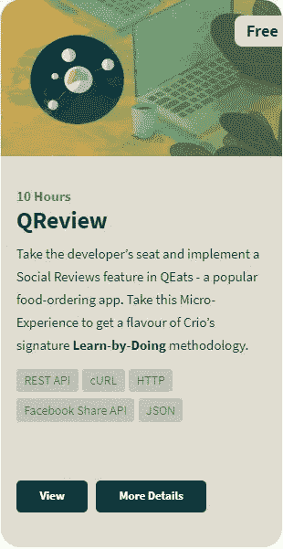
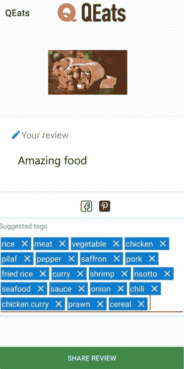
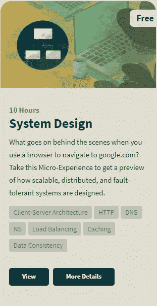
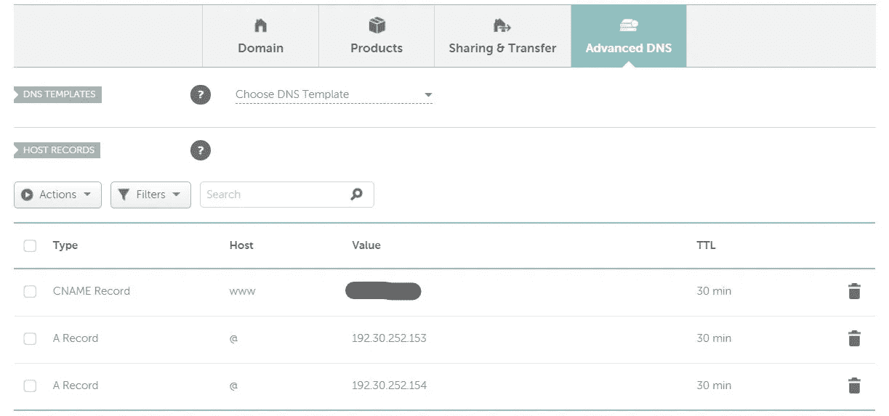

# 我参加 Crio.do 的# IBelieveinDoing 挑战的经历

> 原文：<https://blog.devgenius.io/my-experience-with-crio-dos-ibelieveindoing-challenge-e9618e1329ac?source=collection_archive---------9----------------------->

## 我是如何通过亲身实践来学习构建软件产品的技术的。#LearnByDoing

来源: [Crio.do](https://crioforms.typeform.com/to/r5N7TQ)

## 让我先介绍一下 Crio.do。

与其他视频或导师驱动的学习平台和训练营不同，Crio.do 是一个体验式学习平台。Crio 独特的技术平台和结构化的教学方法为学习者提供了体验类似工作的产品开发场景和获得相关技能的机会。

我参加了 Crio.do 的# IBelieveinDoing 挑战赛，完成了 QReview 和 qp 系统设计微体验。完成第一个挑战后，我获得了很多关于 REST APIs、Django 框架、Python 请求、cURL、JSON 解析的知识。

# 回顾

QEats 是一款流行的点餐应用。它给用户提供了附近餐馆和受欢迎菜肴的列表。这个应用程序上最受欢迎的功能是能够在他们的脸书页面上分享评论，还可以建议与用户上传的图片相关的标签。如果我说 Crio 团队依靠我的专业知识来开发这项功能，你会相信吗？

在这个微型体验中有 3 个模块。

## 模块 1:

模块 1 中给出的任务是将消息和图像发布到脸书页面。我不得不仔细阅读脸书的 Graph API 文档，以确定正确的请求，并使用 Python“请求”库发布消息。在文档页面中，请求以 cURL 的形式给出。所以我还必须理解 cURL 命令，并将其转换成 Python 请求。

## 模块 2:

模块 2 中给出的任务是将 QEats app 的评论分享给脸书。对于这个任务，我从我的 Crio 工作区启动了应用程序的后端服务器，并使用我的工作区 URL 登录到应用程序。然后我发表了一篇来自后端服务器和应用程序本身的评论。您也可以使用您的页面 ID 和页面访问令牌将评论发布到您自己的脸书页面。

## 模块 3:

模块 3 中给出的任务是使用 Clarifai API 的食物模型生成与用户上传到应用程序的图像相关的标签。Clarifai API 的响应是 JSON 格式的。所以我使用“json”库来加载响应文本，并将所有的名字解析到一个列表中。

最后一步是通过在 views.py 文件中进行必要的更改，将标签建议发送到应用程序，瞧！标记功能已启动并正在运行。

我还学习了 Django 框架，以理解应用程序后端的工作。

在完成 QReview 微体验之后，我已经开始着手于 QPrep 系统设计微体验。

# qp-系统设计

## 到底什么是系统设计面试？

相信我，我开始做这个微体验的时候也是这种情况。我对此一无所知。但是我对学习系统设计和完成任务很感兴趣。

因此，系统设计面试需要关于如何构建健壮的、功能性的和可伸缩的系统的广泛知识。与编码面试不同，在编码面试中，一个编码问题的解决方案要么是客观正确的，要么是不正确的，在系统设计问题中，有更多的主观性。一个系统设计问题的解决方案可能没有客观的正确或错误。我们的工作是证明为什么我们用一种方式而不是另一种方式来设计一个系统。为此，理解设计的基本原理是至关重要的。客户端-服务器模型、网络协议等概念是非常基础的设计基础。我们需要了解的一些其他设计基础是代理、数据库、对等连接、缓存、服务器等。

说到微观体验，我需要完成四个模块。

## 模块 1:

在模块 1 中，给出的任务是在云中创建一个虚拟机。首先，我创建了一个 GCP 账户。(如果你能证明自己是学生，GCP 为学生提供免费计划)。我在 GCE 中创建了一个虚拟机——谷歌计算引擎。下一个任务是添加静态 IP。一旦虚拟机启动并运行，就会为其分配一个外部 IP 地址，该地址可能会在虚拟机重新启动时发生变化。因此，如果我们不想改变静态 IP，我们就添加它。

下一个任务是运行 HTTP 服务器来托管网页/网站。我在虚拟机上安装并配置了 NGINX 服务器。现在服务器启动了，如果我在浏览器的地址栏中输入虚拟机的外部 IP 地址，我就可以看到托管的网页。

## 模块 2:

模块 2 中给出的任务是关于购买一个域并将我们的虚拟机分配给它。作为 Github 学生包的一部分，学生可以获得一个免费的域名。然后，我配置 DNS 来指向我的虚拟机。我用我的虚拟机的 IP 地址创建了一个“A”记录，几分钟后，我就可以通过在浏览器的地址栏中键入域名来访问我的虚拟机。我还使用 **nslookup** 命令对域名进行了域名服务器查找，以找到域名服务器。

## 模块 3:

这个模块是关于**负载均衡**的。负载平衡是在多台服务器之间分配网络流量的过程。这确保了没有一台服务器承担过多的需求。

在本模块中，任务是克隆现有虚拟机，并将其 IP 地址分配给 DNS。在 ping 域名时，我们可以观察到 ping 命令有时返回虚拟机的 IP 地址，有时返回其克隆的 IP 地址。

## 模块 4:

第四个模块是关于**内容交付网络** (CDN)。CDN 是一个分布式服务器(网络)系统，根据用户的地理位置、网页的来源和内容交付服务器，向用户交付页面和其他 web 内容。

我选择了一个 CDN 提供商，并通过从本地服务器和 CDN 提供静态图像来比较性能。

我在一个实时项目上工作，学习系统设计，这是一次很棒的经历。我非常感谢 Crio.do 提供了一个惊人的平台来学习真正的技术实践。

查里莎。