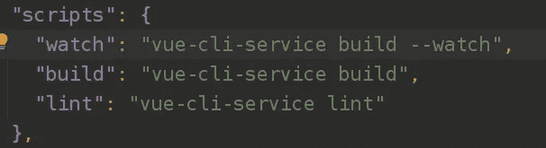

# 到目前为止，我使用 Vue 3 和 Typescript 的经验

> 原文：<https://blog.devgenius.io/my-experience-with-vue-3-and-typescript-so-far-564bb65d4e39?source=collection_archive---------1----------------------->


[https://unsplash.com/photos/C7jBZEGciCU](https://unsplash.com/photos/C7jBZEGciCU)

> 本文原载于我的博客:[https://Marvin Blum . de/blog/my-experience-with-vue-3-and-typescript-so-far-bZ1DQzJdjK](https://marvinblum.de/blog/my-experience-with-vue-3-and-typescript-so-far-bZ1DQzJdjK)

我最近开始为 [Pirsch](https://pirsch.io/) 开发用户界面，很高兴听到 Vue 3 [已经正式发布](https://news.vuejs.org/issues/186)并标记为生产就绪。虽然大多数其他核心库，如 vue-router 和 vuex，仍处于测试阶段，但我不想在 Vue 2 上构建。不要误解我，Vue 2 是一个很好的框架并且很稳定，但是我对我构建前端的方法不再满意了。

这篇文章是关于过渡到一个新的项目设置，我在 Vue 3 中的第一步，以及我使用它和 TypeScript 的经验。我将提供代码示例，并强调几个我认为有用且令人耳目一新的特性。

# 一些背景

当他们从版本 1 过渡到版本 2 时，我开始学习 Vue，并且我很快建立了自己的设置，忽略了通过 vue-cli 设置项目的默认方式。然而，这一次，我只是想使用现有的东西，而不是用我的头脑去建立像 webpack 这样的东西。此外，我想尝试一下 TypeScript，这是我很久以来一直回避的东西，主要是因为我认为它会在普通的 JavaScript 之上增加一个额外的抽象层，这对我来说似乎是不必要的。我们最近开始开发一款名为 [Pirsch](https://pirsch.io/) 的新产品，它的前端相当简单，我借此机会尝试了一些新东西。由于我是打字初学者，如果你发现任何奇怪或明显的错误，请告诉我。

# 设置

建立一个新的 Vue 3 项目的最好方法是安装并使用 [vue-cli](https://cli.vuejs.org/) 。


运行`vue create <name>`设置一个新项目。

该命令将在`test-app`目录下生成一个新项目，并创建基本结构。请注意，您必须在开始时从`Manually select features`选项中选择 Vue 3 和 TypeScript，因为它仍然被标记为实验性的。


新 Vue 3 项目的现成项目结构。

到目前为止没有什么令人惊讶的，但真正让我惊讶的是一切开箱即用。我曾经有两个命令，一个用于构建 Vue 应用程序本身，一个用于编译 Sass 文件。有了这个新的设置，我只需将文件放在`public`目录中，它们就会被自动编译成 CSS。

我所做的唯一更改是删除了`assets`文件夹，并向`package.json`添加了一个命令，以便在发生变化时进行重建(build 仍然用于产品发布)。



非常精瘦的`package.json`。

我过去常常将我的应用程序嵌入到一个定制的 Go 服务器中，以控制配置、标题、文件提供方式、更简单的部署，当然还可以添加一些功能。默认情况下，`build`和`watch`命令会将编译后的文件放到根目录下的`dist`文件夹中。应用程序本身是 Go 服务器的一个子目录。


之前，我只是服务于整个 UI 目录，但这次我必须选择`dist`下的目录才能使其工作。

```
server.ServeStaticFiles(router, "/js/", "ui/dist/js")
server.ServeStaticFiles(router, "/css/", "ui/dist/css")
server.ServeStaticFiles(router, "/img/", "ui/dist/img")
server.ServeStaticFiles(router, "/fonts/", "ui/dist/fonts")
router.HandleFunc("/favicon.ico", func(w http.ResponseWriter, r *http.Request) {
    http.ServeFile(w, r, "ui/dist/favicon.ico")
})
router.PathPrefix("/").HandlerFunc(func(w http.ResponseWriter, r *http.Request) {
    http.ServeFile(w, r, "ui/dist/index.html")
})
```

注意`ui/public`的每个子目录都会在`dist`内部创建一个目录，所以你需要在 Go 中将其添加到路由器中。`favicon` 和`index.html` 是我目前仅有的特殊文件。索引是最后提供的，因为无论访问者在哪个页面，都需要发送索引。如果有人访问`yourdomain.com/foo/bar`，服务器会尝试在`foo/bar`中查找索引文件。

# 组合 API

您可能已经听说过复合 API。这是一种定义组件结构和行为的新方法，与使用对象符号定义组件的传统方法并存。我开始只是使用 Composition API 来设定目标，因为我看过的视频看起来很有希望。你仍然可以使用传统的方式来定义你的组件，但是到目前为止，我对此非常满意。万一你打算从 Vue 2 升级，你不需要重写一切。但是如果你开始一个新项目，我会建议你马上使用 Vue 3。

我是在不得不实施多次下拉的时候爱上的。这是 Pirsch 的一个例子，当我构建菜单时，必须添加四个下拉菜单，它们在功能上是一样的。


皮尔希菜单的早期版本。

有一个用于域、资源、时间框架和您的帐户的下拉列表。从功能上讲，它们都是一样的。你点击菜单项，它就打开了。如果您单击下拉列表之外的任何地方，它将关闭。解决这个问题的一种方法是创建一个组件并在任何地方重用它，但是在这种情况下，HTML 结构略有不同。有了新的 Composition API，你可以将这个问题外包到它自己的文件和函数中，并在你需要的组件中使用它。

```
import {ref, Ref} from "vue";// This defines which attributes and functions will be available to the component.
interface Dropdown {
    dropdownElement: Ref<HTMLElement>
    dropdown: Ref<boolean>
    toggleDropdown(): void
}// And this is the re-usable function which will be called from the components.
export function useDropdown(): Dropdown {
    const dropdownElement = ref(document.createElement("div"));
    const dropdown = ref(false); function toggleDropdown() {
        dropdown.value = !dropdown.value;
    } window.addEventListener("mouseup", e => {
        const element = dropdownElement.value; if(/* ... */) {
            dropdown.value = false;
        }
    }); return {
        dropdownElement,
        dropdown,
        toggleDropdown
    };
}
```

作为一个例子，这是你可以在上面的截图中看到的域选择。

```
<template>
    <div class="selection cursor-pointer" v-on:click="toggleDropdown" ref="dropdownElement">
        <span>{{activeDomain.hostname}}</span>
        <div class="dropdown" v-show="dropdown">
            <div v-for="domain in domains"
                 :key="domain.id"
                 v-on:click="switchDomain(domain)">{{domain.hostname}}</div>
        </div>
    </div>
</template><script lang="ts">
    import /* ... */; export default defineComponent({
        setup() {
            /* ... */ return {
                ...useDropdown(),
                /* ... */
            };
        }
    });
</script>
```

只需要将函数添加到设置函数的返回语句中，boom！您可以使用模板中的功能。我还有更多这样的例子，但我想你们已经明白了。

# 组件结构

Composition API 的另一个主要好处是，您现在可以按照自己想要的方式构建代码。一个组件可能需要数百行代码，这取决于你的应用程序的复杂程度(多亏了 Composition API，这应该不会再那么容易了)，你必须以某种方式将数据、方法和其他部分分开。编辑大型组件自然包括大量的滚动，例如，看不到您在方法内部处理的数据。但是，现在您可以在使用数据的函数上方定义数据，并将其混合。所以与其有这样的东西。

```
<template>
    <!-- lots of code -->
</template><script>
    import /* ... */; export default {
        data() {
            return {
                foo: 42,
                /* far away from each other! */
                bar: ""
            };
        },
        /* maybe even more code */
        methods: {
            methodA() {
                this.foo++;
            },
            /* 500 lines of code */
            methodB() {
                this.bar = "Hello World!";
            }
        }
    }
</script>
```

您现在可以让它更容易阅读。

```
<template>
    <!-- lots of code -->
</template><script lang="ts">
    import /* ... */; export default defineComponent({
        setup() {
            const foo = ref(42);

            function methodA() {
            	foo.value++;
            }

            /*  500 lines of code */

            const bar = ref("");

            function methodB() {
            	bar.value = "Hello World!";
            }

            return {
            	foo,
                methodA,
                bar,
                methodB
            };
        }
    });
</script>
```

您甚至不需要向模板公开所有数据。想象一下`foo`只是内部使用。你仍然需要在`data`中定义它来访问它。现在，你可以在`setup`中使用一个常规变量。

# 带类型脚本的泛型

另一个让我对自己使用 TypeScript 的选择感到非常满意的时刻是我必须实现列表的时候。列表通常用于显示表格中的数据。它们通常由“我的应用程序”中的“卡片”组成，显示它是什么，以及一些额外的字段和按钮来编辑或从列表中删除它们。


我知道此刻这看起来不太好…

由于列表是在页面上使用的，我不想一遍又一遍地重复实现它们。您可能会猜到我使用了组合 API 来实现该行为，但是这次它必须是通用的。

打字稿的优势是…你知道…检查类型。所以我们想建立一个类型保存的可重用函数。正如你在上面看到的，它需要支持`User`类型，还有`Client`类型。为此，您可以使用泛型。

```
interface ListEntry {
    id: number
}interface List<T extends ListEntry> {
    /* ... */
}export function useList<T extends ListEntry>(): List<T> {
    const entries = ref<T[]>([]);
    const selectedEntry = ref<T>(); /*  */ return {
        entries,
        selectedEntry,
        /* ... */
    };
}
```

这里的导入部分是`ListEntry`，它为我的应用程序中的所有实体定义了一个接口。它们都有一个 ID，用于 Vue 中的`:key`属性，也用于在列表中添加和删除条目。下面是你如何利用它。

```
setup() {
    const {entries, addEntry, removeEntry /* ... */} = useList<User>();

    /* ... */

    return {
        entries,
        addEntry,
        removeEntry,
        /* ... */
    };
}
```

# 模板

模板基本保持不变，但是有一些变化让我更加喜欢 Vue 3。对我来说最突出的一点是，你不再需要为你所有的组件都有一个根元素。所以像这样定义组件的模板是没问题的。

```
<template>
    <h2>Email</h2>
    <form v-on:submit.prevent="save">
        <FormInput label="Email Address" name="email" type="email" v-model="email" :err="validationError('email')" />
        <FormSubmit value="Save" />
    </form>
</template><script lang="ts">
    /* ... */
</script>
```

乍一看，这似乎并不重要，但在 Vue 2 中，有时不得不人为地向组件添加一个根元素，即使它不是样式或结构所必需的。

# 结论

我还可以谈很多，比如用 linter 来保持代码的整洁，但我认为这已经足够了。当我对 Vue 3 和 TypeScript 有更多的经验时，我可能会写一篇后续文章。在相当长的一段时间里，我拒绝转换到可能被认为是最佳实践的方法。如果你和我一样，需要知道所有东西是如何工作的，甚至是项目设置，确保你不要浪费时间去做这些，而是花时间去做一些有用的事情。

如果你现在有了尝试 Vue 3 的灵感，你可以阅读[的介绍](https://v3.vuejs.org/guide/migration/introduction.html#render-function)，它比我更好地展示了 Vue 2 和 3 之间的主要和次要差异。