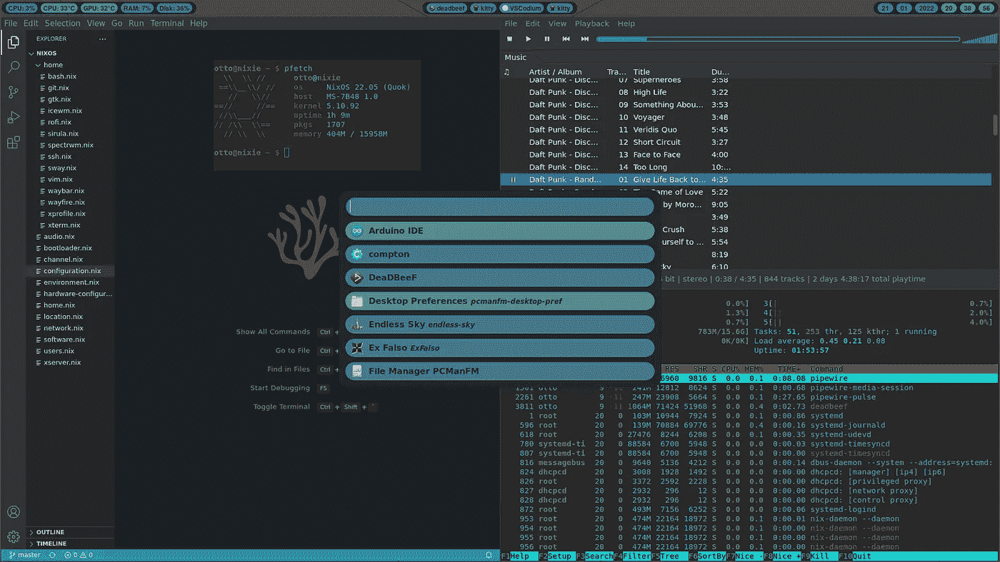

# 我在 2022 年与威兰和 AMD 的经历

> 原文：<https://blog.devgenius.io/my-experiences-with-wayland-and-amd-in-2022-6ca4bfc68fd2?source=collection_archive---------2----------------------->

我的 Sway 桌面

## 一些背景

今年 1 月，我写了一篇关于 Nvidia 显卡(RTX 2070 超级版)在 Wayland 上的表现。本文是那篇的[的延续，所以你不妨在这篇之前先看一遍，了解一下这篇文章中一切的来龙去脉。](/wayland-and-nvidia-in-2022-2f0407fb34f4)

在发表那篇文章之前，我卖了 Nvidia 卡，买了一个 AMD 显卡。具体来说，我买了两个 4GB 的 RX580s。一个用于运行我的操作系统，另一个用于直通虚拟机。

这应该在韦兰提供更好的体验，但它做到了吗？

## 最初的想法

正如我在上一篇关于 Wayland 的文章末尾所讨论的，我已经在我的笔记本电脑上进行了实验。然而，我只是在拿到了台式机的显卡后才真正开始玩它。

我注意到的第一件事是，基于 wlroots 的合成器不再有我在 Nvidia 卡上遇到的图形问题。此外，OBS 在一些修补后工作。

我还能够在没有不支持 gpu 标志或任何类似标志的情况下启动 Sway，尽管在我看来这根本不应该是一件事。

然而，我对 Wayfire 有一些问题。这将需要非常长的时间来启动，并会显示一个灰色的屏幕，而加载的东西。

## 其他排字工人

我还尝试了我在 Nvidia 卡上测试过的许多合成器，这让我能够找出当时我的方法中的错误。除了 KDE，排字工人无法运行可能与我的 Nvidia 卡无关。

那些不运行或出现空白屏幕的仍然在 AMD 卡上执行相同的操作。这使我认为问题不在于我的硬件与合成器的兼容性，而在于我为它们使用的配置，这些配置几乎是它们的文档中的默认配置，但经过修改，包括了我需要做一些事情的键绑定。

这使得许多排字工人的体验很差。我能够用光算出一个半功能配置，现在我可以在其中启动一个终端等等，这进一步支持了我关于配置是问题所在的假设。然而，我不喜欢光占用我的整个键盘，以至于我不能输入 TTY。我也有过类似的纸板故事。

因此，我主要使用 Sway。

## 长期经验

我现在几乎专门经营 Wayland 两个月了，我想从讨论 Wayfire 问题开始。很长一段时间，它让 Wayfire 对我来说无法使用。然而，几天前我发现了一个解决方法。使用命令“dbus-run-session wayfire”而不是“wayfire”启动它已修复该问题。默认启动似乎没有正确初始化 dbus 会话。

就斯威和韦兰的总体情况而言，我的经历基本上是正面的。

元素在屏幕上的移动非常平滑，几乎没有撕裂。与 X11 相比，这也是一个相当大的区别。结果，一切看起来更精致了。

我没有遇到任何会影响我的使用和所有附件工作的输入延迟，包括游戏控制器、HOTAS、鼠标、键盘和 Wacom 绘图板。Wacom 平板电脑可以工作，但笔顶部的橡皮擦的功能就像普通笔尖一样。没什么大不了的，但如果没有别的，就是有点不方便。

OBS 也行，虽然我只能录我整个屏幕。屏幕共享在 Google Meet 和 Zoom 中也以类似的方式工作。微软团队在 Firefox 中没有音频，在桌面应用程序中缺乏屏幕共享，这很可能是在 XWayland 下运行的。

说到 XWayland，它运行得非常完美。屏幕共享显然无法通过它工作，因为窗口在 Wayland 中是孤立的，它不能利用 Wayland 的捕捉工具，但除此之外，X11 应用程序感觉完全是本机的，一切都完美地工作。也没有性能问题。

此外，我非常喜欢能够在合成器的配置文件(Sway 和 Wayfire)中设置我的显示和输入设置，而不是使用 X11 中配置屏幕刷新率的可怕功能。另一方面，许多合成器期望第三方软件(kanshi)来完成这种配置，所以当我更深入地研究其他合成器时，我将不得不使用它。

我也喜欢用自己的命令启动合成器，而不是 startx，在 startx 中，我需要在一个文件中选择一个 WM。

除了一件事，其他的事情都很好。

## 主要问题是

生活并不总是容易的，这里也不容易。在这种情况下，Firefox 再次成为问题。

所有的网络浏览功能都如预期的那样完美运行。我没有像在 GNOME 中使用 Nvidia 卡时那样遇到标签问题。然而，浏览器每天会无缘无故地在我身上冻结多次，这非常令人沮丧。任何音频都会继续播放，但浏览器不会对任何内容做出反应，视觉效果也不会改变。在这些情况下，我也不能通过 Sway 的正常关闭键来关闭它。我每次都要经历在 htop 中杀死 Firefox 的麻烦。

我也试过铬，但那更糟。它有一个闪烁的黑框，有时出现在左上角。此外，拖动标签是不可能的，所以标签卡在一个地方。移动它们的唯一方法是固定一个，然后不断重复固定标签，直到它们排列整齐。

因此，我回到了 Firefox，但解决方案可能是可行的。我暂时回到 X11 上，因为我现在不想让我的浏览器崩溃，但到目前为止，我一直使用火狐的 97 和 98 版本，这两个版本都有我在 Wayland 上提到的问题。不过，我现在已经换成了 ESR 版的火狐。虽然我还没有使用它足够长的时间来得出任何正确的结论，但它已经在 X11 中提供了相当大的改进，在 X11 中，登录后第一次启动版本 98 将需要很长时间。如果 Wayland 问题以类似的方式特定于版本，使用 Firefox 的 ESR 版本可能会解决该问题。同样，对普通 Firefox 的进一步更新可能会及时解决这个问题。

## 结论

总之，我在 Wayland 上使用 AMD 的体验比在 Nvidia 上好得多。我不仅可以在没有图形问题的情况下使用 wlroots 合成器，而且几乎所有其他东西都工作得非常好。

现在唯一可能让我回到 X11 的是 Firefox，但如果 ESR 版本或新的更新解决了我的问题，我就没有理由再使用 X11 了。功能上，韦兰感觉好多了，所以我真的希望这个问题得到解决。