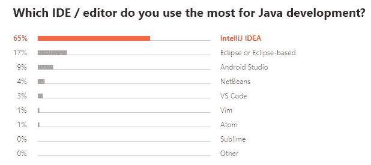
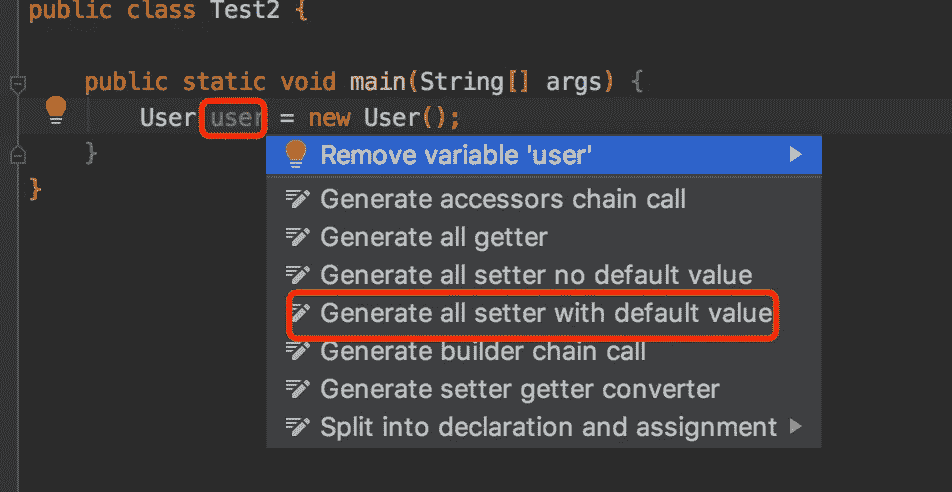
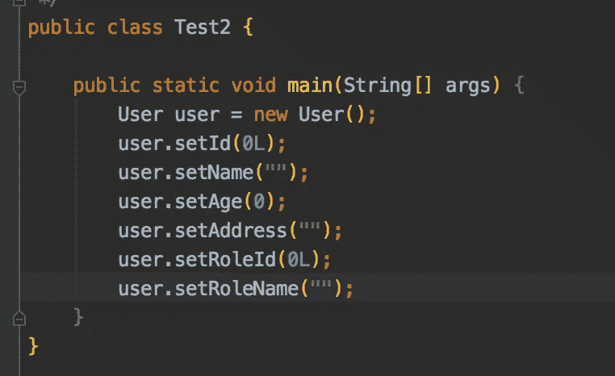
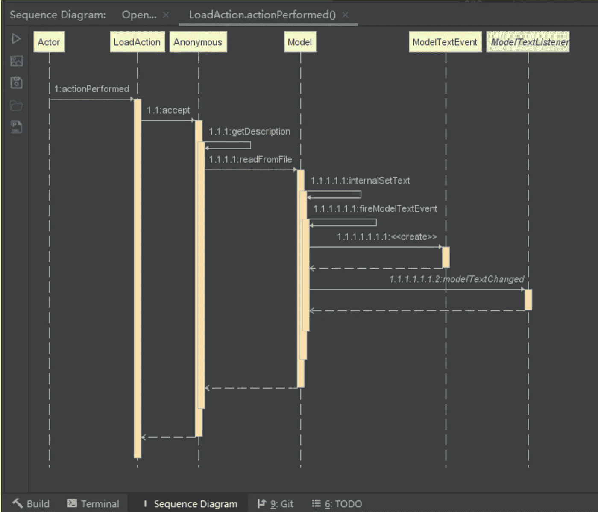
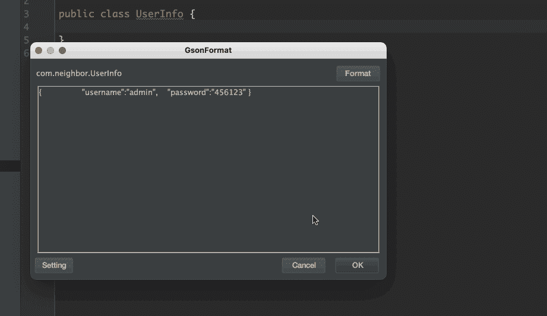
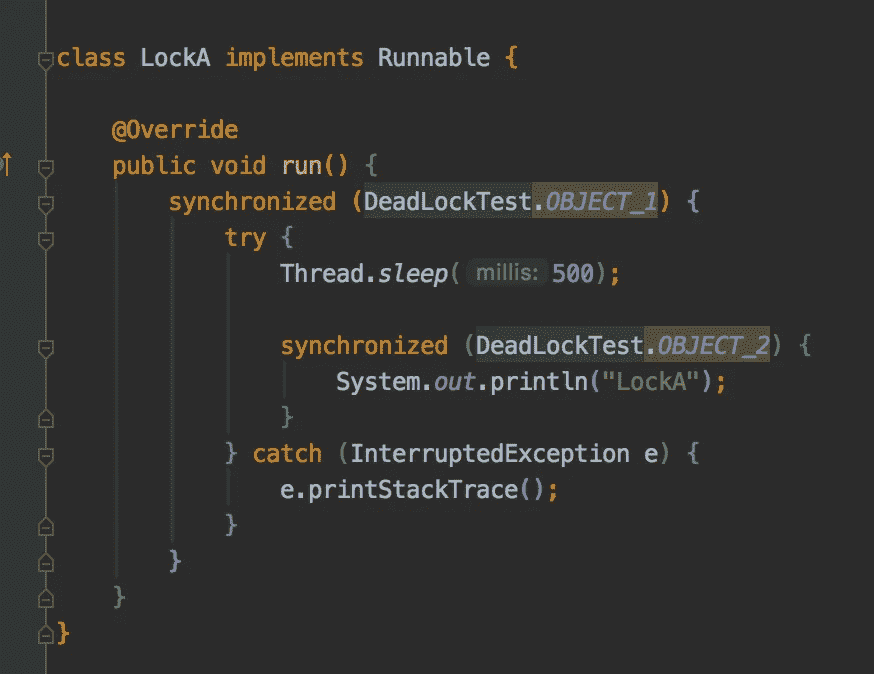
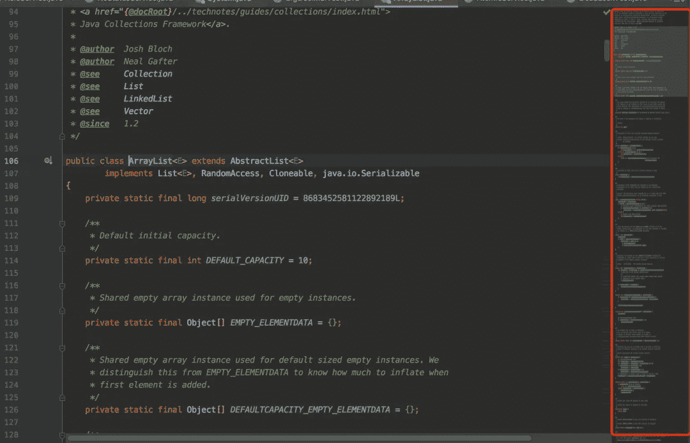

# 我最喜欢的 5 个 IntelliJ 插件可以提高你的工作效率

> 原文：<https://blog.devgenius.io/my-favorite-5-intellij-plugins-that-can-boost-your-productivity-b30ac73389ce?source=collection_archive---------0----------------------->

> IntelliJ 已经成为 2022 年 Java 开发中使用最多的 IDE。

[https://www . javacodegeeks . com/2019/11/visual-studio-code-vs-intellij-idea-which-is-best-for-Java-devs . html](https://www.javacodegeeks.com/2019/11/visual-studio-code-vs-intellij-idea-which-is-best-for-java-devs.html)

在这篇文章中，我将分享我在日常开发中使用的五大插件，它们可以帮助你提高工作效率。

# 1.GenerateAllSetter

作为开发者，我们总要*新()*点什么。想象一下，一个对象有 10 多个属性，但是你只在一个简单的测试用例中需要它，你必须一个接一个地调用所有的 setters，这非常耗时。

这个插件可以帮助你在一个类中生成所有带有默认值的 setters，而不会遗漏任何东西。

现在，物体的**越大**，你节省的**时间就越多**。

# 2.顺序图

你有没有试过点击一个又一个方法，只是为了看看到底发生了什么？

安装插件后，右键单击您想要探索的方法:

这个插件帮助你自动生成一个带有漂亮标签和颜色的方法序列图。您还可以将其导出，用于团队交流或文档记录。

# 3.GsonFormat

在我的工作中，我们的许多 API 使用 JSON 作为请求和响应对象。有时我们必须通过输入类名和属性名来创建新的 Java 对象。

如果有一个工具可以根据 JSON 对象为我们自动生成一个 Java 类呢？

现在，您可以将预定义的 JSON 对象传递给 Java 类，插件会帮助您生成所有必需的字段和注释。

[https://medium . com/Java re visited/5-useful-intellij-idea-plugins-to-improve-your-coding-efficiency-36bc 75440477](https://medium.com/javarevisited/5-useful-intellij-idea-plugins-to-improve-your-coding-efficiency-36bc75440477)

# 4.彩虹括号

我知道 IntelliJ 为括号对内置了高亮。但是，当有更多的括号和更多的层时，我们可以利用彩虹括号来帮助我们更快地识别括号对。

# 5.代码浏览

最后，当我们的代码变得越来越长时，我们必须一路滚动来找到错误或方法。这个代码浏览插件提供了一个代码结构的**缩小**视图，让我们更快地找到我们想要的代码块。

您可以选择将其设置为显示，或者仅当鼠标悬停在滚动条上时隐藏。

你最喜欢的 IDEA 插件是什么？分享你的想法！

我希望这篇文章对你有所帮助。

我是后端软件工程师。如果你渴望了解技术，请关注我的频道，了解我在日常工作和生活中获得的灵感。

> ***阅读更多:* -**-[IntelliJ 中的主调试](https://medium.com/geekculture/master-debugging-in-intellij-9115d03f895a)-[系统设计面试要知道的一个重要定理](https://medium.com/p/a-important-theorem-to-know-for-system-design-interviews-9bceaa07daf2)
> - [高并发场景下使用 CompletableFuture 和阻塞队列的批处理](https://medium.com/p/batch-processing-using-completablefuture-and-blocking-queue-under-high-concurrency-scenario-3a1f8478588a)
> 
> ***获取连接:***[我的 LinkedIn](https://www.linkedin.com/in/daini-wang-5127b2182)