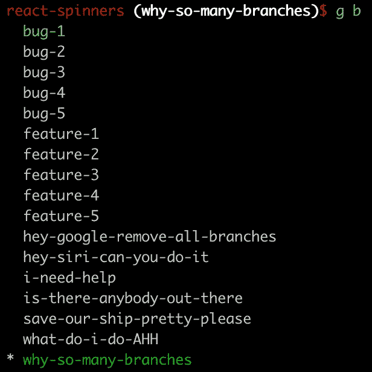
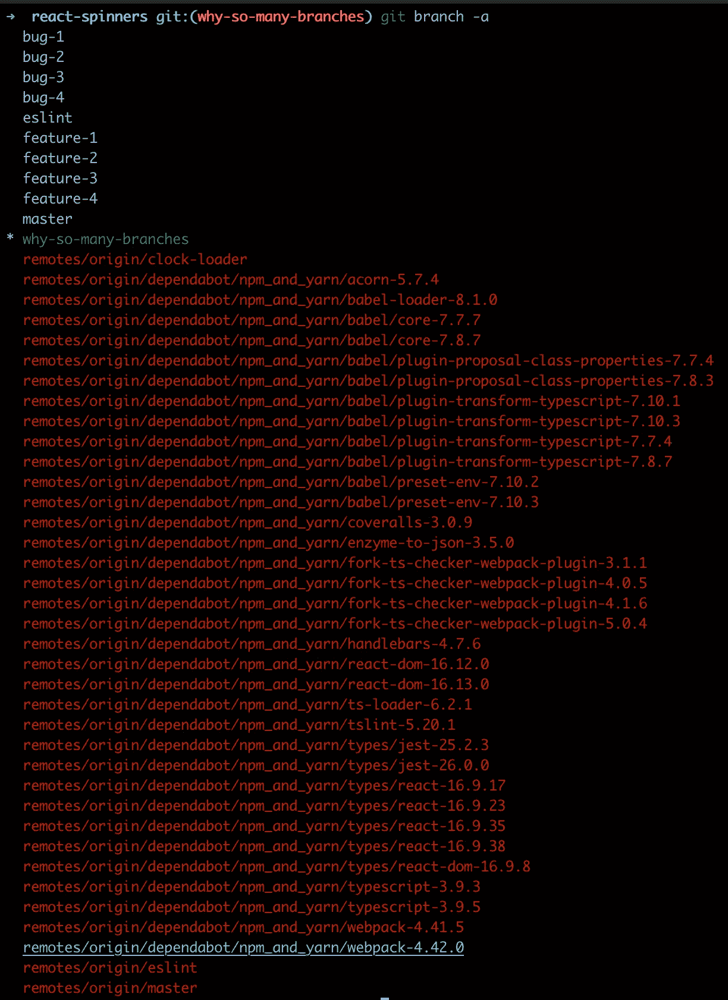

# 我最喜欢的 git 别名来检查我的分支

> 原文：<https://blog.devgenius.io/my-favorite-git-alias-to-keep-my-branches-in-check-e0b49b7cbfd5?source=collection_archive---------9----------------------->

每个人都有自己喜欢的 git 快捷方式或别名。他们太多了！

```
gc - git checkout
gm - git merge
gb - git branch
```

但是，缺少一个别名来解决我经常遇到的问题:

> 如何保持本地和原产地分支机构的清洁？

我需要在我的每一个分支上运行`git branch -d <branch name>`吗？



所以。很多。分支机构…

或者必须运行`git fetch --prune`来确保我正在清除已删除的远程分支。如果我把`-a`旗加到`git branch`上会更糟



😰

# 构建新功能


幽默是如此的相关

我决定构建一个处理整个操作的函数。我将把它命名为`gclean`。这个问题从两个方面着手解决:

**一个**:从远程清理删除的分支。这个很简单。它内置在 git 中。只需要运行`git fetch --prune`。问题解决了！


简单的柠檬汽水！Giorgio Trovato 在 [Unsplash](https://unsplash.com?utm_source=medium&utm_medium=referral) 上拍摄的照片

**二:**清理不再需要的本地分支。这个问题有点棘手，但是没有什么是谷歌搜索不能解决的(毕竟，我是专业的谷歌搜索者)。使用一点 bash，StackOverflow 社区集体想出了:

```
git branch | grep -v '<branch to keep>' | xargs git branch -d
```

我们都很高兴！

厉害！现在，我只需要把它们放在一起，加上一点“花哨”的输出就可以了。

```
# ~/.aliases
gclean () {
  echo "----------------------------"
  echo "       Syncing Change       "
  echo "----------------------------"
  git pull
  echo ""echo "----------------------------"
  echo "  Removing Remote Branches  "
  echo "----------------------------"
  git fetch --prune
  echo ""echo "----------------------------"
  echo "  Removing Local Branches   "
  echo "----------------------------"
  git branch | grep -v 'development' | xargs git branch -d
  echo ""
  echo "----------------------------"
  echo "            DONE            "
  echo "----------------------------"
}
```

# 一个小小的警示故事

当我第一次构建这个别名时，我最初构建的函数是先删除本地分支，然后删除远程分支。

这引发了一个有趣的问题。我当时正在做一个专题，最初负责推动当地的分支机构。然而，我最终还是从 Github 上删除了这个分支(不记得为什么了)，并且再也没有修剪过我的分支。

然后我运行了这个函数

```
----------------------------
  Removing Local Branches
----------------------------
warning: deleting branch 'medium' that has been merged to
         'refs/remotes/origin/medium', but not yet merged to HEAD.
Deleted branch medium (was e615bce).----------------------------
  Removing Remote Branches
----------------------------
From github.com:davidhu2000/react-spinners
 - [deleted]         (none)     -> origin/medium----------------------------
            DONE
----------------------------
```

Git 认为我的特性分支仍然远程存在，并决定删除我的本地分支，然后修剪原始分支。现在工作时间已经过去了。我甚至不得不学习`git reflog`来取回我的树枝。

如果您有兴趣查看完整的输出:

```
----------------------------
       Syncing Change
----------------------------
remote: Enumerating objects: 20, done.
remote: Counting objects: 100% (20/20), done.
remote: Compressing objects: 100% (20/20), done.
remote: Total 20 (delta 13), reused 0 (delta 0), pack-reused 0
Unpacking objects: 100% (20/20), done.
From github.com:davidhu2000/react-spinners
 * [new branch]      dependabot/npm_and_yarn/babel/plugin-transform-typescript-7.10.4 -> origin/dependabot/npm_and_yarn/babel/plugin-transform-typescript-7.10.4
...
Already up-to-date.----------------------------
  Removing Remote Branches
----------------------------
From github.com:davidhu2000/react-spinners
 - [deleted]         (none)     -> origin/clock-loader
 - [deleted]         (none)     -> origin/dependabot/npm_and_yarn/acorn-5.7.4
 - [deleted]         (none)     -> 
... (cut for spacing)
origin/dependabot/npm_and_yarn/webpack-4.42.0----------------------------
  Removing Local Branches
----------------------------
Deleted branch bug-1 (was f2cdd3e).
...
error: The branch 'eslint' is not fully merged.
If you are sure you want to delete it, run 'git branch -D eslint'.
Deleted branch feature-1 (was f2cdd3e).
...
Deleted branch why-so-many-branches (was f2cdd3e).----------------------------
            DONE
----------------------------
```

老实说，这是我最常运行的命令之一。我希望这篇文章对你有所帮助。编码快乐！


卡尔·海尔达尔在 [Unsplash](https://unsplash.com?utm_source=medium&utm_medium=referral) 上拍摄的照片