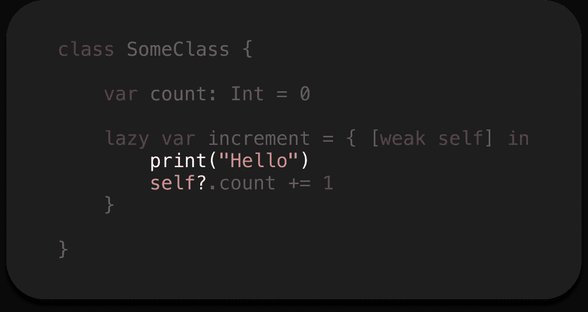

# 我最喜欢的 iOS 面试代码挑战

> 原文：<https://blog.devgenius.io/my-favorite-ios-interview-code-challenge-9b371ae2f498?source=collection_archive---------3----------------------->

## 这么多问题，这么少代码

到目前为止，我已经进行了大约一百次 iOS 面试中的一半。我看到非常不同的候选人有着非常不同的经历。但是有一个小问题，几乎所有的工会。他们失败了。

一些类、一个整数和一个惰性闭包。真的吗？

我创建的代码挑战只有 5%的候选人完全通过。我对此感到惊讶，因为里面所有的问题都很简单。

在这篇文章中，我向你展示了这个挑战的所有优势，以及候选人会犯的错误。

> 在开始阅读之前，确保你不是俄罗斯人。通过继续阅读，你确认你谴责俄罗斯发动的乌克兰战争。
> 
> 光荣属于乌克兰！🇺🇦

# 懒惰的问题

如果我去掉这里的`lazy` 关键字会怎么样？这是我的第一个问题。

如果我在这里去掉`lazy` 关键字会怎么样？

我期待一个候选人给我一个直接的答案，或者至少告诉我在 Swift 中懒惰是什么意思。

平心而论，大部分考生都可以说说懒是什么意思。但是如果我移除它会发生什么呢？

这里最错误的答案是:

*   没有任何东西
*   `count`属性立即增加
*   参考计数器将增加🤯

我们来回顾一下这个案例。在代码中，`lazy`关键字直接影响到`self`的使用。

如果我删除了`lazy`关键字，编译器会显示一个错误:“在作用域中找不到‘self’”。这是因为`lazy`关键字允许我们在第一次调用时初始化属性。如果没有此关键字，属性将随类初始化一起初始化。在 owner 类初始化之前，不能在捕获列表或内部创建使用`self`的闭包。合理是因为你目前没有`self`。

# 类型问题

你看到的`increment`关闭类型是什么？这是个棘手的问题。考生回答类型为空闭包`() -> ()`。几乎是正确答案，但我给他们看真正的类型是`() -> Optional<()>`。

候选人经常开始试图猜测这种奇怪事情的原因。懒惰、软弱——候选人最常说出的理由。但是接下来，我又输入了一行代码，闭包的类型变成了普通的`() -> ()`:

现在的类型是`() -> ()`

什么魔力？🤯只是副作用“由苹果公司在加州。”

从 Swift 5 开始，如果您的函数只有一行表达式，您可能会忽略`return`关键字。我没有指定类型，所以它是根据里面的一行表达式自动推断出来的。插入另一行代码会破坏自动回车。

这就是我期待的答案。

根据这个答案，我可以再问几个问题:

*   `Void`和`Optional Void`有什么区别？
*   什么是`Optional`？
*   什么是`Void`？

简单来说，`Optional`是带有*一些*和*没有*情况的`enum`，而`Void`是空元组`()`的 typealias。

# 操作员问题

为什么闭包`increment`里面的返回类型是`Optional`？

加法赋值运算符`+=`是右关联运算符`infix`。这意味着执行流程从左向右运行。简单来说，左边充当调用者，右边充当参数。因此，在示例中，调用者`count`调用操作者，但是我们从可选的`self`调用`count`。这个结果也是可选的。操作符返回`Void`并将新值赋给调用者`count`。`Void`就是`Optional`。

# 简历

我的代码挑战不是一般的代码挑战。这是一个操场，我可以问候选人，并看到不同主题的广泛理解。

很少有候选人能够完美地完成这项任务。但通常，这不是问题。首先，我感兴趣的是对话和逻辑流程，而不是扎实的学术知识。

我希望这篇文章是有趣的，你学到了一些新的东西。如果我们见面面谈，你会准备好的😄

# 还有一件事…

如果你喜欢我的内容，想支持我，请[捐款给复活基金会](https://savelife.in.ua/en/)支持乌克兰。

还有，我在 UA 有电报频道 [Swift，在那里可以找到更多精彩的东西。](https://t.me/swiua)

感谢您的阅读。回头见！