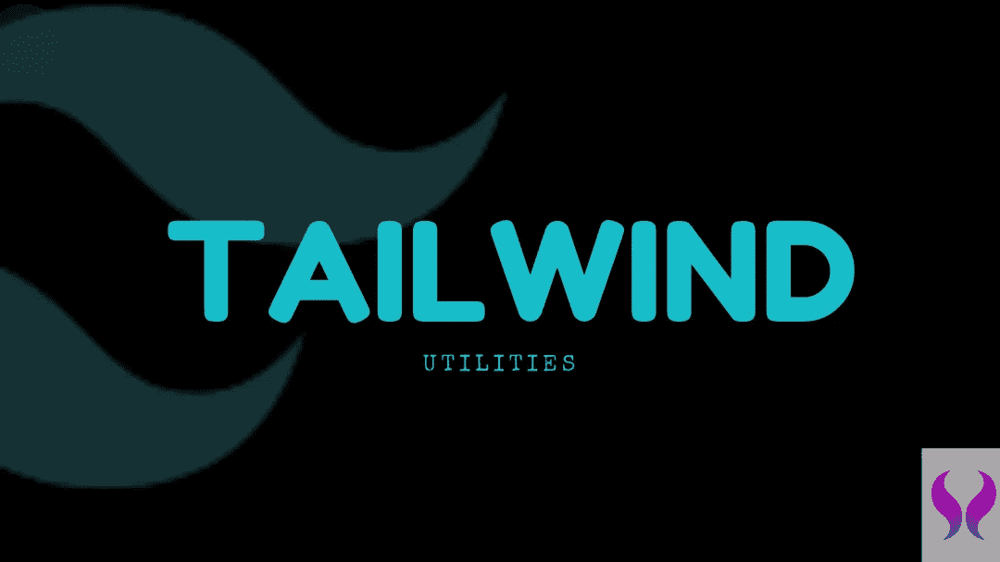

# 我最喜欢的前端工作框架

> 原文：<https://blog.devgenius.io/my-favourite-framework-for-doing-frontend-work-3e88e07ff2b?source=collection_archive---------15----------------------->

顺风很难回。

顺风+双宏

在我 5 年多的前端开发生涯中，我使用了很多 UI 框架和我最喜欢的前端 Javascript 库 React 我曾经做过引导、材料、语义、蚂蚁设计等等..

近年来，我注意到了很多围绕顺风的炒作，这并没有错。我个人的经验是，当你有一个保守的开发管道时，你从产品团队那里得到设计，然后必须将它们转换成一个可工作的实时版本。没有比顺风更近的了。

使用非设计工具的缺点是，许多 UI 框架都有自己的外观和感觉，很难在你的应用程序中复制你收到的相同设计。由于两个主要原因。

1.  覆盖和正确覆盖现有框架，以获得相同的外观和感觉。
2.  添加断点以处理不同的屏幕大小。

Tailwind 克服了这两个问题，并为您提供了大量不同的实用程序类，您也可以根据自己的需要进行扩展。

一个简单的例子是布局部分，在这里你可以得到不同的边距和相同的 rems，比如 ml-2，ml-3 等等，这些类非常直观，几天后你就会习惯了。

因此，现在你没有默认的外观，而是有了构建模块，让你的设计成为你自己的。

它们提供了第二吨的断点，也可以扩展。这些断点也非常直观，因为 tailwind 遵循移动优先的方法，您可以使用 lg: md:和类似的断点来更改样式，这些断点也可以根据您的需要进行定制。

利益相关者对我的一个批评是，没有一个经过充分测试的生态系统，你只能靠自己来实现像 RTL 这样的东西和其他存在于材料或其他东西中的东西。

出于这个特殊的原因，我们添加了一个很好的顺风框架，它利用顺风的力量，给你同样的灵活性，给你一个可以遵循的设计系统。

**雏菊 UI**

Daisy UI 也非常有用，它提供了许多现成的组件。

我们得到的另一个批评是在最后使用了很长的类名，因为我们使用了与样式化组件非常相似的 twin 宏，但是使用了顺风类名的力量。所以最终你可以为卡片和其他基本 UI 元素创建好的纯组件和不同的类组合。

我目前在公司用于前端工作的堆栈；

1.  顺风
2.  双胞胎。宏(类似于样式化组件过于原始的 CSS)
3.  Daisy UI

国家防范机制储存库；

 [## 尾翼 css

### 实用程序优先的 CSS 框架，用于快速构建自定义用户界面。有关完整文档，请访问…

www.npmjs.com](https://www.npmjs.com/package/tailwindcss)  [## twin .宏

### Twin 融合了 Tailwind 的魔力和 css-in-js Demo twin 在 CodeSandbox 上的灵活性→ Style jsx 元素使用…

www.npmjs.com](https://www.npmjs.com/package/twin.macro)  [## 大秀

### Tailwind CSS Components 向 Tailwind CSS [查看所有组件] show /…

www.npmjs.com](https://www.npmjs.com/package/daisyui) 

直到下一次，保持坚强，坚持学习…