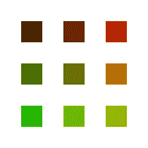

# 我和哈斯克尔在一起的第一个 77 小时

> 原文：<https://blog.devgenius.io/my-first-77-hours-with-haskell-188222314040?source=collection_archive---------7----------------------->

我忍不住要讲我和哈斯克尔在一起的第一个 77 小时的故事。为什么？因为这是一个在爱与恨之间不断变化的故事。

这一切都是从我第一次对 [Cardano](https://cardano.org/) 项目感兴趣开始的(附注:这不是一篇关于 Cardano 的帖子)。多年来，我一直对区块链的项目感兴趣，但直到现在，我读到的项目(比特币、以太坊、Hyperledger 等)都没有真正引起我的注意。我对它非常感兴趣，我决定了解它的内部工作原理，并深入研究它。那正是我第一次知道哈斯克尔的时候。

就像我一样，许多人正试图开始学习 Haskell，我开始阅读《[为了更好地学习 Haskell！](http://learnyouahaskell.com/)”。虽然这本书写得很好，但这是**我第一次开始讨厌哈斯克尔**。来自一个完全命令式语言的背景，Haskell 函数式的代码编写方式对我来说看起来非常混乱和难以理解。

这与命令式编程语言几乎是作为一组指令编写的这一事实有关。因此，阅读这种类型的代码几乎就像阅读一套指令。哈斯克尔就不是这样了。尽管如此，哈斯克尔还是引起了我的注意。最重要的是，我太固执了，不能让一种新的编程语言来征服我，所以我继续前进。

看了其他的书，网页，看了几十个小时的视频(*我的意思是，单子周围的绒毛都是什么？我开始掌握和理解一些 Haskell 基础知识，并开始理解一些代码。但是众所周知，**仅仅通过阅读和观看视频是学不会编程的。所以，我决定抓住我的一个非常小的项目，试着把它翻译给 Haskell。***

这个项目很简单。它使用非常好的 [p5.js](https://p5js.org/) JavaScript 库创建一个画布，上面有一组正方形。然后，给定一个特定的数学函数，正方形以特定的方式着色。比如下图。

用 Haskell 制作的 10x30 正方形数组

很简单，对吧？**否**。至少对初学者来说不是。

# 挑战#1:环境和包

Cabal 还是 Stack？没有明显的原因，我决定用 Stack。在这里，我的主要障碍是学习和理解 Stack 如何工作，以及如何将一个包导入到我的项目中。

因为我的目标是处理图像，所以我必须找到一个图像处理包。通过快速的谷歌搜索，我最终找到了一个名为 [hip](https://www.stackage.org/package/hip) (haskell 图像处理)的包。到目前为止，一切顺利。

现在，如何将包添加到我的项目中？我对哈斯克尔的第二次仇恨就是从那里开始的。和第一个问题一样，其中一个主要原因就是我缺乏经验。第二个，包装页缺乏明确的说明。我天真的自我心想:“这应该和 JavaScript 的 npm 差不多；我所要做的就是将包的名称添加到我的 package.yaml 文件的依赖项列表中。但是那没有用！为什么？**快照**！

我花了一段时间才明白 Stack 到底是怎么工作的。并且意识到我使用的快照并不包含我想要使用的包。稍作谷歌研究，解决方案似乎很简单:“只需使用`extra-deps`函数从不同的快照添加包”。简单。不要！！！因为我想使用的包有其他依赖项，需要其他快照版本，这些也有同样的问题。在给`extra-deps`增加了一堆包裹后，这个建筑就会完全崩溃。太好了。

那么，几个小时后我找到了什么解决方案呢？使用包含我要使用的包的最后一个快照来设置我的环境。没那么简单。

# 挑战#2:文档

好了，现在我可以构建包含 *hello world* 示例和`hip` 包的项目了。成功。最后，我们来写点代码吧！第一步，让我们看看这个包是如何工作的。

> 我的下一个噩梦来了。文档不是 Haskell 的强项。

我期望看到某种类型的`*.md`文件或任何其他关于我自己设置使用的包的文档。总的来说，包在 npm 或 pip(至少是最常用的)中有很好的文档记录。但是对于`hip`软件包来说，文档并不是最好的。这里，我需要提到的是，由于没有详细的文档，我缺乏使用 Haskell 的经验使得理解一个包如何工作变得更加复杂。

但是，这最终对我有利。是的，我失去了相当多的时间来学习如何使用`hip`，但是因为我没有其他选择，除了在代码内部挑选，我最终在浏览和试图理解它的时候学习了一些好的 Haskell 课程。虽然软件包缺乏详细的文档，但代码写得很好。

# 挑战#3:性能

好的。所以，现在我可以编译一个空项目，并开始创建一些空图像。再过几个小时，我就有一个正方形了。再多一些，我得到一条有三个正方形的线。接下来，一个 3x3 正方形阵列的图像。成功！对吗？你可能已经知道答案了。

用 Haskell 制作的 3x3 方形数组

现在，我的代码正在运行，我可以创建一个 3x3 的正方形数组图像，我想创建一个有许多正方形的真实图像，我可以在社交媒体上发布，以显示我对自己有多自豪。因此，我再次运行我的程序，这次请求一个 30x30 的正方形数组图像，然后我等待。我等待着。我再等一会儿。10 分钟后，我不敢相信花了这么长时间，于是我终止了程序的执行。可能是代码中的错误。

不完全是。我的节目有一个**糟糕的表现**。以至于我不得不学习如何在 Haskell 中分析程序，试图找出问题所在。我还记录了创建 1、4、9、16、25 个正方形的图像需要多长时间，以便估计创建一个 900 个正方形的图像(30x30 数组)需要多长时间。大约需要 6400 秒！真是一场灾难。有些事非常不对劲。

经过一些剖析和代码审查，我最终找到了一些罪魁祸首。

1.  我的程序多次写入相同的像素。例如，我将首先创建一个画布，然后创建每个正方形并用正方形覆盖原始画布。这会造成不必要的执行。
2.  我使用列表来存储图像数据。由于我用来覆盖原始画布的方法，我在列表中做了大量的搜索和索引。因为列表不是为此目的而创建的，所以它们缺乏良好的性能。

但是，我最大的错误是我自己写的代码。即使我在开始编码之前做了大量关于 Haskell 和函数式编程的研究，我最终还是让我的命令式编码器占了上风。我最终做的是用伪函数方法创建了一个伪命令式代码。糟透了。

如果你想看看这个可怕的模块，你可以在这里查看[。](https://gist.github.com/fabiomolinar/301d7ea6628d4687203bf5ffa450afa2)

# 重构

但是我还没说完。在大量的代码剖析之后，我明白我应该远离列表。这样做不是为了存储在任意随机位置频繁访问的数据数组。此外，我意识到我没有正确地使用`hip`库，我的代码也根本不起作用。

经过几个小时的重构，我得到了一个更小(几乎小了 50%)、功能更好、更简洁(类型的使用将代码的清晰度和可读性提高了一个数量级)并且效率更高的模块！仅仅经过几个小时的重构，这是多么大的进步啊。

现在，创建一个 30×30 的正方形阵列图像只需要 3.7 秒(快了 1730 倍)，而不是 6400 秒！这就是我所说的进步。

想看改进版，点此查看[。](https://gist.github.com/fabiomolinar/3c71c09dc4502af339df086894b77827)

# 下一个

尽管我强调的主要是我在学习和试用 Haskell 时的“厌恶”，但在整个旅程中，我实际上享受了**的许多乐趣**。强迫我的大脑以不同的方式思考是一个非常好的、令人愉快的思维练习。不仅如此，我脑海中一直有个声音在说“上帝，这一切都变得有意义了；为什么不是所有的语言都这样？”和“该死，这段代码就是这么简短、简单、切中要害、漂亮！”。

谈到哈斯克尔，我只是略知皮毛。我想尝试和接触大量更高级的主题。我已经阅读了他们，我一直在提高我的理论背景。但是我还是缺乏一些实际的编码经验。但是我希望在不久的将来，我的下一个项目能解决这个问题。

如果你一路来到这里，你想阅读更多，已经有一个关于这个主题的[后续故事](https://medium.com/@fabiomolinar/importing-csv-data-with-haskell-and-the-worlds-dependency-on-fossil-fuels-7070e7796b4a)。希望你喜欢。