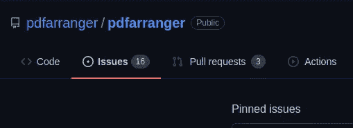
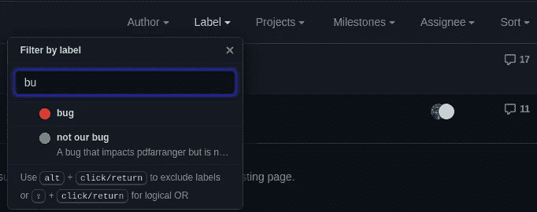

# 我对自由/开源软件的第一个贡献

> 原文：<https://blog.devgenius.io/my-first-contribution-to-foss-3e88659ed35?source=collection_archive---------14----------------------->


这个博客的主要目的是传达在不了解整个代码库的情况下为开源软件做贡献是多么容易，我也会告诉内部人士我是如何为自由开源软件做贡献的。

**第一步:**找到你日常生活中最常用的软件，看看它的软件是否开源。如果软件不是开源的，搜索你知道的或者至少用过一次的应用程序或软件。在我的案例中，是**pdf farranger**应用程序帮助我整理了多个 pdf 并将其全部合并。



**第二步:**如果你已经选择了一个你喜欢的应用程序，在你的档案里创建一个克隆，检查一下 GitHub 的代码，看看问题部分。你可以看到人们指出代码库中的问题，问题的数量因项目而异，例如 flutter、Tensorflow 等是一些有大量问题的回购。



因此，困难的部分来了，选择和贡献什么问题，对我来说，我通过过滤问题标签“bug”来对问题部分进行排序，但对于初学者，我建议你对问题标签“good first issue”进行排序。你也可以使用其他过滤器来了解关于代码的问题，并开始逐个阅读问题的标题。

我选择了一个标题为“**记住屏幕上的窗口位置#450** ”的问题，这里您可以看到#450 是问题 id

**第三步:**至少了解项目中最常用的编程语言，并开始研究代码库，因为我了解 Python 并了解语法，但我不了解用于创建 pdfarranger GUI 应用程序的 GTK( **GIMP ToolKit** )

之后，我在 repo 中导航，发现了一个操纵屏幕大小的代码，所以我想使用相同的逻辑来记住窗口位置。我谷歌了一下 python GTK 文档，了解了两个名为 get_position()和 set_position()的函数

> python gtk 文档
> 
> [http://library . ISR . ist . utl . pt/docs/pygtk 2 reference/class-GTK window . html](http://library.isr.ist.utl.pt/docs/pygtk2reference/class-gtkwindow.html)

**步骤 4:** 在您的笔记本电脑上设置项目，理解代码，尝试更改一些代码，然后重新运行应用程序，以获得解决问题所需的结果。

在进行任何更改之前，创建一个功能/问题分支

```
git checkout -b issues/{issueid}/patch# In my case it was
git checkout -b issues/450/patch
```

首先，对于我来说，我们需要在一些配置文件中保存窗口的位置

```
self.config.set_position(self.window.get_position())*# where get_position() Returns* :a tuple containing the X and Y coordinates of the gravity-determined reference point of the GUI application.
```

由于 pdf arranger 使用 **configparser** 来保存应用程序的其他属性(如果应用程序关闭的话),所以我设法理解了如何使用和保存配置对象中的数据。

```
def set_position(self, position):        
    self.data.set('window', 'root_x', str(position[0]))
    self.data.set('window', 'root_y', str(position[1]))
# Here in the code we are saving the X,Y coordinate in a variables named root_x and root_y 
```

如你所知，我们使用 set_position 方法将应用程序位置保存在变量 root_x 和 root_y 中。现在，如果用户试图启动应用程序，它应该将窗口放置在屏幕上的坐标中。为此，我创建了一个名为“position”的方法来获取它之前关闭的屏幕的位置。

```
def position(self):
    return self.data.getint(‘window’, ‘root_x’, fallback=10), self.data.getint(‘window’, ‘root_y’, fallback=10)# This function will return the values of X and Y coordinate of the window and if the root_x and root_y value is None it will assign the values to 10
```

之后，我们需要将窗口移动到之前关闭的坐标或者存储在 root_x 和 root_y 变量中的坐标

```
self.window.move(*self.config.position())#This will move the window position to the desired position
```

**第 5 步:**创建一个拉式请求，因为这一部分非常重要。要提交您的更改，您可以完成下面给出的简单步骤

*   向临时区域添加更改并提交更改

```
git add .
git commit -m commit_message
```

*   将变更推送到分叉回购

```
git push origin issues/450/patch
```

*   之后，您可以创建一个 pull 请求，该请求将在您的分叉回购上提示。

```
click on compare & pull request
```

之后，如果指导者批准了变更，他/她将合并变更，如果没有，您必须按照指导者提到的那样做变更，并将变更重新推送到特性分支

> ***pro 提示:*** *总是尝试在一次提交中合并所有更改，如果不尝试将头移动到前一次提交，则进行更改并强制推送到特征分支。*

感谢阅读这篇博客，希望你喜欢，如果喜欢的话，请鼓掌👏

[](https://github.com/pdfarranger/pdfarranger/pull/450) [## 通过 JATIN2111999 拉动请求#450 pdfarranger/pdfarranger 记住窗口在屏幕上的位置

### 将此建议添加到可以作为单次提交应用的批处理中。此建议无效，因为没有更改…

github.com](https://github.com/pdfarranger/pdfarranger/pull/450) 

> [https://github.com/JATIN2111999](https://github.com/JATIN2111999)
> [https://twitter.com/jatinhabibkar](https://twitter.com/jatinhabibkar)
> https://www.linkedin.com/in/jatinhabibkar/