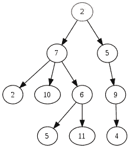
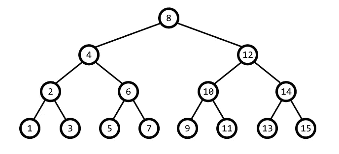
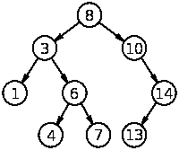
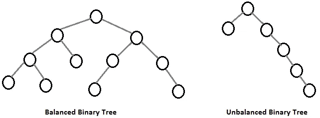

# 我的第一个数据结构:树的基本指南

> 原文：<https://blog.devgenius.io/my-first-data-structure-a-very-basic-guide-to-trees-f89c3e307195?source=collection_archive---------28----------------------->

老实说:尽管这篇文章的名字是树，但树绝对不是我的第一个数据结构。也不应该是你的。然而，我将保持我的帖子的标题不变，以向您保证树绝对是一种像我们这样的初学者能够自己理解和实现的数据结构。话虽如此，我仍然建议在深入研究之前查看一下[我在链表](https://medium.com/@hopegiometti/my-first-data-structure-linked-lists-b2151538d0ce)上的帖子。

既然我们已经解决了这个小小的免责声明，让我们直接开始吧！

鲍勃·罗斯画树

**一(非常)基本概述**

树是一种数据结构。

什么？太基础？

好吧，让我再试一次。树是一种分层数据结构，它是单线的，以根开始，并有递减的子节点。

树形图

如上图所示，树的根是 2，它的下行子节点是 7 和 5，它们又有自己的子节点，这些子节点又有自己的子节点，依此类推。

这可能看起来不太复杂，也不应该太复杂。这种类型的下降结构是你最熟悉的，并且可能每天都在使用。以你电脑上的文件为例。你会有一个像“文档”这样的文件夹，在这个文件夹里你可能会有更多的像“编码笔记”或“完全随机”这样的文件夹，在每个文件夹里你可能会有更多的文件夹等等。

**二叉树**

现在你已经对树的结构有了基本的了解，让我们来看看一种非常常见的树:二叉树。

要创建一个二叉树，我们必须遵循两个特定的规则。首先，每个节点最多可以有*和*两个子节点。第二，每个孩子只有一个父母。

再看一下上面的图表。是二叉树吗？

虽然我们图中的树遵循我们的第二条规则(每个子节点只有一个父节点)，但它不遵循我们的第一条规则。值为 7 的节点有三个子节点，因此打破了只允许两个子节点的二叉树规则。

下面是一个二叉树*如何能看起来像*的例子:

一棵完美的二叉树！

此图是我们称之为完美二叉树的一个例子，这意味着所有内部节点(也就是所有节点减去根节点和最低级别的节点)都有两个子节点，并且所有叶子都具有相同的深度/级别。完美的二叉树非常高效，并且具有一些对开发人员有用的属性。

**二分搜索法树**

二分搜索法树也可以被称为有序或排序二叉树，这对于它们的工作方式是有意义的。看一下这张图，看看你能否弄清楚 BST 是如何工作的:

二叉查找树

让我们从树的顶端开始。在根节点 8 的左侧，我们可以看到子节点 3。在右边，我们可以看到子节点 10。现在，让我们再看一遍，但是这次从我们的子节点 3 开始。在左边，我们看到 1 的子节点。在右边，我们看到 6。你看出模式了吗？

基本上，二叉查找树的规则是树中根节点右边的所有子节点必须大于当前节点，左边的所有子节点必须小于当前节点。

通常，二分搜索法树是一种非常有用的数据结构，因为它们通常比 O(n)*运行得更快，它们是有序的，并且它们具有灵活的大小。例如，与数组相比，BST 查找要快得多，因为与 O(n)相比，它通常需要 O(log N)。类似地，与哈希表相比，BST 是有序的，并且具有保留的关系。

*虽然 BST 很棒，可以被认为是非常有效和有用的数据结构，但它们确实有可能变得不平衡:

平衡树与不平衡树

如果你看一下不平衡二叉树，你可能会想起另一种数据结构:链表。链表实际上被认为是树，但与其他树不同，它们只有一条路径。此外，如果您熟悉链表，那么您可能会理解为什么 BST 会遇到一些运行时问题，因为许多链表操作的运行时为 O(n)。然而，最终有很多方法可以平衡树，使得不平衡的树的问题最小化。

绘画和编码的好座右铭！

我希望您喜欢这个非常基本的树数据结构介绍。如果你很想看看树是如何工作的，你可以马上回来看看我自己实现的二叉查找树，或者试着自己实现一个！就像我一直说的，学习算法和数据结构最好的方法就是练习，所以请试一试！

祝你好运，编码愉快！