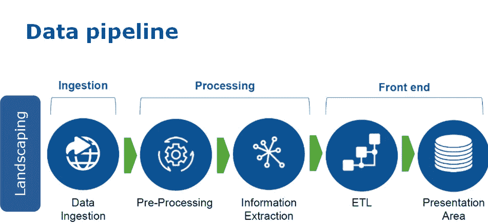
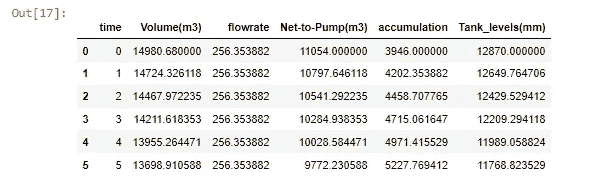
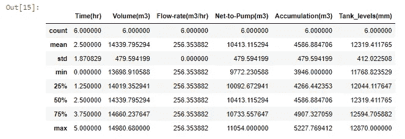
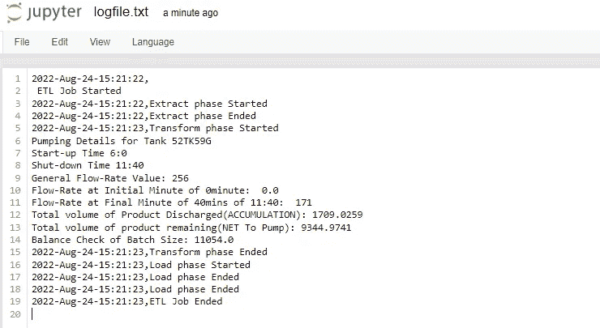
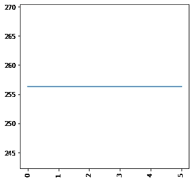
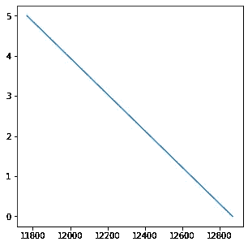
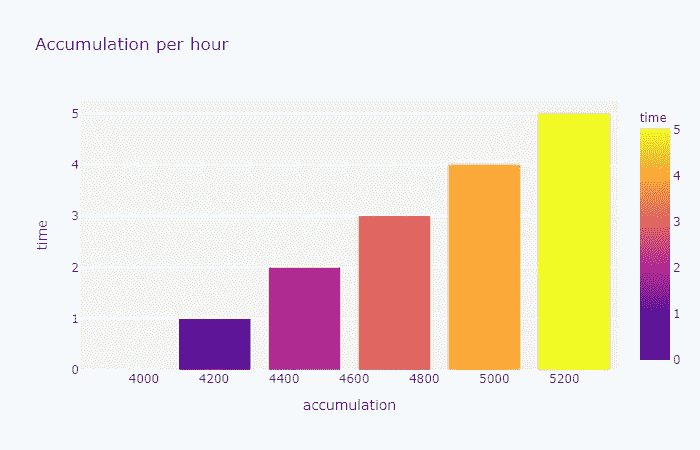

# 我的第一个 ETL 数据工程项目

> 原文：<https://blog.devgenius.io/my-first-etl-data-engineering-project-35a7f31d33a2?source=collection_archive---------1----------------------->


斯蒂芬·道森在 [Unsplash](https://unsplash.com?utm_source=medium&utm_medium=referral) 上拍摄的照片

在我为尼日利亚管道和储存公司(NPSC)哈科特港地区工作之前，我接触了工业建筑和管道泵送系统的操作，用于将石油产品从源头仓库运输到目的地仓库。

不知不觉中，我踏上了成为一名数据工程师的旅程。到那时，2019 年，2020 年我连数据工程都不知道，更谈不上 ETL。在 NPSC 工作期间，哈科特港地区让我接触到了各种管道泵送和管线作业。我负责运营部门的产品会计、对账和运营月度报告。

通过观察 NPSC 石油管道系统的运行，我发现其工作流程与数据管道系统的情况非常相似。但我必须告诉你，数据是新的石油，所以从石油产品管道职业线转移到数据管道及其不同存储库的数据工程，对我来说并不困难，而是通过将工作流与解决数据管道问题联系起来，增强了我的理解。

本文解释了我如何使用 python 编程语言为尼日利亚管道和存储公司开发 ETL 模型。ETL 模型能够执行以下操作:

*   从成品油管道源站采集传统间歇泵送参数
*   转换收集的数据
*   将转换后的数据保存为可随时加载的 csv 格式以供分析。



**让我们简单谈谈数据工程、数据管道和 ETL**

**数据工程**关注的是确保数据通过专用管道从不同来源准确传输到数据存储库以供使用的过程。

**数据管道**是数据工程的一个子集，能够将数据从一个处理点传输到另一个处理点。

**ETL** (提取、转换和加载)是一个数据管道集成过程，涉及三个不同但相互关联的步骤，用于帮助将数据从多个来源传输到数据存储库，如 RDBMS、数据仓库、数据中心或数据湖。

更好地理解业务上下文是构建有效 ETL 解决方案的重要步骤之一。

**NPSC 石油产品经营背景**

NPSC 泵站通过传统的管道分批将石油产品从成品油罐区输送到不同的油库。在每次泵送操作开始之前，必须进行产品库存盘点，通常描述为指定产品储罐的财政化和去财政化，这也可称为获取初始储罐液位和最终储罐液位，以确定库存产品的数量。

通过分批使用增压泵和主线泵来帮助从指定储罐中排空产品，其中通过手动读取指定储罐的储罐液位读数来每小时进行一次输送流速，这与储罐的初始和最终液位相关，有助于确定库存产品的体积和输送的体积。这也有助于了解目的地仓库中的累积量。每一次泵送操作的目标是确保在测量的参数和估计的时间内将编程的产品准确地输送到终点。

**为什么石油产品管道系统需要 ETL？**

ETL 在以下方面对石油产品管道运输系统至关重要:

*   它提供了操作的历史背景。
*   增强用于决策的商业智能解决方案。
*   数据上下文和聚合有助于增加公司收入或节省运营成本。
*   启用公共数据存储库。
*   允许验证数据转换、聚合和计算规则。
*   允许源系统和目标系统之间的样本数据比较。
*   有助于提高生产率，因为它无需额外的技术技能即可进行编码和重用。

**现在让我们深入研究 ETL 开发**

这个项目是 NPSC 泵站管道系统的模型。它是根据 NPSC 泵站管道系统的传统抽水参数开发的。该模型遵循 3 个关键的 ETL 过程。

首先，我必须导入必要的库，这将有助于 ETL 开发。

```
import pandas as pd             #for data manipulation 
import numpy as np              #for numerical computation
import matplotlib.pyplot as plt #for visualization 
import plotly.express as px     #for visualization 
import seaborn as sns           #for visualization 
import plotly.express as px
from datetime import datetime   #for date&timestamp for log.txt file
```

接下来，设置存储事件日志和转换数据的路径。

```
logfile = “logfile.txt” #all event logs will be stored in this file
targetfile = “transformed_data.csv” #file where transformed data is stored
```

定义获得的参数:

这里，根据系统标准和规范，从泵站手动获取参数。这些参数用于开发提取功能。

```
def extract():
```

获得的参数:

```
tank_name = input(“Enter Tank Name:”) # 52TK59G 
tank_factor = eval(input(“Enter the Tank factor:”)) #tank_factor 1.164
batch_size = eval(input(“Enter the Batch size to pump: “)) #Batch_size 15000
initial_hr = int(input(“Enter Initial Time(hour):”)) #6
initial_minute = float(input(“Enter initial Time(Mins):”)) #0
final_hr = int(input(“Enter Final time(hour):”)) #11
final_minute = float(input(“Enter Final time(Minute):”))#40
initial_tank_level = eval(input(“Enter the initial tank level: “)) #initial_level 12870
final_tank_level = eval(input(“Enter the final Tank level: “)) #11622
accummulated= input(‘Enter last accumulative Value’) #3946 or 0 for last accumulation value
```

开发转换功能。

```
def transform():
```

现在可以使用上述参数来开发转换函数。

定义加载函数:

```
def load(targetfile,data_to_load):
    data_to_load.to_csv(targetfile)
```

定义日志功能:

```
def log(message):
    timestamp_format = ‘%Y-%h-%d-%H:%M:%S’ # Year-Monthname-Day-     Hour-Minute-Second
    now = datetime.now() # get current timestamp
    timestamp = now.strftime(timestamp_format)
    with open(“logfile.txt”,”a”) as f:
          f.write(timestamp + ‘,’ + message + ‘\n’)
```

# 运行 ETL 流程

日志:

```
log(“\n ETL Job Started”)
```

摘录:

```
log(“Extract phase Started”)
extracted_data = extract()
log(“Extract phase Ended”)
extracted_data
```

转换:

```
log(“Transform phase Started”)
transformed_data = transform()
log(“Transform phase Ended”)
transformed_data
```

负载:

```
log(“Load phase Started”)
load(targetfile,transformed_data)
log(“Load phase Ended”)log(“Load phase Ended”)
log(“ETL Job Ended”)
```

# 分析

```
transformed_data.head()
```



```
transformed_data.describe()
```



日志文件结果:



# 形象化

下图可用于谱线衰减和时间衰减评估。

```
plt.figure(figsize=(5,5))
plt.plot(transformed_data[‘time’],transformed_data[‘flowrate’])
plt.xticks(rotation=’vertical’);
```



线衰减图

```
plt.figure(figsize=(5,5))
plt.plot(transformed_data[‘time’], transformed_data[‘Tank_levels(mm)’])
```



时间衰减图

绘制一个柱状图来显示积累率

```
transformed_data.sort_values(by=[‘accumulation’],ascending=False)
fig1=px.bar(transformed_data,x=’accumulation’,y=’time’, color=’time’,title=’Accumulation per hour’)
fig1.show()
```



**总结**

ETL 模型根据管道系统泵送参数执行三个 ETL(提取、转换和加载)步骤。与哈科特港地区 NPSC 泵站的人工计算流量记录表相比，结果证明有 80%的效率。ETL 模型只接受批量泵送参数，因为管道系统没有连接到任何实时读取设备。在从远程终端传感器或数字读数装置获得各种泵送参数的情况下，这也是进一步开发模型的情况。这个 ETL 可以集成到 Hadoop 框架、Apache Spark 等大数据平台中。开发 ETL 模型是可能的，因为我了解业务环境，这是开发高效 ETL 的一个重要方面。

这个项目的完整代码可以在我的 Github 上找到。

**关于作者**

福音 Orok 是一名数据专家，也是一名 AI 爱好者，拥有电子商务和工程行业的工作经验。他非常熟悉数据分析、数据管道、数据管理和处理系统，并强烈希望始终面对新的挑战，扩展他在数据工程领域的技能。

他还是数据分析、数据科学和数据工程专业技能的倡导者，致力于提供高影响力的解决方案。他目前是哈科特港城市数据科学家网络(DSN) AI+社区的负责人。他愿意与组织和个人合作，建立一个人工智能生态系统，开发高人类能力的影响。

感谢您阅读这篇项目文章。欢迎在 [LinkedIn](https://www.linkedin.com/in/orokgospel) 和 Twitter[Orok 福音](https://twitter.com/iamorokgospel)上联系作者