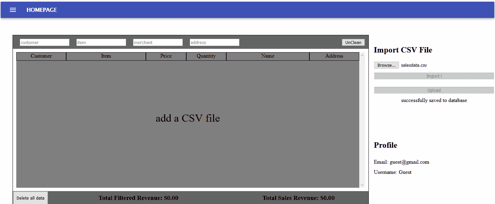

# 我第一次被软件开发人员拒绝

> 原文：<https://blog.devgenius.io/my-first-software-developer-rejection-ff524ddc004b?source=collection_archive---------25----------------------->

克里斯蒂娜@ wocintechchat.com 在 [Unsplash](https://unsplash.com?utm_source=medium&utm_medium=referral) 上的照片

完成编码新兵训练营后，我立即开始求职。在坚持不懈地给商界& LinkedIn 人脉中的朋友发消息后，我终于获得了第一次面试机会。

在我的电话筛选中，我的面试官发现我没有疯。所以他给我发了一个技术挑战，很有趣。

我没有回答 LeetCode 类型的问题，而是接受了一项任务，创建一个允许用户上传销售数据的 CSV 文件的应用程序。它必须将信息转换并传输到数据库，计算销售数据的总收入，并为认证加分。

亚达亚达…我完成了程序。当时，我想“这份工作十拿九稳了！”，我觉得很神奇。我一完成就提交了挑战*。*

这里有一个小的 gif 演示

6 天过去了，我没有得到回复。在这 6 天里，我已经构建了一个简单而功能强大的应用程序。

在那 6 天之后，我发了一封跟进邮件，为了不显得绝望。大约 3 个小时后，我收到了邮件。

## “关于您的代码提交，我认为您在建模数据实体和记录您的工作方面做得不错。我也很欣赏你通过 Firebase 添加用户认证。我希望看到测试以及运行应用程序的更好的说明。当我运行应用程序并上传测试 CSV 时，我收到了一个错误(TypeError:无法读取 undefined 的属性“includes”)。出于这些原因，我们决定不进行下一步。”

我的快感就像是从 18 层楼高的地方掉下来，直直地落到新拌的混凝土板上。两天后，当我坐在这里写这篇博客时，我可以说我起身离开了，尽管一些残余仍然留在我的脑海中。

所以当我回想我的第一次面试经历时，我学到了一些东西。

我应该把时间花在带回家的挑战上，并彻底阅读交付要求。它明确地说*测试*是第一需求。

在我为初级开发人员的职位做好准备之前，我还需要学习更多的东西，比如 ***测试*** 。我将学习笑话并擅长它。

创建一个应用程序感觉是很好的实践，即使是简单的如这个 CSV 转换器。创建应用程序**总是**感觉像是很好的练习，自从我在新兵训练营的最后一个项目以来，我还没有这么开心过。

在挑战之前，我是 LinkedIn 的伪装。我醒来，做了一两个 LeetCode 问题，看了招聘启事，找到了在这些公司工作的人，然后每天发 10 个小时的冷信息。

我计划开始另一个项目，我会集思广益&我会做一些我喜欢的事情。我会确保为它写一些 ***测试*** 。**测试**