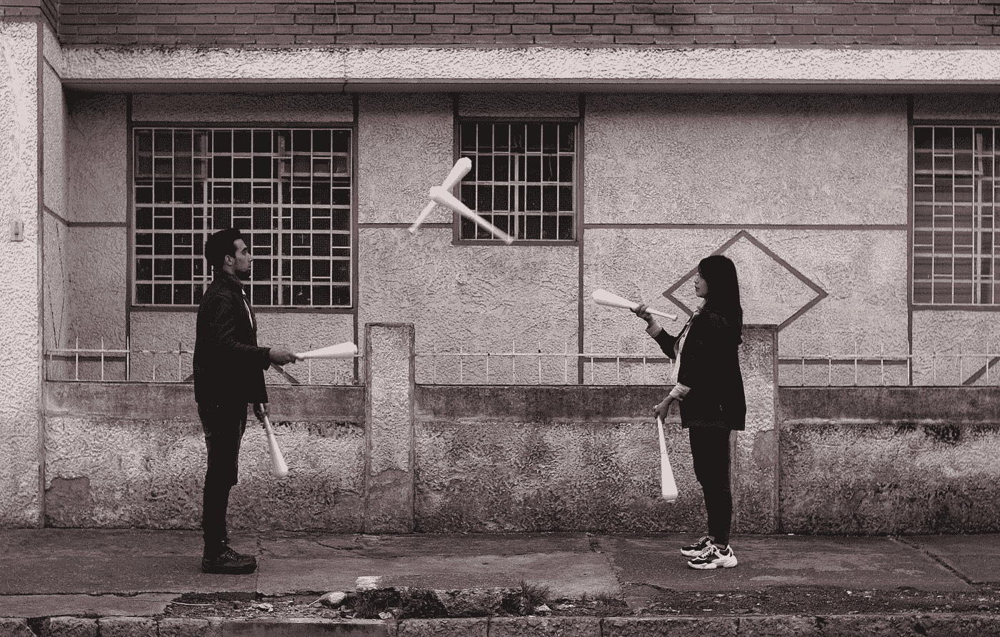

# 我在科技行业担任直线经理的第一年

> 原文：<https://blog.devgenius.io/my-first-year-as-a-line-manager-in-the-tech-industry-f1083ef6bfe8?source=collection_archive---------20----------------------->

今天是我成为科技行业直线经理的第一年。正如每一个优秀的 Scrum 大师都会做的那样(包括我)，我想回顾和反思我的经历。

我在 23 岁时成为一名直线经理。

我开始在我工作的公司做实习生，随着时间的流逝，我承担了指导新实习生的角色。在我毕业并永久返回公司后，我非常想承担生产线管理的角色。

作为一名实习生，我并不幸运，我的直线经理并不真的想成为一名实习生，这并不好。我从来没有真正有机会了解他，他也没有时间一对一。当我第一次以软件工程实习生的身份走进这里时，这些是我最需要的东西，一切都有点令人生畏，我需要支持来驾驭这个新世界。

所以，我想确保我能成为我如此渴望的其他人的经理。

谢天谢地，六个月后，机会出现了，我马上抓住了它。

我将成为某人的直接经理，我可以保护他并为他提供支持。

现在一年过去了，以下是我学到的东西。

# 这个角色实际上包括什么？

*   入职员工
*   提供结构和方向
*   建立信任关系
*   实现良好的性能
*   管理出勤
*   评估试用期
*   处理雇佣终止
*   管理纪律和投诉
*   咨询和指导

# 成为直线经理有哪些好处？

在我的经历中，这是我做过的最有价值的角色，对我来说这是一个广泛的觉醒，因为我也承担了软件工程和 Scrum Master 的责任。从入职到结束与公司的雇佣关系，看着一个人发展和成长，我获得了如此多的快乐。

我非常相信人，没有什么比看着别人证明你是对的更有意义的了。

以下是我找到的其他几个专业人士:

1.  **建立有效沟通的关系**

我记得在最开始的时候，我知道我想成为那种你可以坦诚相待的经理。

我认识一些员工，他们觉得自己需要向经理撒谎，因为他们害怕别人会知道他们是因为需要一个心理健康日而生病，还是因为他们宁愿表现得好像一切都很完美而无法承认自己遇到的问题。

我从一开始就明确表示，我是一个非常善解人意的人，没有什么能让我震惊。没有什么比和我的团队一起达到这一点更有意义的了；有了这种信任和透明度，我可以更好地支持他们。

**2。设定目标并实现目标**

我的意思是还有什么可说的？

**3。获得反馈**

在我们聊天的时候，我总是询问反馈，我想知道是否有我可以改进的地方。这为我提供了发展直线管理技能的空间。我发现非常有用的一件事是，了解到他们需要一个更有条理的 1:1 来帮助他们进步。我走开了，四处阅读，发现了这个博客[https://monzo . com/blog/an-engineering-managers-guide-to-one](https://monzo.com/blog/an-engineering-managers-guide-to-the-one-to-one)。从那以后，我们一直使用这个模板，它极大地帮助我们集中讨论(推荐)。

# 作为一名直线经理，有哪些挑战？

**1。找到你的方法**

最初，你很难找到自己解决问题的方法。我知道我做了，但是在回答他们之前花些时间考虑我想如何给他们留下印象对我帮助最大。我知道我想让他们意识到我不是来自一个筑坝的地方，但事实上我是在解决这个问题，以帮助他们更好地表现。

弄清楚这一点会让世界变得不同，因为我不喜欢让事情变得消极。

2.**远程工作**

学习在封锁期间保持沟通水平绝对是一个挑战。就我而言，在家工作并不是经常发生的事情。因此，保持远程有效通信无疑是一个挑战。但是就像其他事情一样，如果你继续努力，并对反馈做出反应，它将会改善。

# 结论

我喜欢做直线经理，我认为这非常符合我的个性。我是主角，没有什么比激励人们变得更好，并通过支持他们来帮助他们实现目标更让我享受的了。一路上肯定有一些有趣的挑战。很快，我将管理一个更大的团队，我迫不及待地想看看这会带来什么新的乐趣和挑战。

你是直线经理吗？在下面评论你觉得有挑战性的东西！

如果你不是直线经理，请在下面评论你认为的优秀直线经理。

我很想知道！👋