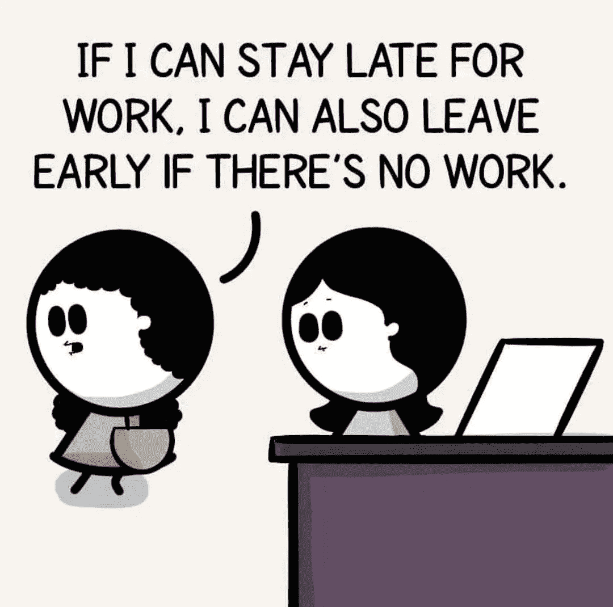

# 由于我们经理的恶劣行为，我的朋友要离开公司了

> 原文：<https://blog.devgenius.io/my-friend-is-quitting-the-company-due-to-the-toxic-behaviour-from-our-manager-5dbb4484712f?source=collection_archive---------1----------------------->

## 人们不会离开糟糕的工作。他们离开是因为糟糕的经理和管理不善，不欣赏他们的价值观。

照片由来自[佩克斯](https://www.pexels.com/photo/businessman-looking-at-papers-5439376/?utm_content=attributionCopyText&utm_medium=referral&utm_source=pexels)的[马体·米罗什尼琴科](https://www.pexels.com/@tima-miroshnichenko?utm_content=attributionCopyText&utm_medium=referral&utm_source=pexels)拍摄

当我开始作为一名软件开发人员工作时，我对我工作的初创公司抱有很大的期望。看，事情是这样的，我被软件开发人员的薪水和生活方式所吸引，这首先创造了很高的抱负。

[我发现自己做了所有的工作却没有报酬，也没有学到任何相关的东西，这太令人失望了。我不得不辞职。](https://levelup.gitconnected.com/how-i-survived-my-first-tech-startup-job-that-failed-within-a-year-667a6a3f97ea)

我是在第二个组织里认识我的朋友的。我们被选中参加同一个项目。巧合的是，我们碰巧坐在一起。我们会分享所有的笑声，在那里我们会谈论一切，无论是政治，体育，电影和电视剧，时事，技术，甚至是生活。他碰巧比我大五岁，无论是年龄还是工作经验，但我们在办公室成了强有力的伙伴。

一切都很好，直到我们的项目经理开始表现怪异。他开始给我们每个人分配不必要的任务。例如，如果他需要一份申请报告，以便他可以将其提交给经理，他会将报告交给我们，并要求在今天结束前完成。他也不喜欢看到我们去喝咖啡或休息。尽管我们会完成我们的工作，我们还是被强烈建议在办公室呆 9 个小时。本组织没有这样的政策。

作者照片来自[instagram.com/@thedeveloperstory](https://www.instagram.com/p/CTCHsZZDQHQ/)

每当安排“*月度团队会议*”时，我们就开始大声疾呼，但经理非常不愿意改变。接受反馈已经变成了一种形式。因此，人们开始离开。

在离职面谈中，没有人会抱怨，因为他们为什么要抱怨呢？在软件行业，如果你从事微服务、区块链、云计算或人工智能等最新技术，跳槽相对容易一些。

我们的经理不太接受我们在这些会议中的反馈。他开始给我们分配更多的积压任务。

backlog 任务是即将到来的 sprints 中的任务。根据客户的要求，完成这些任务的验收标准可能会随着时间的推移而改变。因此，我们将完成需求最终会随着时间的推移而改变的积压任务，这意味着我们将不得不重新工作每一个积压任务。

幸运的是，无论分配给我的任务是什么，变化都不大。然而，我的朋友就没那么幸运了。在过去的几个月里，我们一直在家工作。没有人知道我们在办公室工作上花了多少任务和多少时间。

我发现我的朋友已经连续一周每天工作 12 个小时来返工他积压的任务。他有 9 年的经验。他结婚了，有两个漂亮的孩子。我只能想象他没有时间陪家人的感受。

我的朋友甚至试图和不听的经理讲道理。如果他告诉我和其他同事，我们会在内部分享这项工作，但他选择不分享。我哥们决定默默寻找其他机会。

一个晴朗的日子，当他告诉我他要辞职时，我变得极度悲伤。你看，很难和你的朋友成为好同事。我已经和几个团队合作过了，但是这个团队对我来说很特别，我的朋友是你能找到的最好的同事之一。我从他身上学到了很多东西。很难看到你的好朋友离开。

最终，我们作为一个团队抱怨我们的项目经理。最终，经理换了，但为时已晚。

人们不会离开糟糕的工作。他们离开是因为糟糕的经理和管理不善，不欣赏他们的价值观。

我的朋友从一家好得多的公司得到了一份报酬丰厚的工作。虽然我请求他留下来，但我看得出他很高兴离开，我也为他高兴。

我仍然不知道为什么我们的项目经理发疯了。可能是因为他个人的困难，也可能是他抑郁了。也许他一直都是这样，但后来我们才发现他的真实面目。对此我没有答案。

把你的个人生活和职业生活分开是很重要的。一个组织的管理层和员工有责任在工作场所创造一个积极的环境，鼓励思想流动而不是消极。

如果你喜欢读这篇文章，你可能也会发现下面的文章值得你花时间去读。

 [## 为什么工作是特权，你不应该认为它们是理所当然的

### 如果你以任何身份工作谋生，就认为自己是有特权的。

medium.com](https://medium.com/the-post-grad-survival-guide/why-jobs-are-privilege-and-you-should-not-take-them-for-granted-a72c9b3d2505)  [## Linux 30 岁了——这里有 16 个事实让 Linux 成为有史以来最重要的操作系统

### 今天，Linux 驱动了一切，包括智能手机、股票市场、潜水艇、电影《VFX》等等…

levelup.gitconnected.com](https://levelup.gitconnected.com/linux-turns-30-here-are-16-facts-that-make-linux-the-most-important-os-ever-created-5c854455d06c) 

如果你喜欢阅读有助于你更好地学习、生活和工作的故事，考虑成为中等付费会员。每月只需 5 美元，你就可以无限制地接触到 1000 个故事和作家。 [*如果你使用我的链接*](https://viveknaskar.medium.com/membership) *注册，我将获得一点佣金，帮助我写更多的文章。*