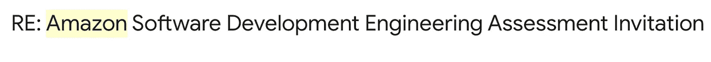

# 我在亚马逊的面试经历

> 原文：<https://blog.devgenius.io/my-interview-experience-with-amazon-853023959b78?source=collection_archive---------11----------------------->

大家好！在这里我想分享一下我在亚马逊上应聘软件工程师的经历。

Amazon.com

这是 2020 年初，在一个电报小组中，许多软件工程师，一些在 FAANG 和欧洲其他大型科技公司工作的人，分享了他们团队需要软件工程师的信息。我认为为什么不试试呢？我已经有足够的经验了，我已经联系了其中一位在亚马逊工作的人，问了一些关于面试过程的问题。但是在和他谈过之后，我明白我不能尝试申请并从他那里得到推荐，可能是错误的方式。

所以我决定更深入地准备。l [eetcode](https://leetcode.com) 是我当时最好的朋友，周末的每个早上我都会早起开始参加挑战。第一次，我每次只能解决一个任务，但在经历了一些挑战后，我试图理解如何解决多个任务，学习了数据结构的类型和解决这些问题的算法，我的进步开始成长。

一天晚上下班后，当我有空的时候，我决定也许我可以试着把我的简历发送到 FAANG 公司，我决定把它们都发送，但不是全部发送。我只是把我的简历发送到亚马逊在温哥华的工作职位软件工程师 II，并认为让我们等待它是否可行。我投简历的时间是 2 月 15 日，但我不相信他们会联系到我。

**邮件截图**

但令人惊讶的是他们回答我:

**回复邮件屏幕**

我真的很高兴，因为我收到了回复，有一个在线评估的链接，以及当我需要通过所有考试时的解释。亚马逊有自己的在线评估平台，他们不使用黑客排名，也不喜欢这些平台。所以当我看到邮件的第一天，我有点担心，那天我没有做在线评估。两三天后，我决定这样做，我开始了，这是两个编码任务。我不能分享全部的信息，但我可以说没有困难的任务。第一个是字符串算法，第二个是 BFS(呼吸优先搜索)。我已经解决了所有的 2 个任务，因为对我来说没有那么难，但其中一个只有一个测试案例失败。我想得更深入，但不能修复它，并发送了我的解决方案。当然，我希望我能更进一步。

几天后，他们给我发来消息说我进入了下一步，2020 年 2 月 26 日

**截图表格邮件**

对于我需要为电话面试安排 5 天时间的回答，我已经选择了 5 天并回答了。作为回答，他们给我发来了电话面试流程的资料，我开始更深入的准备。在那封邮件之后，什么都没有继续，我选择了未来 2 周的 5 天，我想他们会在几天内回复我，但是没有人回复我。他们没有回答，我想好吧，如果他们不回答，可能已经决定不继续这个过程。一个月后，我收到了亚马逊发来的另一封邮件，他们说日程安排有问题，让我重新安排 5 天的时间，我又安排了 5 天的电话面试。

2 天后我收到了电话面试确认，离电话面试还有 10 天，我为 7 天的准备计划了一些日志，我知道在电话面试中不会有[领导原则](https://www.amazon.jobs/en/principles)的问题，我只是重复 [leetcode](https://leetcode.com) 的算法和数据结构题目解决的任务。

电话面试那天，当离面试开始还有 10 分钟时，我真的很紧张，每一秒都感觉像一小时，一分钟像一天。之后他问了我两个问题，第一个是关于 LinkedList 的非常简单的问题，但在解决之后他有一些后续问题，第二个任务是关于 hashmaps 的，我也很容易就解决了。面试官非常细心地帮助我，用提示和边缘案例来发现我的解决方案中的问题。我知道他们的目的不是让你失望，而是想知道你的知识水平。面试后，我觉得我做到了，但我怀疑我的英语，我想也许在某些情况下他不理解我。

两天后，我收到了一封电子邮件，祝贺我进入了下一步，因为当时是疫情时间，所有边境都关闭了，他们给我发了一封虚拟现场面试的邀请，当然要求 5 天时间进行选择，并说虚拟现场面试至少需要 5 个小时。

**邮件截图**

我安排了 5 天，回复了他们的邮件。我很高兴，因为现场面试是 offer 之前的最后一关。))1 周后，他们给我发来了一封确认电子邮件和许多关于现场面试的信息，以及我必须准备的主题。

确认后，我开始准备，每天我都学习领导原则，记住一些有利于该原则的情况，重复广告材料，还解决了许多来自 leetcode 的任务，在 youtube 上观看了许多关于系统设计的视频，在 pramp 上进行模拟面试，并采访了我在大型科技公司工作的朋友，收到了反馈并纠正了我的错误。

所以直到我面试的那天，招聘人员给我发了一封电子邮件，说时差是 12 个小时，我确定要在一天内完成所有的面试，我想如果能把我的面试分成两天会很酷，于是我写了一封信。所以我的现场面试分为两天，第一天 3 场，第二天 2 场。

第一天，我上了 3 节课，第一节是关于行为问题和领导原则。许多这样的问题看起来像

*   告诉我一个当你…
*   告诉我当时的情况。。。

所以，在这种情况下，我必须告诉他们在我的生活/职业生涯中发生的情况，他们对你职业生涯中的情况更感兴趣，他们会问一些关于这种情况的问题，你是如何解决的，是错误的决定还是类似的问题。。。第二次会议也是从 LP 问题开始，30 分钟后继续编码部分，就像 OOP +算法会议一样，我设计了一个流行的在线音乐门户的一些功能。第三节课再次从 LP 问题开始，并继续编码。采访结束后，我累了，刚刚入睡。

第二天我参加了两次面试，第一次是编码会议，我们从 LP 问题开始，然后继续编码，任务是 leetcode 的中级任务，但条件不同，我建议了 2-3 个版本的解决方案，当然，面试官用提示和边缘案例帮助我解决了它，不要忘记他们的目的是不失去你，但他们想知道你是否准备好与他们合作。最后一次面试是系统设计面试，我们再次从 LP 问题开始，继续系统设计问题，我们尝试开发社交网络的一些功能。面试结束时，他们说招聘人员会在几天后给我发一封电子邮件，告诉我结果。

我等回信等了很长时间，对我来说感觉像过了几年，但他们在 3 天后给了我回信，不幸的是，回信被拒绝了:

**邮件截图**

当时我很难过，但几个小时后，我认为尽管我失败了，但我有一个很好的经历，现在，我知道亚马逊的面试过程是怎样的，当然，我下次会再试一次。

在我帖子的最后，我想分享一些有用的资源，它们帮助我做好了准备:

*   [leetcode.com](https://leetcode.com)
*   geeksforgeeks.org
*   【pramp.com 
*   [ACM Ivanovo](https://www.youtube.com/channel/UCYYWxOGe__aCM1pF1JjPkUQ) ， [CS Dojo](https://www.youtube.com/channel/UCxX9wt5FWQUAAz4UrysqK9A) youtube 频道关于算法和数据结构(俄语)
*   [技术假人](https://www.youtube.com/channel/UCn1XnDWhsLS5URXTi5wtFTA)， [Gourav Sen](https://www.youtube.com/channel/UCRPMAqdtSgd0Ipeef7iFsKw) youtube 频道关于系统设计
*   [破解编码面试:189 道编程题及解答](https://www.amazon.com/Cracking-Coding-Interview-6th-Edition/dp/0984782850)
*   [设计数据密集型应用程序:可靠、可伸缩和可维护系统背后的重要思想](https://www.amazon.com/Designing-Data-Intensive-Applications-Reliable-Maintainable/dp/1449373321)

如果你正在面试这份工作，我想说祝你好运，永远成功，永远不要失败，但是如果你失败了，不要忘记这是提高你自己的理由。

永远健康！:)