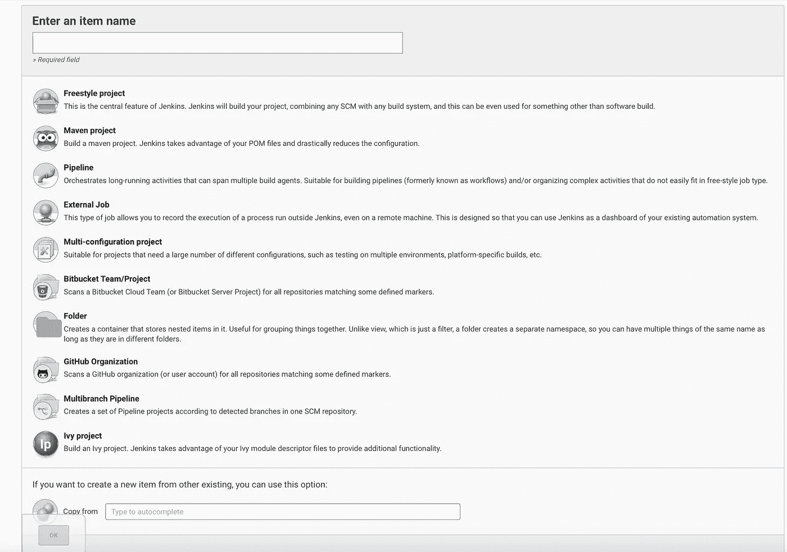
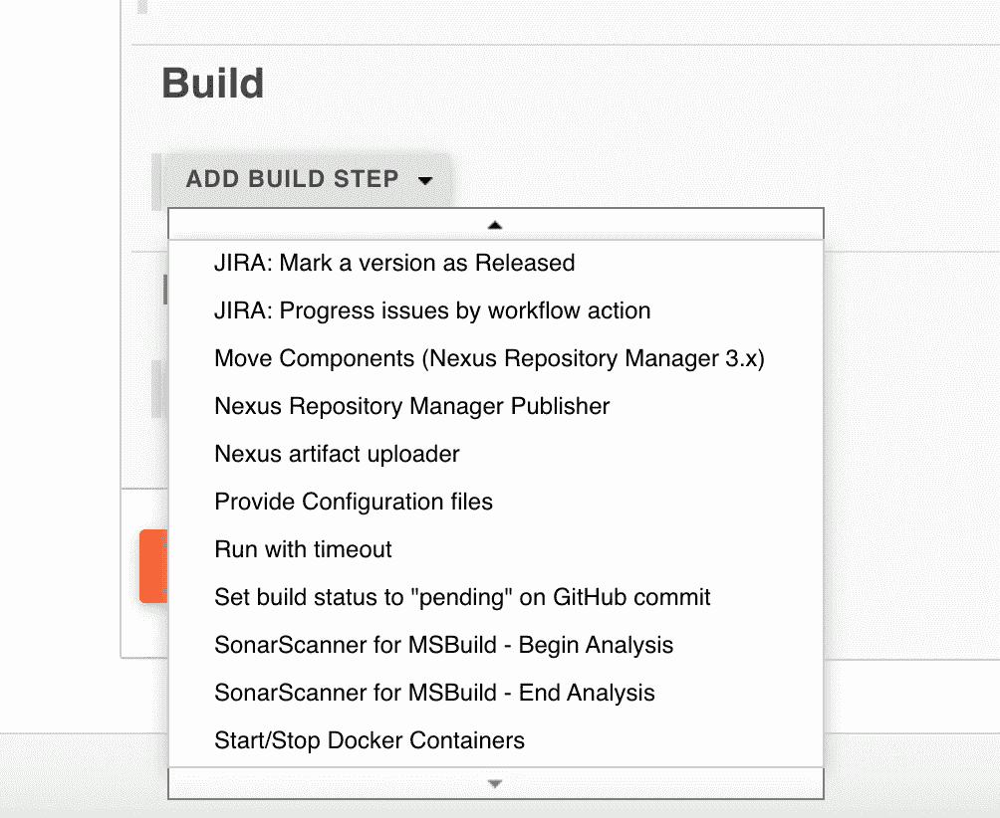
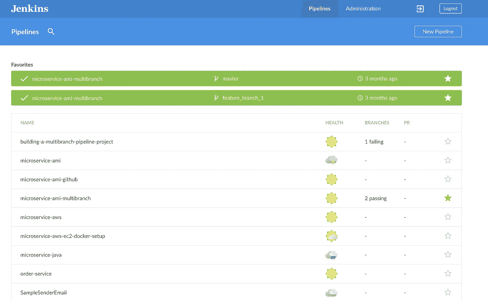

# 我的詹金斯故事:我为什么爱詹金斯

> 原文：<https://blog.devgenius.io/my-jenkins-story-why-i-love-jenkins-eff08e5716e6?source=collection_archive---------8----------------------->

在这篇文章中，我将展示我对詹金斯的爱。

我知道很多开发人员/工程师并不热衷于这个工具，因为很多已知的原因，我不能责怪他们。詹金斯有时可能有点难以适应，需要时间来适应。如果你做错了，它会给你的开发工作流程带来很大的混乱和压力。

但是，我无法表达我有多崇拜詹金斯。我对这个工具的喜爱是首屈一指的，原因如下:

## 詹金斯不仅仅是一个 CI 服务器。

Jenkins (<2.0)曾经一度只是一个 CI 服务器。这基本上是哈德逊项目的一个分支。它的目标是比哈德逊更好。但是詹金斯 1 号只是造成了一个又一个问题。作为一个 CI 服务器，我觉得它完成了它的工作。但是真正让大多数人痛苦的是他们生态系统中庞大的插件库。有些插件比其他的好，而其他的很差&没有很好地集成到 Jenkins 的生态系统中，这给人们带来了很多问题。不管出于什么原因，当时的东西还不成熟。也许与今天相比，开源仍然处于初级阶段。此外，正确管理 Jenkins 服务器或 Jenkins 服务器集群也是一件痛苦的事情。要做好这件事太难了。维护是单调乏味的，而且大多数时候也不是没有错误。在我看来，詹金斯的使用远远超过詹金斯管理和维护的缺点。

Jenkins 使用插件架构，正是这一点让它如此强大。开源社区在开发这些插件方面的贡献，这些插件做了很多很酷的事情。与许多你无法想象的外部系统互动。

所以 Jenkins 就像一个通用的多用途自动化服务器。

查看您可以创建多少种不同的作业进行管理:

这么多选择。

例如，您可以创建一个完整的基于 maven 的 Jenkins 项目，或者您可以使用 FreeStyle 项目选项根据自己的喜好来定制 Jenkins 作业。

如今，随着 Jenkins Pipelines 的引入，您还可以创建模拟完整 CI/CD 管道的管道作业。

此外，请查看配置期间可用的不同选项:

从上面可以看到，您可以:

*   连接到 JIRA(一个问题-任务管理系统)
*   将工件发布到工件存储库管理器(Nexus)
*   链接到 GitHub 这样的 VCS
*   使用声纳进行静态代码质量分析
*   管理 Docker 容器
*   +多得多

无尽的…

## 希望在遥远的蓝色海洋的尽头…

随着管道的发展，Jenkins 2.0+应运而生，也就是 Jenkins 今天所知的版本。

近年来，新的 Jenkins 开始引入一个全新的 UI——蓝海。这很酷。请参见下面的示例:

用户界面很简单，非常干净。太神奇了。

同时，詹金斯仍然保持经典的主题用户界面。实际上，我仍然非常喜欢它，但是现在有些人认为它可能有点老派了。

也就是说，旧的主题用户界面可以很容易地定制成你喜欢的样子。它们是帮助你做到这一点的插件。