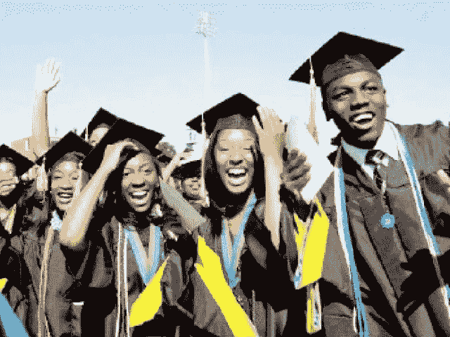
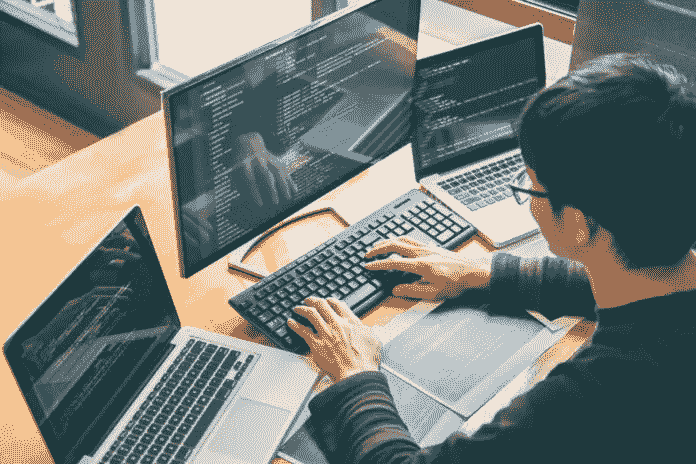

# 我的软件开发之旅

> 原文：<https://blog.devgenius.io/my-journey-into-software-development-9e714b61f5d1?source=collection_archive---------35----------------------->

在我的成长过程中，我不是那种被父母允许使用电脑的孩子。就在几年前，我开始使用智能手机。

*你能想象吗？:)*

像我这样有着所有这些缺点或限制的人，如何开始软件开发的职业生涯呢？

这一个深哦！

你想知道吗？你应该继续读下去！

本人 2015 年 7 月高中毕业，没有编码，也没有基本的计算机技能。那年我写了《UTME 》,不幸的是，我没有被录取，所以为了不呆在家里，我不得不参加基本的计算机培训班。

*这里是我找到初恋的地方:)*

很快，我变得非常擅长使用电脑。培训结束后，我在接受培训的地方找到了一份工作，担任电脑教员，教初学者如何使用电脑。我必须承认，我喜欢我的工作。

直到 2018 年，我才意识到自己并没有从工作中学到什么新东西。每天，我做同样的事情，每天都像递归函数调用的活动…Lol！！！

2018 年 2 月，了解到拉各斯州政府举办的免费校外编程培训， [CodeLagos](https://codelagos.org/) 。我申请并被录取了，实际上我申请了两门不同的课程，而不是一门。Lol！！！

我们喜欢的人太过火了

不要介意我的热情。我只是想学习一些新的东西，我申请了 Python 编程和 Web 开发入门班。我从周一到周五连续 6 周上课，没有错过任何一节课，因为我真的在学习并且享受每一节课。

遗憾的是，培训只是一门入门课，但它让我走上了通往软件开发美好职业生涯的轨道。

这次培训使我改变了在大学学习计算机科学的计划。*耶！！！*

哦！我没告诉你吗？？

我之前想学习医学和外科，从 2015 年到 2017 年，我申请了它，但我被拒绝录取。

好难过，耶！

胜利，终于来了！

2018 年底，我终于被联邦理工大学录取，学习计算机科学。我参加的培训让我看到了一个更有趣的世界，我从未后悔这种改变，而是感谢上帝，我没有获准学习医学&外科。

快进到 2020 年，我目前正在学习 Javascript，我已经建立了一些项目，它们可以在我的 [GitHub](https://github.com/dha-stix) 页面上找到。我还申请了 Genesys 实习项目:代号 Learnable。

你猜怎么着？？？

我是一名实习生，我很高兴能有这个机会学习并与科技行业的优秀人才交流。:)

我非常确定参加实习计划将帮助我学习新的工具，也给我成为世界级软件开发人员所需要的动力。

软件开发人员

我真的很期待培训，尽管我不会亲自去培训地点，但我会在线参加(虚拟的)。

非常感谢 Genesys 团队为我们提供了这个绝佳的机会。

在 GENESYS，一切都是可以学习的！！！

谢谢大家！:)