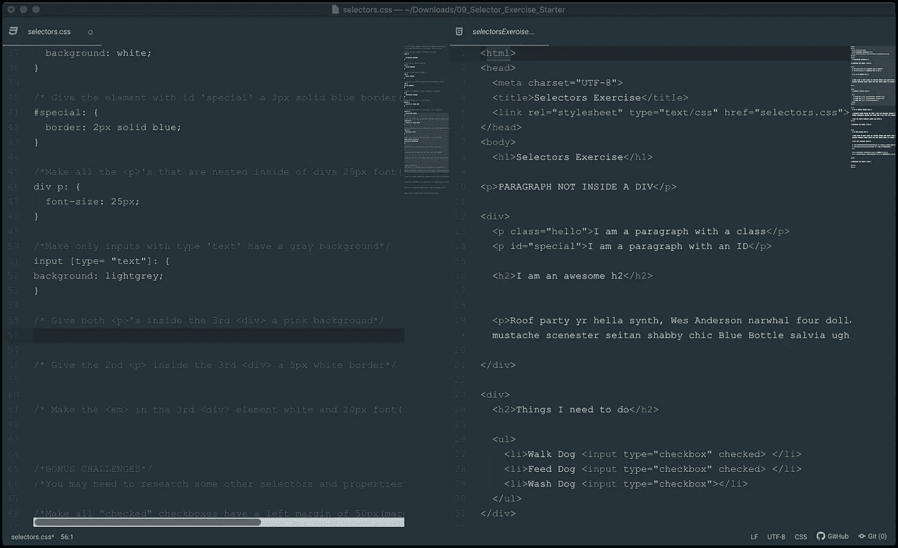

# 我的软件工程之旅

> 原文：<https://blog.devgenius.io/my-journey-into-software-engineering-b3236a6aaed1?source=collection_archive---------47----------------------->

我为训练营做的一个编码挑战。

当我冒险进入成为一名软件工程师的第一周编码训练营时，我想反思一下我的决定，这些决定让我来到这里学习编码。

我想首先声明，我从小就是一个技术爱好者。我最美好的回忆之一是，我母亲给我买了 1983 年上市的旧麦金塔电脑，你知道那个臭名昭著的广告。当然，我并没有那么老，而是我的母亲在 1996 年为我购买了这台电脑，所以当时它已经相当过时了，但是，当你考虑到我在一个农村长大的事实时，通常很难轻易接触到新技术。然而，那块旧的单色漂亮塑料激起了我对技术的兴趣。

而不是谈论我如何在学校的技术和机器人俱乐部，以及我如何通过高中课程或通过编辑我的 myspace 个人资料首次学习 HTML。或者当我还是一名研究生的时候，当我在寻找一份历史学家的工作时，我是如何学会爱上 Linux 终端的。或者当我得到我的第一份教师工作时，我经历了一段极其艰难的时期，这段时期粗暴地惊醒了我，让我试图尽快找到离开那个地方的方法。

也就是说，我想谈谈为什么我没有选择早点学习编码，或者为什么我花了这么长时间才完全暴露出来并致力于成为一名软件工程师。从小到大，我的数学一直很糟糕。所以当我上大学的时候，尽管我想在高中一年级时成为一名计算机科学专业的学生，但我还是主动选择了不去读计算机科学专业。对我来说,“工程师”这个词带来了一个令人难以置信的错误含义:你需要成为一名数学高手。所以作为一名新生，我像躲避瘟疫一样避开它！哦，我错了！直到我开始在 Linux 终端上运行命令，我才恍然大悟！我说等等，编码真的是这样吗？所以我开始做越来越多的研究，我意识到我真的想编码！我发现了编码训练营，经过深思熟虑后，我终于全身心投入，并在熨斗学校的第一周开始写作！

祝我好运！