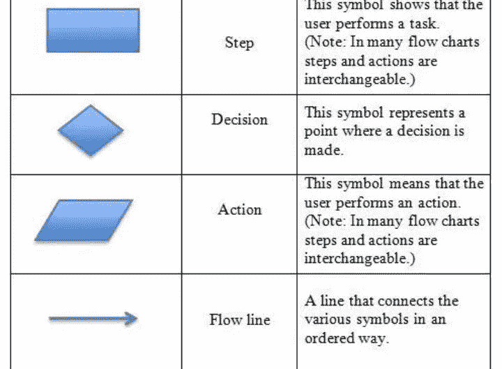
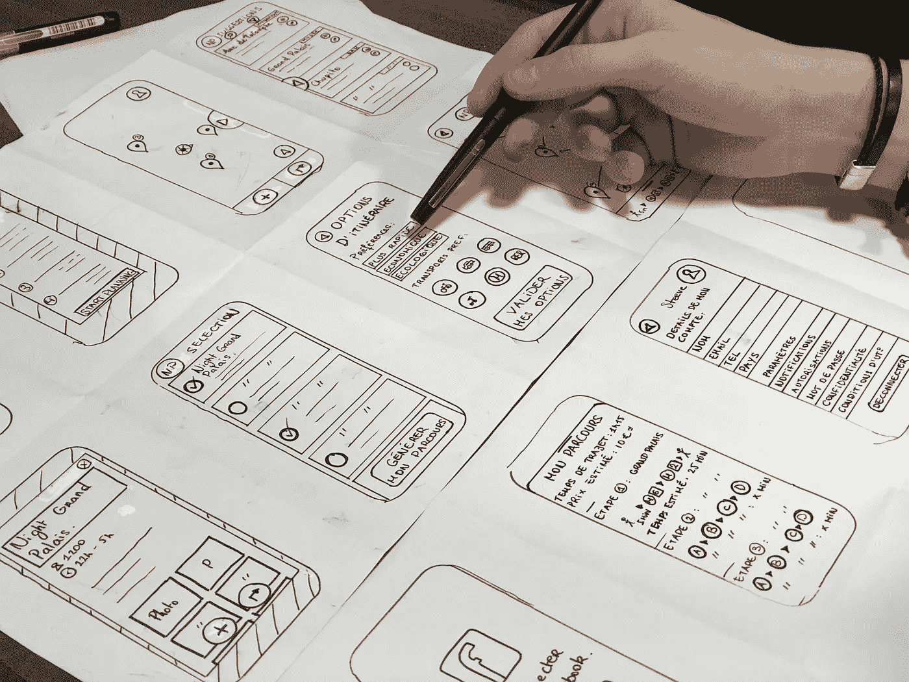
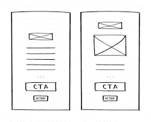
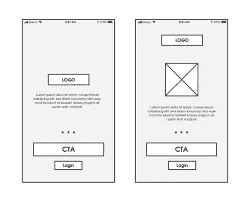
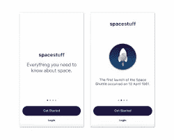

# 我作为 UI/UX 初学者的旅程

> 原文：<https://blog.devgenius.io/my-journey-so-far-as-a-beginner-in-ui-ux-29469273751?source=collection_archive---------8----------------------->

我将带你经历我的旅程，也将分享一些我在 UI/UX 设计中学到的东西。我于 2021 年 12 月开始在 UI/UX 工作，这是天赐良机媒体技术指导项目给我的机会的结果。你可以查看我以前的帖子了解更多细节。

然而，作为一名 UI/UX 设计师，你需要关注如何为他人改善事物，而不仅仅是为你自己。注意这个！为娱乐而非功能而设计的产品会影响用户的体验。

*为什么应用程序设计很重要？*
从 2016 年至今，我们在 IOS 应用商店上有超过 200 万个应用，在 Google play 商店上有超过 240 万个应用。因此，如果你想让你的应用在众多应用中脱颖而出，你需要注意你的设计。
*什么会让人爱上你的 app？*
1。它的易用性如何，它能让你用最少的努力完成你想要的任务吗？
2。界面有多好看？是否高效且符合逻辑？

你必须专注于应用程序设计的基础，这样你才能让你的应用程序变得漂亮，用户也会爱上它。

在我们能够适当地钻研设计之前，有一些基础必须被打下。*我们可以称之为设计的不同阶段，包括:*

> **用户流程图**
> UX 设计中的流程概念最早是由心理学家**米哈里**杜撰出来的。
> 用户流也可称为 UX 流或流程图。用户流是一种可视化的表示，可以是书面的，也可以是数字的。
> 
> 用户流程图显示了用户使用产品的路径。它也意味着用户完成任务的实际质量和体验。如果用户可以很容易地通过一个界面而不被迷惑，他们会有更大的机会再次访问这个网站。

*为什么是用户流程图？*
流程图协助设计团队的其他成员，并帮助向客户轻松传达界面布局。要设计最好的用户流程图，你必须了解你的用户。

*不同的流程图形状及其代表的含义*

**矩形**通常代表一个页面或显示屏。

**菱形**形状是用来提问的。它有助于显示需要做出哪个决定。例如，你可以问这样一个问题，你愿意成为会员吗？

**圆/平行四边形**用于显示动作。它们显示了必须采取的步骤或必须完成的任务。当你想表示一个过程或操作时，你可以用一个圆。

**线和箭头**将一切联系在一起，并通过图表确定流程。

如果你不想手工绘制，这些工具可以用来数字化地创建你的*用户流程图*。

【Figma.com】
[lucid chart](http://LucidChart)
[Adobe XD](http://Adobe XD.com)[flow mapp](http://flowmapp.com)
[mock plus](http://Mockplus.com)

让我们转到**线框**

> 什么是**线框？线框图是设计师衡量用户如何与界面互动的完美方式。它也可以作为设计的第一阶段。一个好的线框可以让你对你的应用程序的整体布局和功能有一个清晰的认识。**

让我们来谈谈不同类型的线框。
1。低保真度线框
2。中保真度线框
3。高保真线框

> 这些线框的区别在于它们包含的细节数量。

***低保真线框***
这些都是网页或 app 的基本视觉呈现。它们或多或少像一幅草图。

***中保真线框***
这些有更精确的布局表示。

***高保真线框***
这种线框具有像素特定的布局。它们可能包括相关的书面内容。

所有这些线框都可以使用数字线框工具创建，例如:

[Balsamiq 线框](http://Balsamiq.com)
[草图](http://sketch.com)
[Figma](http://figma.com)
[Photoshop](http://photoshop.com)
[漫威](http://marvel.com)
[Proto](http://proto.io) 。io
[Invision](http://invision.com)
[Azure](http://Azure.com)
[UXPin](http://Uxpin.com)

*可以在线框中找到一些元素包括:*

1.  逻各斯圣语
2.  搜索字段
3.  头球
4.  共享按钮
5.  占位符文本。

我将在下一篇文章中谈论原型以及如何创建漂亮的模型。很抱歉我不能在这篇文章中分享我所有的设计，期待在我的下一篇文章中看到它们。

结论
作为一个 UI/UX 的初学者，你必须注意上面列出的几件事，我相信这能帮助你提高设计技巧。当你继续设计的时候，你必须把你的用户放在心上。不要匆忙，不要在没有理解流程图、线框之类概念的情况下就投入设计。

感谢阅读到最后！

希望你有价值。