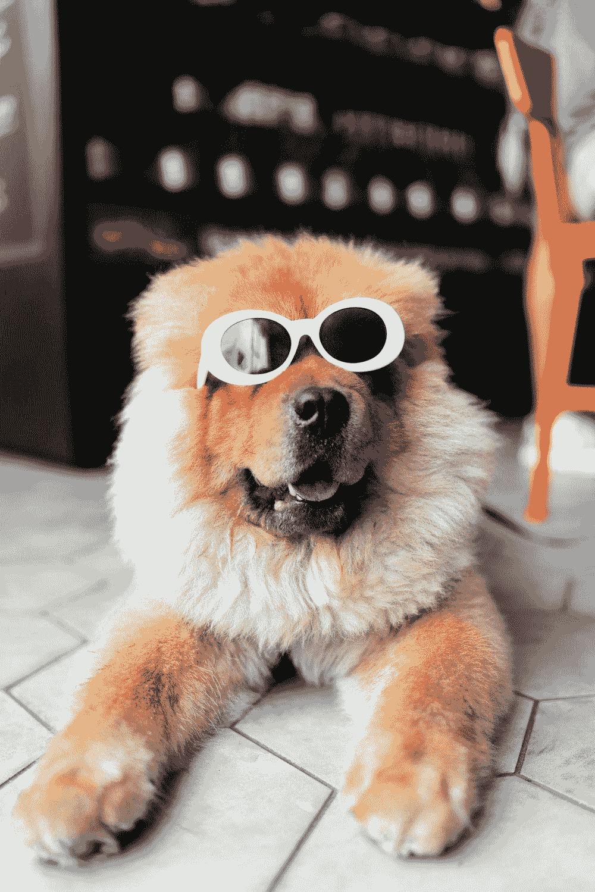

# 我的新角色…工作拒绝专家

> 原文：<https://blog.devgenius.io/my-new-role-a-job-rejection-expert-da407782b983?source=collection_archive---------9----------------------->

我在整个疫情找工作的经历

[马太·亨利](https://unsplash.com/@matthewhenry)在 [Unsplash](https://unsplash.com/) 上拍照

所以我在目前的职位上已经工作了一段时间。这是新的，我肯定已经习惯了。我称之为**求职拒绝专家** …

……好吧，这个幽默可能不太好，或者不合你的口味，但是为了表达求职的进展情况，我想我会提供一个不同的解释。

所以，你可能已经猜到了，这个故事是从一个找工作的人的角度来说的…而不是从一个向申请人发出拒绝的人的角度来说的…

# “新”现实…至少现在是这样

通过对我们此刻在疫情所经历的现实的一些自我反思，以下几点似乎是真实的:

*   这更加困难，尤其是对于更多的研究生/初级人员来说，要获得一个新的职位**(正在寻找新职位的高级人员可能会被迫接受降薪，仅仅是为了得到一个职位！)**
*   随着疫情和失业人数不可避免地增加，更多的人寻找意味着更多的竞争……雇主有更多的人来选择特定的职位
*   公司削减成本意味着工作机会可能会减少

# 这个故事的一些要点…

*   如果你感到有压力，有点沮丧，真的厌倦了找工作，请随时分享你的经历并伸出援手
*   你能做的就这么多了…所以总是要找时间休息一下，不仅要保持身体健康，还要保持心理健康…非常健康！(当你有压力时很容易过度劳累试图完成任务，解决“没有工作”的问题)
*   在某种程度上类似于上一个，然而**找一个新的爱好或者花时间享受现有的爱好**来平衡你的一天……**与人/朋友联系**
*   无论如何，找一份工作可能要花很长时间……记住，这是前所未有的时代(我相信你已经听过/读过很多遍了)，所以不要对自己太苛刻了……以前找工作很难……**现在更难了！**
*   博客，Vlog 和所有那些好东西来帮助处于相同情况下的其他人，或者把你的想法写在纸上，在屏幕上…你知道我的意思:)

# 在一天结束的时候，试着像这个酷家伙一样…

[阿兰·金](https://unsplash.com/@alanking)在 [Unsplash](https://unsplash.com/) 上拍照

感谢你的阅读，我希望这能让你振作起来/让你从单调重复的求职中有一点动力，并表明你并不孤单…而且你阅读我的博客文章非常酷:……**不，严肃地感谢你的阅读。**