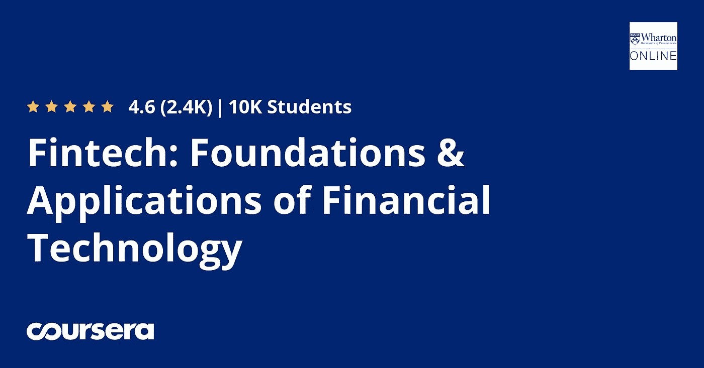

# 我对 Coursera 提供的金融技术专业化的概述

> 原文：<https://blog.devgenius.io/my-overview-of-financial-technologies-specialization-offered-by-coursera-e33c42ec1dd8?source=collection_archive---------3----------------------->

密歇根大学提供的另一个专业。以下是我对密歇根大学金融技术专业化概述的详细信息。

## 1-概述了金融支付系统

第一门课实际上是从金融支付系统开始的。但在整个模块中，它们将继续得到更好的发展，除了获得专业化认证的最后一个模块，您将主要看到区块链和一些大数据，以了解支付系统。总的来说，除了最后一门专业课，其他专业课都很好理解。更重要的是，密歇根大学的课程讲师很有趣，当谈到支付系统和金融技术的抽象定义时，他们真的教得很好。

## 2-他们让你觉得你在他们想象中的岛上进行一次冒险

他们创造了金融科技岛，你只需按照他们的课程去那里。它可能会让你在整个专业化课程中充满冒险精神，并自愿让你参与讨论，以解决课程教师创造的想象中的解决方案。当你进行测验和讨论时，你会有更多的满足感，并渴望了解更多关于金融技术及其各自的应用。

## 3-本课程主要包含区块链

正如我在上一段中提到的，前三门课程主要包括区块链技术，以了解 fintech(金融技术)的应用。更有甚者，他们询问金融科技初创公司如何利用区块链技术渗透市场，以及他们如何在这样做的过程中真正取得成功。

## 4-最后一个模块是最难完成的课程

这是一门涉及人工智能的课程，如果你没有回归分析等主题的知识，这可能会很难。更糟糕的是，因为他们谈论有效市场理论，以及 Robo advisors 如何通过 ETF 带来一定比例的回报，以及如何通过特定的等式实现这一点。如果你有数学背景，可能需要无数次才能理解人工智能将如何改变金融科技行业。但是如果你对数学没有足够的理解，方程很可能会让你的学习变得更加困难。

你对密歇根大学的金融科技专业有什么看法？如果您参加了专业化课程，请在下面的评论部分分享您的想法。

**关于阿塔特科利**:我是本土耳其的协调员，负责技术和研发&部门。我还是伊斯坦布尔大学区块链技术俱乐部的创始副总裁兼编辑。我的主要兴趣是区块链 R & D、数学和统计学。