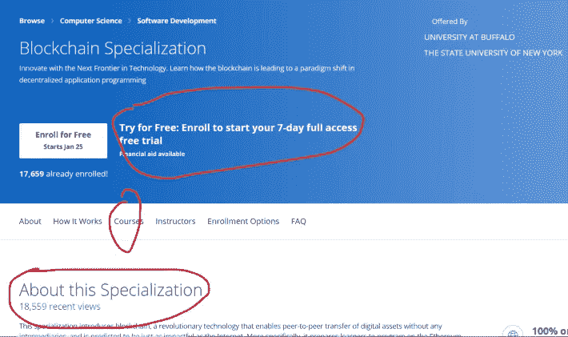

# 我对 Coursera 区块链专业课程的概述

> 原文：<https://blog.devgenius.io/my-overview-on-courseras-blockchain-specialization-courses-c41176d52607?source=collection_archive---------3----------------------->

向知名机构学习区块链。良好的证书，可能对区块链职位的申请有用。以下是我对 Coursera 的区块链专业课程的概述。

## 你为什么要选这门课？

首先，他们的证书有很好的声誉，因为他们是由声誉很高的机构支持的。其次，他们让你对区块链本身有一个总体的了解。更重要的是，不管你的大学学位如何，你都可以被认证为某种专业人士。最后，你可以意识到你错过了各种专业化的课程。

## 我是如何选择这门课程的？

我使用 Coursera 提供的学生课程，包括由某些机构赞助的数千门课程，直到九月底。当我搜索区块链的课程时，我看到了区块链的专业课程，并且不假思索就报名了。

## 它是如何累积成技能的？

在我看来，尽管他们有声誉良好的机构支持他们的证书，但与他们的技术教程和指导相比，他们还不如 udemy。但是，他们的评分系统和要求用户必须达到高分才能获得认证，也让人们充分参与和学习课程模块。而且，编程作业允许你用虚拟机与以太坊网络进行交互，让你编程一个智能合约，让你编程一个 Dapp 及其测试代码，获得一些实践经验。

## 这个课程给我增加了什么技能？

首先，当我在布法罗大学完成一门课程时，它让我名声大振。其次，我学会了完成程序的每个细节，即使编译器告诉我一切都是正确的。第三，我学会了如何与以太坊网络互动，尽管是与虚拟机互动。最后，它让我意识到我缺少什么技能，让我更加专注于这些技能。因此，我决定在区块链学习商业课程、金融课程和商业模式课程。现在，多亏了 Coursera，我拓宽了自己的知识面，可以提供现实生活中的解决方案。

*你觉得 Coursera 的区块链专业化课程怎么样？这个专业化给你增加技能了吗？这种专业化让你意识到自己的不足了吗？如果您已经完成了课程，请在下面的评论部分分享您的想法。*