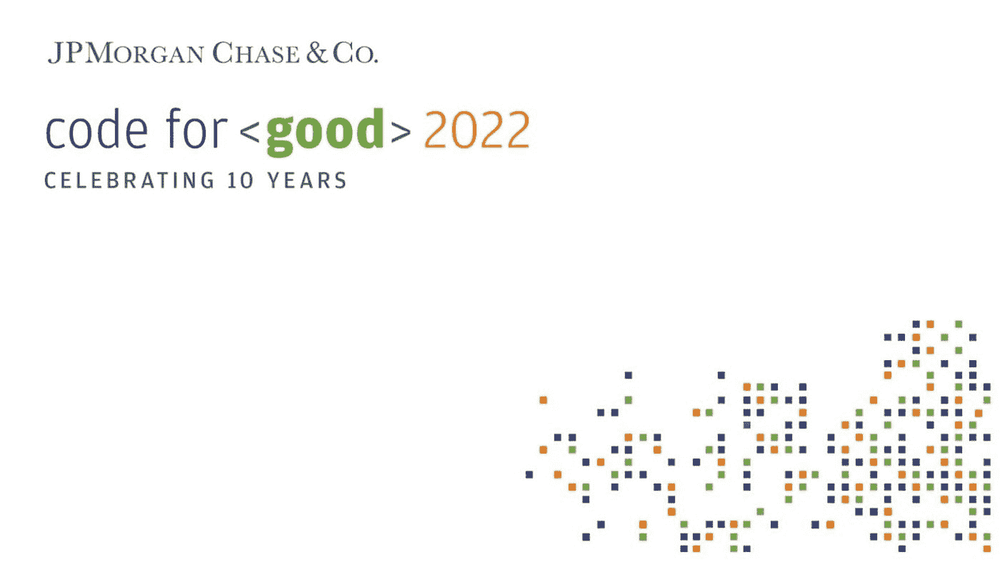
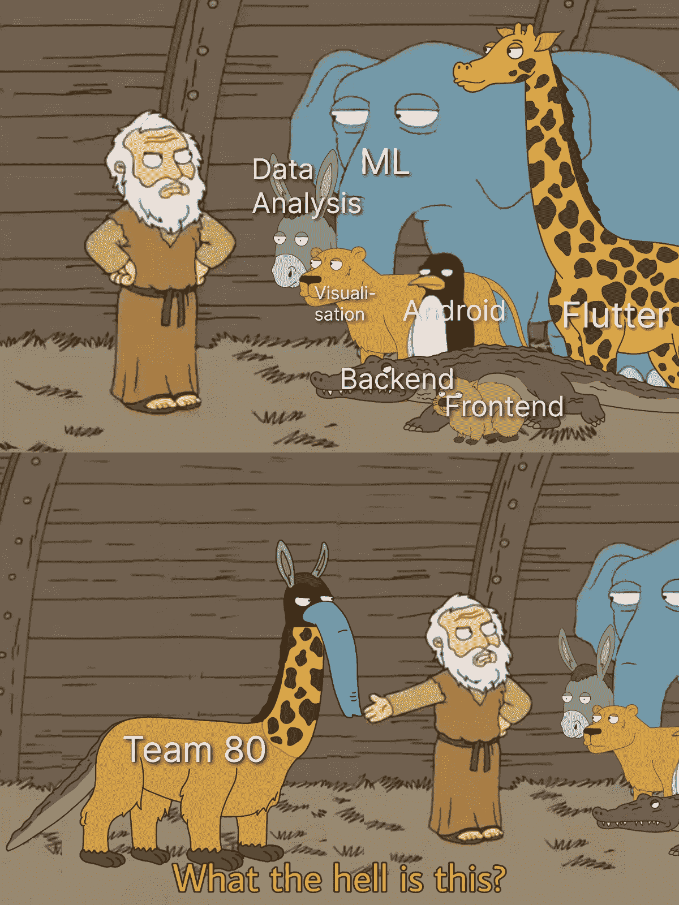
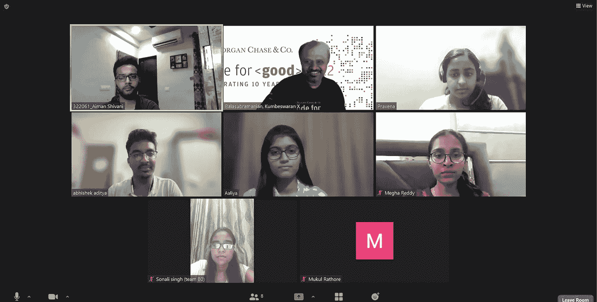

# 我的摩根大通之路:好代码之路

> 原文：<https://blog.devgenius.io/my-path-to-j-p-morgan-chase-the-code-for-good-way-88d919ddb50d?source=collection_archive---------2----------------------->

最近，我得到了参加摩根大通 2022 年黑客马拉松的机会。今年是永久代码的十周年纪念日🎉

很多学生向我咨询我的经历和招聘过程，所以这里有一篇文章可以帮助你！开始了。(附:一直读到最后，为自己找到一些成功的秘诀；)

2022 年 JPMC 永久代码

## 关于永久代码的简介

自 2012 年以来，摩根大通(J. P. Morgan Chase)每年都会组织一次“好的代码”( Code for Good)活动，来自不同机构的大学生组成团队，在 24 小时内解决一个现实世界的问题。听听他们怎么说。

> “善的代码”是我们的机会，让大学生来到我们的办公室，进行 24 小时的头脑风暴，讨论非营利组织如何解决他们面临的挑战。

然而，今年的黑客马拉松在网上举行(course🥲的疫情)

让我们从流程的开始说起:

**第一步:网上申请**

第一步是在 JPMC 的职业门户网站上申请。他们会在你的简历上询问一些细节。以下是资格标准:

*   **学位:**b . tech/b . e/MCA
*   2023 批次结业[有资格获得全职机会]
*   2024 批次结业[有资格获得实习机会]
*   **流或专业:**计算机科学/信息科学/信息技术/数据科学/人工智能/大数据/物联网/电子/电气/电子和电信等。
*   全面的学术背景，在工程课程上至少有 7 CGPA 的总成绩。

根据资格，一些学生进入了候选名单，我们进入了下一步。

**第二步:编码测试(1 小时)**

HackerRank 上给出了两个容易到中等水平的问题，应该在一个小时内解决。这里没什么新鲜的。入围的学生进入了下一轮。

**第三步:在线面试**

在 HireVue 平台上提出了 2 个行为问题，我们有大约 2 分钟的时间来回答每个问题。这是最后的入围名单，很少有学生进入最后一轮->hackathon⚡

**第四步:优秀黑客马拉松的代码**

CFG Bangalore 于 2022 年 6 月 4 日和 5 日在线举行。在黑客马拉松的前一周，举行了一些信息/培训会议，包括 Github 最佳实践、演示技巧和与 CFG 团队的问答会议。

活动的那一周，我们开始了解我们的团队和导师团队！大约有 105 个团队，每个团队有 8-9 名成员。每个团队被分配了 2 名导师，他们都是 JPMC 的资深员工。除了导师之外，SME(主题专家)也在黑客马拉松期间出现。

顺便说一下，这是我为迷因比赛制作的一个迷因，描述了我的团队:

这就是我的团队成员的技术多样性！你说得出的，我们都有

# 黑客马拉松日:

***第一天:*** 一大早发布了问题陈述，随后活动以正式开幕式拉开序幕。上午 10，黑客马拉松以 SGO 挑战赛演示开始，之后，我们有 30 分钟的时间填写问题陈述优先表，问题陈述按照先到先得的原则分配。你猜怎么着！我们被分配了最后一个 preference🥲.奖

## **SGO 办公时间:**

在分配到问题陈述后，我们有大约一个小时的时间与我们的社会公益组织(SGO)的代表进行互动，以更好地理解问题陈述，并就问题陈述提出疑问/问题。

## 让我们开始工作吧！！！

在 SGO 办公时间之后，所有团队都开始在他们导师的指导下讨论和规划解决方案，我们也是如此。塔塔努力是我们被分配的组织，他们需要一个数字双胞胎。我们的导师知识渊博、乐于助人且谦逊。在整个讨论过程中，他都在帮助我们，指导我们如何解决问题，朝哪个方向思考等等。在确定了完美的解决方案之后，我们开始着手实现，一直持续到第二天早上。

***第二天:*** 上午 10 点是编码截止时间，之后我们不允许对我们的代码库进行任何更改，上午 11 点是视频演示和 PPT 的提交截止时间。

评估从上午 11:30 开始。有两轮评估，一轮技术评估和最后一轮评审。在 8 或 9 支队伍中，每支队伍中有 2 支进入最后一轮评审，其中一支获胜。每个问题陈述都有一个获胜团队。

最后一轮评审结束后，宣布获胜者，随后举行闭幕式。

## 我们来谈谈数字，好吗？

我们来看看关于 CFG 2022 的一些统计。一些旧的一些新的:

*   52，000 多份申请，2400 份入围，约占 20%🤯是不是很疯狂！
*   105 个团队，每个团队有 8-9 名学生成员和 2 名导师(每次活动)。
*   24 小时解决一个现实世界的问题陈述。
*   14+ SGO 问题陈述。
*   第二天的黑客马拉松结果；45 天内的招聘结果。
*   获胜团队的每个成员都将获得最新的 iPad，所有决赛选手都将获得 JPMC 糖果。
*   我们学院只有 4 名学生参加了黑客马拉松，包括我在内的 2 名学生获得了全职邀请。

虽然我没能赢得黑客马拉松，但我非常享受在不到 24 小时的时间里，与一个多元化的团队一起解决一个非政府组织面临的现实世界问题的经历。完全陌生的人，拥有不同的技术，但为了一个目标团结成一个团队！这是一次怎样的经历啊！我很高兴今年我被一个价值观与我一致的组织列为 SEP 的候选人之一。

我的团队！😁

## 这是关于黑客马拉松的很多信息，现在让我们来谈谈招聘流程。

黑客马拉松的 USP 是**没有面试，**即根据你的表现直接招聘。现在，在黑客马拉松的 24 小时之间，每个团队成员都将与导师进行一对一的交谈，导师可能会决定问你一些问题，但在我们的情况下，这根本不像面试！

另一件需要注意的事情是，招聘结果与黑客马拉松的结果无关，也就是说，无论你的团队是赢是输，你的报价将完全取决于你的个人表现。够公平吧？

## 正如我所承诺的，以下是我的一些建议，可以帮助你在 CFG 取得成功:

*   软技能和技术技能同样重要。所以，也要注意你的沟通技巧。
*   除了 DSA，拥有一些开发经验总是好的。
*   做一个团队成员和一个好的倾听者。
*   在你的任务中发挥领导作用。
*   善于表达，在你的队友中善于沟通。
*   记录下谁在做什么。
*   将大部分时间用于计划，其余时间用于实施。
*   根据项目要求选择技术组合，而不是根据您的舒适程度。
*   随时随地学习新技术。
*   每当有不确定的事情时，向你的队友、导师和中小企业寻求帮助。
*   记住:每个人都希望你做得好，所以要乐于接受反馈。

好了，以上就是我今年在 CFG 的经历以及一些小贴士。我希望这能对你有所帮助。如果你有，请给我留点👏下面，激励我继续写下去！感谢您读到这里:)