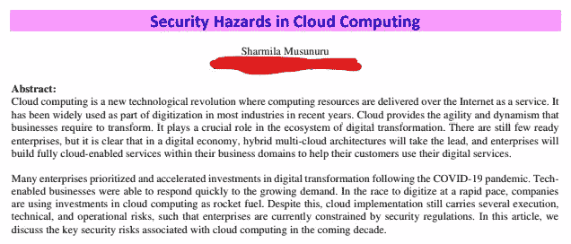
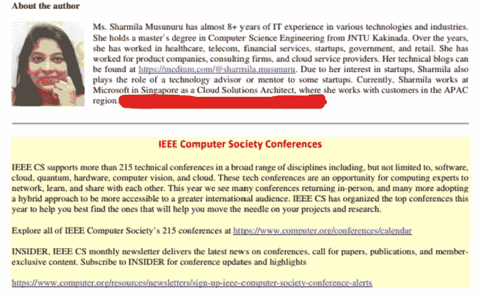
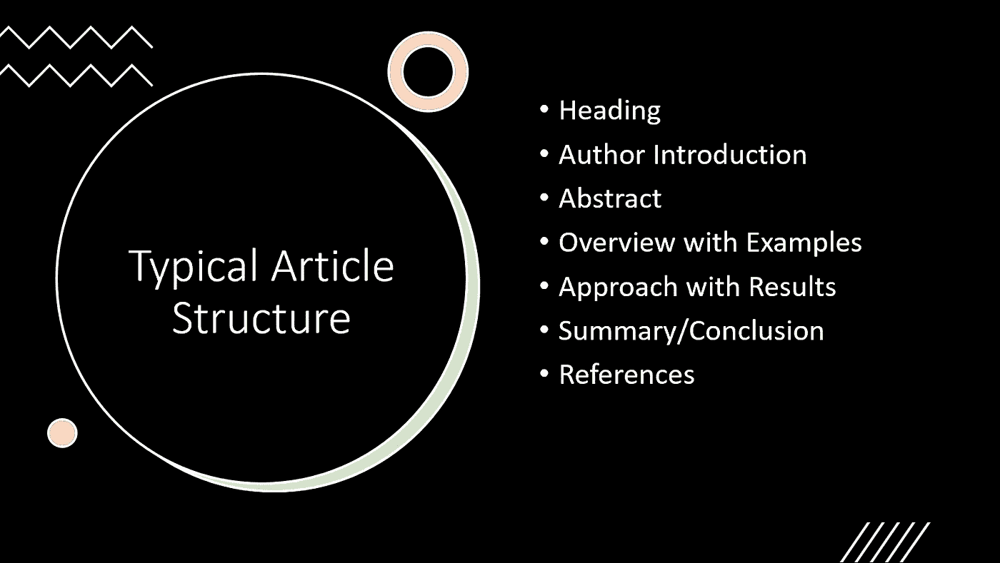

# 我最近在 IEEE 时事通讯上发表的关于云安全的文章

> 原文：<https://blog.devgenius.io/my-recent-article-on-cloud-security-in-ieee-newsletter-7909756bc3b5?source=collection_archive---------8----------------------->

最近，我在 IEEE 时事通讯上发表了一篇文章，今天在这篇博客中，我将向投稿人谈谈我的经验和建议..

作者照片

作者照片

众所周知，IEEE 是最负盛名的技术和专业组织之一，致力于推动技术进步，造福人类。通过在 IEEE 时事通讯上发表您的文章，您将获得更多志同道合者的关注，在那里您可以与他们联系并分享想法。

# 我们为什么需要发布？

马库斯在 [Unsplash](https://unsplash.com/photos/givZa50I9HA) 拍摄的照片

通过发布我们的想法，其他人可以了解世界各地发生的技术的最新见解，以及我们如何解决这些问题？作者会发现，与 IEEE 时事通讯一起出版扩大了他们专业网络的**曝光度，并通过分享他们的知识获得了可信度** **。**

你不需要为发表你的文章付费，你所需要的是对你的领域有更深刻的见解，并且简洁地用一个问题陈述和一点研究得出一个结论。

# 你如何组织你的文章？

每个出版物的提交指南可能会有所不同。为了确保您符合某个**特定出版物的所有要求，请访问**[**IEEE Xplore**](https://ieeexplore.ieee.org/Xplore/guesthome.jsp)，并使用浏览或搜索功能选择您希望在其中发布的出版物。

但是对大多数人来说，典型的文章结构是以标题**(你的文章的名称)和作者的**介绍**开始，在标题的后面是(电子邮件/姓名)**

****摘要**包含对文章的简短描述，你应该简明扼要地用 100-250 字(最多)来表达你的整篇文章。这是一个关键的组成部分，你的审稿人会看到并进行讨论，以继续发表你的文章。因此，花些时间清晰、简明地撰写摘要是至关重要的。**

****

**作者照片**

**接下来是**介绍**，其中你可以谈论**具体问题/用例**以及目前可用的潜在步骤，并提供一些从研究中获得的**示例**(一些字段，如**讨论**、**方法**是可选的)，但这取决于你是否基于它们进行接触，因为你最多需要用 **2500** 个单词来完成这篇文章。**

**附上参考链接是非常重要的，这些参考链接是你为了写文章而寻找的。最后但同样重要的是，做**抄袭**检查，并检查字数，以确保你遵循标准发表你的文章。**

> **敬请关注 [me](https://medium.com/@musunurusharmila/) 获取更多更新。别忘了给我们你的👏如果你喜欢阅读这篇文章来支持你的作者。！！**
> 
> ***如果你想阅读更多的 join Medium $5 会员折扣，请点击这里。***

****