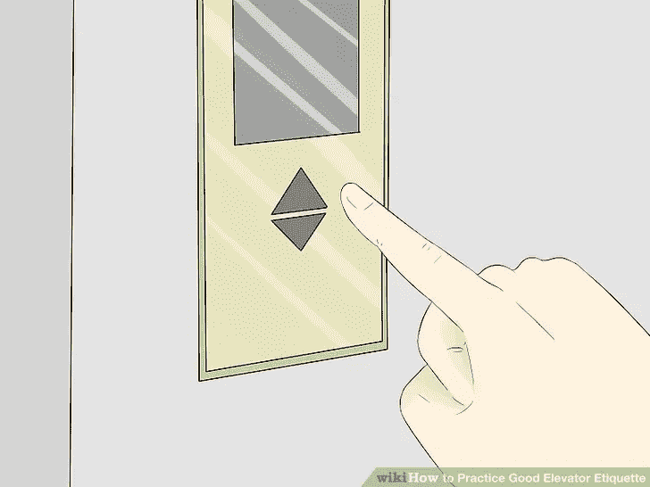
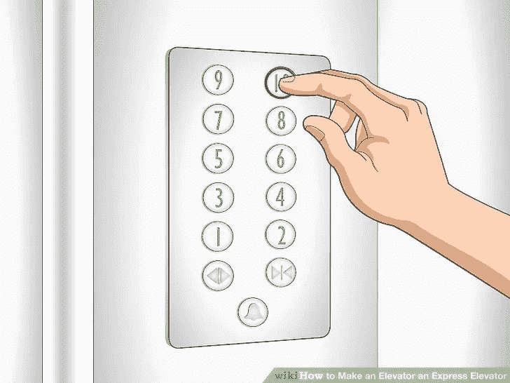

# 我的坚如磐石的系统设计秘诀

> 原文：<https://blog.devgenius.io/my-recipe-for-a-rock-solid-system-design-d1ff3d63cb55?source=collection_archive---------0----------------------->

系统架构的一个重要方面是跨类和包有效地组织功能。

一个有太多函数的类(例如神类)可能会频繁地被改变，结果是不稳定的。此外，该类的任何客户端也会不稳定。

另一方面，将功能划分到太多的类中会导致一个不切实际的、支离破碎的系统，这个系统设计过度并且难以理解。

因此，决定哪些功能应该打包在一起将对系统未来的可维护性产生重大影响。

但是我们如何将正确的功能组合在一起呢？

# 非软件系统的工作原理

让我们对电梯系统进行逆向工程:

这个系统显然有几个功能组合在一起:

*   *订单升降机(移动方向:移动方向)*
*   *getCurrentCabinFloor()//显示电梯在几楼。*

但在电梯轿厢内，还有其他功能:

因此，系统中有一个额外的独立接口:

*   *选择楼层(floorNum: Int)*
*   *openDoor()*
*   *closeDoor()*
*   *alert()*

每部电梯都应进行维护和配置，因此将有各种功能用于这些目的:

*   *settimebeforeclosedoom(时间:长)*
*   *activate()//开启电梯服务*
*   *deactivate()//关闭电梯服务*

这些功能将何去何从？是否应该将它们添加到以前的接口中？

当然不是！
应限制电梯服务的用户使用仅供电梯操作员使用的功能。

操作员通常会有自己的界面来控制这些功能。

换句话说，在电梯系统中，功能是基于**参与者**和**用例**进行分组的

**演员**是:

*   *来电者*
*   *乘客*
*   *操作员*

使用案例包括:

*   *呼叫电梯*
*   *选择楼层*
*   *配置电梯*

因此，这些功能被分为以下接口:

*   ***ElevatorBookingService*** *+order elevator()
    +getCurrentCabinFloor()*
*   ***电梯轿厢服务*** *+选择楼层()
    +开门()
    +关门()
    +警戒()*
*   ***ElevatorOperatorService*** *+activate()
    +deactivate()
    +setTimeBeforeClose()*

根据角色，为每个用例提取一个专用接口可以确保使用系统的每个参与者**只依赖于它需要的功能。**

在物理世界中可以找到许多类似的例子，如电话系统、汽车等等。

适用于所有这些系统界面的原则是:

*   同一个参与者一起使用的功能被打包在同一个组件接口中。
*   使用**特定**系统接口的演员应该利用这个**整体**接口。

这两个原则的结合确保了系统中的每个参与者只依赖于它所需要的。这种分离减少了系统易受错误使用类型和角色间冗余依赖的影响。

如果这些原则适用于几个系统工程学科——软件系统是个例外吗？

# 基于组件的系统设计算法

如果你正在寻找的是一个具有符合你的**特定系统需求的组件分离技术的系统——**我已经编了一个**算法来设计一个系统**，**确保**这个属性。

该算法基于弗劳恩霍夫实验软件工程研究所提出的 [KobrA 方法](https://link.springer.com/chapter/10.1007/978-3-540-85289-6_4)。

1.  *创建一个空函数列表‘L’*
2.  *对于* ***系统分析中确定的每个用例****:
    对于用例* ***中的每个动作由一个参与者*** *:
    给‘L’添加一个适当的函数‘f’(如果它还不存在**)*
3.  *对于‘L’中的每个函数‘f’:
    如果有一个接口‘I’，为其添加‘f’会保留相同的* ***使用 actors*******group****然后将‘f’添加到‘I’。
    否则:创建一个新的接口‘I’并添加‘f’到其中。**
4.  **检查所有创建的接口和功能，并根据每个接口包含的内容提供有意义的名称**

**

# *例子*

*让我们分析一个典型的 Android 闹钟应用程序的一部分:*

**用例名称:* ***创建新警报*** *已知参与者:alarm configuration presenter
序列流程:**

1.  **执行者向系统提供一份带有报警描述的请求表**
2.  **系统保存报警。**

**用例名称:* ***删除一个报警*** *已知参与者:AlarmConfigurationPresenter，alarmslistppresenter
序列流程:**

1.  **行动者提供了其希望删除的系统警告。**
2.  **系统搜索是否有此类危言耸听。如果找到→删除它。**

**用例名称:* ***获取保存的报警*** *已知动作者:AlarmsListPresenter
序列流程:**

1.  **参与者请求从系统中列出所有报警**
2.  **系统执行搜索并返回所有报警列表**

**用例名称:* ***切换报警激活*** *已知参与者:AlarmConfigurationPresenter，AlarmsListPresenter
序列流程:**

1.  **行动者请求系统激活或停用报警**
2.  **系统根据操作者的请求安排或取消警报。**

# *应用算法*

***步骤 1 & 2** (演员执行的所有动作列表):*

****乐趣****addNewAlarm(request:add request)* ***乐趣*** *deleteAlarm(杞人忧天)* ***乐趣****getAllAlarms():List<杞人忧天信息>* ***乐趣*** 激活*

***步骤 3** (按演员组合分组划分界面):*

*   **component interface 1* ***actors:****alarm configuration presenter* ***fun****addNewAlarm(request:add request)**
*   **component interface 2* ***演员:****alarmslist presenter* ***趣味****getAllAlarms():List<alarm info>**
*   **component interface 3* ***actor:****alarm configuration presenter，AlarmsListPresenter* ***fun****activate alarm(alargid:String)* ***fun****deactivate alarm(alarm:String)【T122**

***步骤 4** (根据分离上下文重新评估所有命名):*

*   ****AlarmsRegistryService******fun****注册(请求:RegisterAlarmRequest)**
*   ****alarmstoreservice******fun****getAllAlarms():List<alarm info>**
*   ****alarmsmaintenance service******fun****activate(id:String)* ***fun****deactivate(杞人忧天:String)* ***fun****delete(杞人忧天:String)**

*我喜欢这种方法的原因是，在应用算法之前，我真的无法预测我最终会得到这些组件。*

*现在我们有了每个用户**依赖于整个组件的组件；**没有用户可以访问未使用的功能。*

*仔细观察生成的接口——这种分离非常有意义。以*AlarmsRegistryService:* 为例，与报警注册相关的用例不应访问影响现有报警的功能。
此外，随着系统的发展，可能会出现与报警登记相关的额外功能和数据模型；因为它们将与 *register()* 函数*、*一起使用，所以它们可以合理地依赖于 *AlarmsRegistryService* 。*

*有人可能会说，这种类型的界面分离对于未来的产品需求来说过于间接和敏感。例如——直接从 AlarmsListPresenter *创建新警报。*没错，就是这样。但是，因为每个组件都是专门为其用例设计的**——哪些用例可能受到影响**将会非常清楚**。所以，会很容易改变。此外，并没有真正的方法来设计一个系统，以适应未来所有可能的需求；试图这样做可能会导致一个复杂的、过度工程化的系统。***

*这种设计技术的另一个好的“副作用”是，从这种建模中出现的结构倾向于清楚地反映业务领域结构，这使得开发人员和其他业务涉众使用同一种语言。这与当**主要**关注软件层、架构模式或特定框架规则时出现的结构形成对比。*

*最后，设计算法确保对于相同的系统分析——**将进行相同的设计**；在一个由几个程序员组成的团队中工作在同一个代码库上，这可以节省时间并提高一致性。*

*就像一首好歌的歌词和旋律在不断变化的音效和流派的边缘悬而未决一样，声音代码质量也在不断变化的技术和框架的边缘。*

*让我们一起创造伟大音乐的未来！*