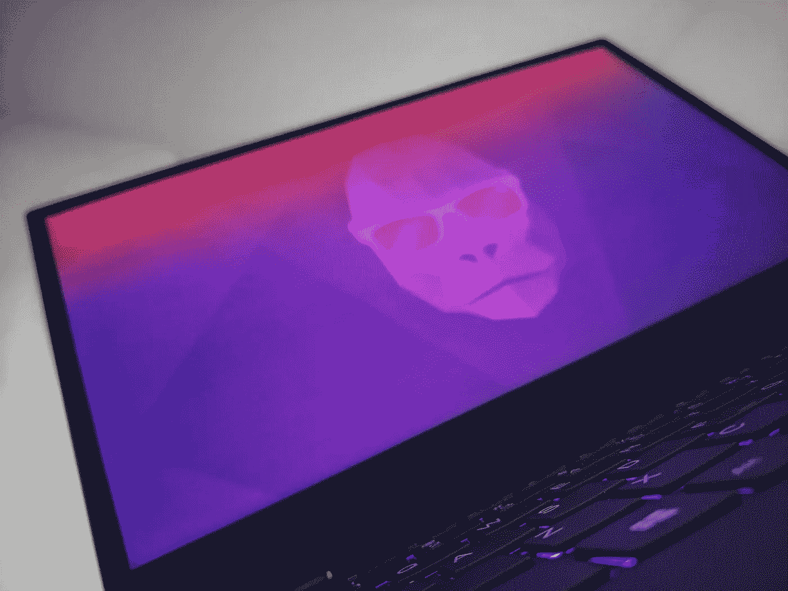

# 我进入 Linux 桌面世界的十个月旅程

> 原文：<https://blog.devgenius.io/my-ten-month-journey-into-the-world-of-the-linux-desktop-bc89b37ae58?source=collection_archive---------1----------------------->

## 开发人员对完美操作系统的探索

资料来源:伊姆兰·雷姆图拉

在古代——2019 年——当人们还在办公室工作的时候，我通过工作提供的 MacBook Pro 第一次接触到了 MacOS。我来自一个 Windows 世界，需要一点时间来适应，但一适应，我就爱上了。光滑的用户界面让 Windows 看起来过时了。苹果标志提醒我，与 Windows 不同，这个操作系统的制造商没有利润动机来监视我，并不断将我的数据发送给公司母舰。事实上，我的工作需要我使用命令行，这意味着我真的开始欣赏 MacOS 的 UNIX 方面，以及我在大学里学到的熟悉的命令和 CLI 概念。

当然，每天回到家，我都会面对联想电脑的严峻现实。由于我无法证明购买 Mac 是合理的，我想到了研究 Linux，看看它是否可以替代 Windows。我没有像一个普通的 Linux 新手那样在我的机器上安装 Ubuntu，而是决定深入到流行的 Linux 相关媒体中去，看看爱好者们在说些什么。我偶然发现了 [Linux for Everyone 播客](https://www.stitcher.com/podcast/linux-for-everyone)，它——在几集之后——说服我下载了 [Pop！_OS](https://pop.system76.com/) 并尝试一下。就这样，我开始了长达十个月的 Linux 桌面世界之旅。

# 掉进了 Linux 的兔子洞

砰！_OS 给我留下了深刻的印象，它的设计相对现代，安装速度快，没有 Windows 令人讨厌的提示和免责声明，而且我可以在永久安装之前先从 USB 试用它。设置中最棒的部分是当我点击“下一步”按钮时，发现自己正盯着一个复选框，以启用全磁盘加密。到目前为止，我觉得每台笔记本电脑都应该默认全磁盘加密，但 Windows 只在更贵的专业版中提供了专有选项。

一旦我完成了操作系统、电子邮件和浏览器的设置，我就准备好深入研究我久仰大名的 Linux 的大量定制选项。在浏览了几段 YouTube 视频和播客后，我陷入了沉思。我安装了一个[自定义主题](https://www.gnome-look.org/browse/cat/135/order/latest/)来代替默认的黄色，并使用 [GNOME 调整](https://wiki.gnome.org/Apps/Tweaks)来向左移动窗口控制按钮来模仿苹果操作系统。我使用了几个 [GNOME 扩展](https://extensions.gnome.org/)来添加一个开始栏，并找到了熟悉的带有新功能的类似 Windows 的导航。我使用 [GSConnect](https://extensions.gnome.org/extension/1319/gsconnect/) 实现了只有苹果生态系统才能比拟的 PC-Phone 集成。

随着时间的推移，我对 Linux 的内部工作机制以及 Linux 发行版和应用程序的整体生态系统了解得越来越多。我了解了定制的启动应用程序，修改了主题，甚至安装了[软件](https://github.com/Hikari9/comfortable-swipe)，该软件提供了全系统定制的触控板手势来复制 Windows 和 MacOS 在虚拟桌面之间移动时使用的四手指滑动。我开始痴迷于自动化，创建复杂的脚本来备份和恢复我的数据，甚至一到[就在日出/日落时自动切换](https://github.com/ImranR98/Lux)明暗主题。那是书呆子的天堂。

# 天堂里的麻烦

我的实习结束了，该回学校了。这就是问题开始出现的时候。到目前为止，我只把操作系统用于网络开发、移动应用程序开发和轻松的网络浏览。虽然在 Linux 上的开发经验非常丰富，但我突然发现自己需要使用只支持 Windows 的应用程序，比如 Visual Studio、Office 365，偶尔也使用 Adobe Photoshop。

起初，我选择了一条显而易见的路线——双引导——但最终以悲惨的失败告终。事实证明，Windows 无法从格式化为 Linux 的固态硬盘分区中读取任何文件，所以当我需要文件时，所有文件都被锁在了外面。每次我需要使用某个特定的应用程序时都必须重启我的机器，这也不是很有效率，并且打乱了我的工作流程。最后，一个 Windows 更新清除了我的 Linux 引导分区——使得它不可能引导到 Pop！_OS —我不得不放弃双引导的想法。下一个明显的选择是使用虚拟机。由于性能问题和加载速度慢，这远非完美，但这是我唯一的选择，所以我坚持了下来。

很快我开始发现硬件相关的问题，这些问题一直存在，但我之前太沉迷于操作系统而没有注意到。指纹传感器没有工作，当从睡眠中醒来时，屏幕的某些部分会因彩色显示故障而变得疯狂。除此之外，我的笔记本电脑有两个独立的显卡，虽然 Windows 能够根据后台的工作负载智能地在它们之间切换，但 Linux 要求我手动进行切换，并且每次都要注销。这些本质上不是 Linux 的问题，而是由于不兼容的硬件或专有驱动程序；尽管如此，他们的体验并不理想。然而，最糟糕的是寒冷。当 Windows PC 由于行为不当的应用程序而冻结时，它会冻结单个应用程序，并允许用户进入任务管理器来强制关闭它。在 Linux 上，没有这样的机制。当流行！_OS 冻结，包括鼠标光标在内的一切都停滞不前，唯一的解决方法是执行硬重启。

# 爬回来

装了十个月后，我卸载了 Pop！_OS 在一次随意的冻结后让我认定这是最后一根稻草。我仍然喜欢这个操作系统的某些部分，但是这些 bug 已经把我拖垮了。GNOME 扩展的本质意味着它们会在更新后经常中断。定制的触控板手势有故障，一半时间都不起作用，感觉不如原生解决方案灵敏和自然。我仍然没有像我想象的那样习惯垂直虚拟桌面，我怀念轻触传感器登录的便利。此外，我花了半天时间在 Windows 虚拟机上工作，不得不单独处理它的维护，而从来没有真正做到“无 Windows”。最终，缺乏流行的应用程序支持，加上我的特定硬件组合，使操作系统变得更加麻烦，尽管我尽了最大努力来解决或解决这些问题。

当然，我不能只是擦我的爸爸！_OS 立即安装。我已经习惯了 Linux 的一些特性，比如命令行和包管理器，并且非常依赖它们。幸运的是，微软为 Linux 创建了 [Windows 子系统——本质上是一个集成到 Windows 中的 Linux CLI 虚拟机——正是为了像我这样的人。尽管](https://docs.microsoft.com/en-us/windows/wsl/install-win10)[官方的 Windows 包管理器](https://docs.microsoft.com/en-us/windows/package-manager/)太新而无用，但 [Chocolatey](https://chocolatey.org/) 是一个足够好的第三方选项。

当我一启动 Windows 系统，我就想起了当初为什么要做这么大的改变。平淡无奇的蓝色 4:3 宽高比设置，烦人的 Cortana 助手试图用手拉着我通过一系列令人恼火的对话框，这些对话框实际上都在问“我可以监视你很多或很少吗？”足以让我想把我的笔记本电脑扔进垃圾桶。不过，我挺过来了，并强迫自己再一次适应它。

# 妥协

在广泛使用了三种可行的桌面操作系统中的两种之后，我只剩下一个问题 MacOS 会是完美的中间选择吗？我和它一起度过的几个月是非常积极的。它有一个光滑的用户界面，不需要插件、主题或扩展就已经很好了。它与我需要的大多数应用程序兼容。UNIX 环境意味着终端仍然感觉熟悉，并且拥有我想要的所有命令。最棒的是，我知道我永远不必处理硬件兼容性问题。

MacOS 的锁定和专有性质意味着我不会有使用和支持开源软件的那种温暖、模糊的感觉，我可以选择的笔记本电脑也少得多，但它似乎仍然是两个世界中最好的，妥协是合理的。此外，MAC 是唯一可以在需要时运行所有三大操作系统的设备。

就目前而言，我将坚持使用 Windows，而世界在等待新一代定制的苹果硅驱动 MAC 电脑(T1)，它们可能会撼动游戏，让 T2 变得更好(T3)或让 T4 变得更糟(T5)。

> 2021 年更新:写完这篇文章几个月后，我决定再试一次桌面 Linux 这次用的是[初级操作系统](https://elementary.io/)。它解决了我的很多问题，我会一直坚持下去。要点是:有时需要一段时间才能找到最符合您需求的 Linux 发行版，所以要做好反复试验的准备。

我希望您发现这位开发人员对桌面 Linux 的观点很有趣；感谢阅读！