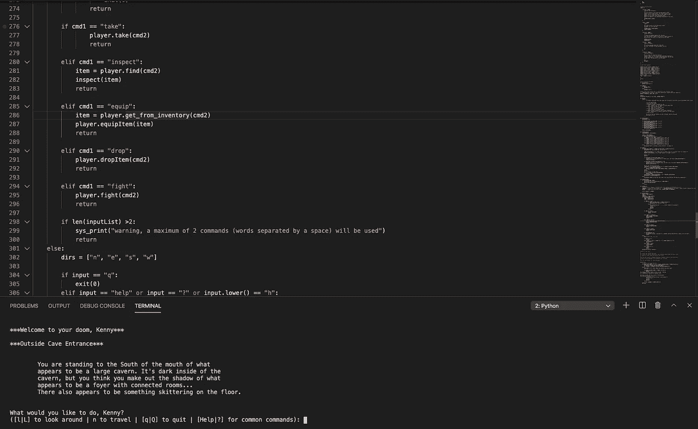
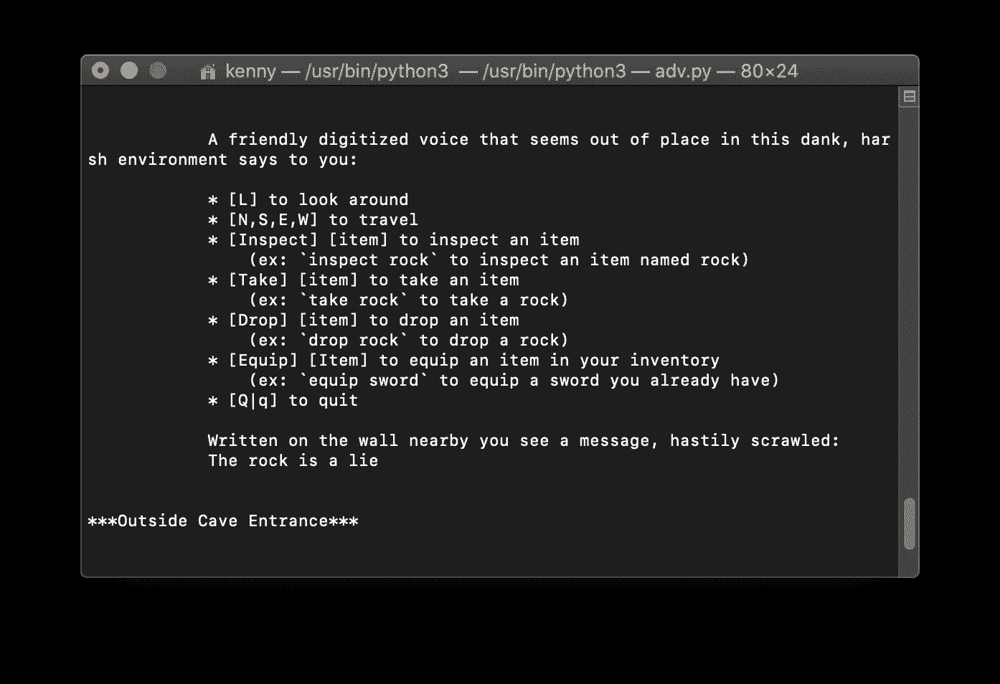
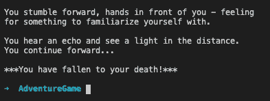
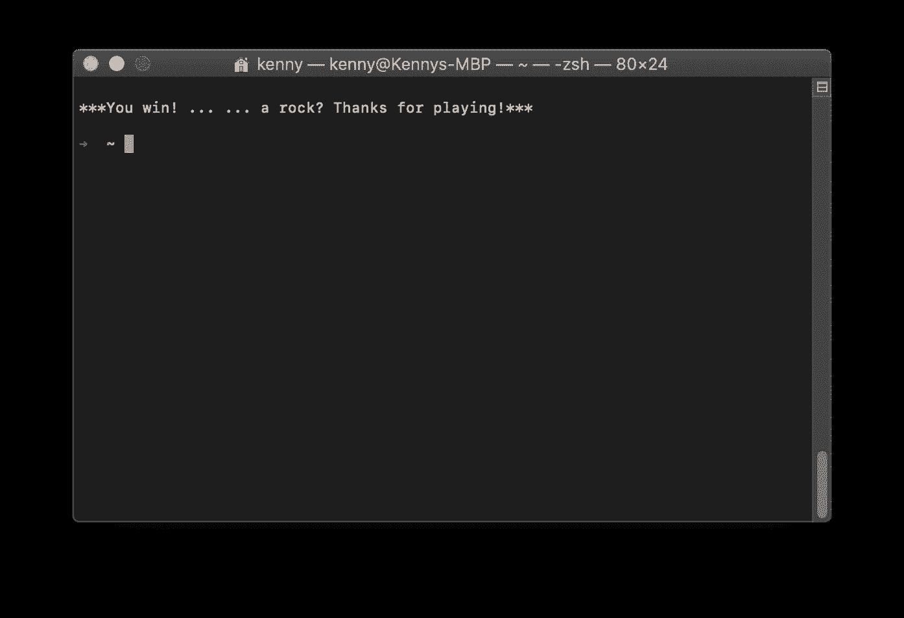

# 我的文字冒险！

> 原文：<https://blog.devgenius.io/my-text-based-adventure-18c9b60483f2?source=collection_archive---------9----------------------->

## 石头是个谎言

## 和你一起回到佐克的日子！

我玩过的第一个电子游戏( [Zork](https://gallery.guetech.org/zork1_folio/zork1-folio.html) )是基于文本的…

你的想象力是极限！

可能是因为这让我想起了我的早年。可能是因为我不用那么担心逻辑，可以更专注于用户体验。

也可能是因为我就是喜欢看着我的创作走向生活的体验，当它从我的文字中走向生活时，它正是我脑海中想象的样子。当它是视觉的时候，总有一些我最终不得不做出的妥协，它不再感觉是 100%的“我的”。

我内心的声音非常叙事。我不知道是否对每个人都一样，但当我思考时，我脑海中大多是单词——如果我想到一些特别生动的东西，还会有一些意象。但是很多时候，我想象的不是风景。当我记得与某人的互动时，我记得的是文字而不是面孔。我想说的是，你的里程可能会有所不同。对我的话要有所保留(我希望你作为一名程序员总是这么做)。但是我跑题了…

迄今为止，我最好的学习经历之一是我刚刚用 Python 完成的一个为期两天的项目。我是 Python 的新手，在这个项目开始前 2 天刚刚开始学习基础知识。

该项目的要求非常简单。互联的房间已经为我们创造出来了，我们只需要弄清楚如何在这个基于文本的世界中导航。名称和描述已经提供给我们了，尽管我立刻对第一个进行了相当多的修改。

我们得到了基本的指示，接着是一份要完成的详细任务清单。

## 基本说明:

> `/src`目录包含文件`adv.py`，这是游戏的主要逻辑应该存在的地方，`room.py`，这将包含房间类的定义，`player.py`，这将包含玩家类的定义。

## 详细说明(例如):

> 给`adv.py`添加一个 REPL 解析器，接受方向命令来移动玩家
> 
> 每次移动后，REPL 应该打印玩家当前房间的名称和描述
> 
> 有效的命令是`n`、`s`、`e`和`w`，它们将玩家向北、向南、向东或向西移动
> 
> 如果玩家试图移动到没有空间的地方，解析器应该打印一个错误。

***还有添加物品的指令和与它们互动的方式(玩家可以输入拖放动作)***

我开始时尽可能简单，在 adv.py 中定义大多数逻辑，后来把它移到任何有意义的类中。当我完成基本需求(MVP)时，我并不满意。有一个挑战目标清单，所以我开始实施它们。

首先，我决定实现一个帮助系统，让玩家可以方便地访问可用的命令(但只是我想让他们知道的命令)。

然后，我通过在“外面”的房间里提供一个手电筒来创造一个照明系统。如果玩家在外面或者有一个手电筒，当他们导航时，他们会被提供每个房间的名称，然后是房间的描述。如果没有，他们会被告知这是黑暗的，他们应该找到一盏灯。

这是我的第一个“大”创意 UX 时刻，当时我决定，如果玩家在没有灯的情况下进入“俯瞰”房间，他们会摔死，游戏将退出。

嗯，我确实警告过他们…

我在实现一个玩家类的同时也实现了一个怪物类，但是直到我完成 MVP 目标时才创建实例和填充房间。我也实现了一个武器类，只要我实现了一个物品类，但再次保存创建任何武器。

我决定先做一半的地图，这是我时间用完的地方——“宝藏和危险”部分(基本上是 4 个房间)。既然我已经告诉玩家有东西在地板上移动，为什么不添加一个经典的地牢怪物——一只蜘蛛。我还放了一把生锈的剑，放在这间屋子天花板的滴水下面。

然后我去了“俯瞰”室，在那里放了一具骷髅和一把金剑。我独自离开了狭窄的房间，但在最后的房间里添加了一条金龙。我还添加了一个条件，如果你在最后一个房间，你输入`take rock`——你就赢得了游戏。

没错——你实际上不需要打任何东西，也不需要拿武器，甚至不需要火炬。你可以从头到尾导航，拿着石头，然后上路。我想通过让龙在玩家进入房间时攻击玩家来实现这一点，但我决定把它作为复活节彩蛋留下——如果你愿意的话，这是一种隐形的方法。

## 那么战斗呢？

很高兴你问了。我离开战斗完全是可选的。不管玩家抢不抢到火炬，他们都不用打什么。然而，如果他们决定与地牢中的所有怪物战斗，他们将面临挑战。我设计了这样一种方式，如果他们在与房间里的怪物战斗之前没有在每个有一只*的房间里拿到武器，龙就会杀死他们，因为他们没有足够的健康来完成这场战斗。*

## 这如何帮助我学习

我认为我在这个项目中学到了更多，比我过去学任何语言都要快。我不确定这是因为 Python 与我熟悉的两种语言——JavaScript 和 Swift 非常相似，还是因为我现在比以前更有在压力下学习的经验，或者因为它非常有趣，但我倾向于后者！

在我的一天中，我很难不去想这个游戏，因为它让我兴奋，能够在不了解太多语言的情况下，这么快就创造出人们可以享受的东西。也就是说，这也促使我尽可能多的学习，以实现延伸目标。

## 未来目标

*   让它更有挑战性。添加更多的怪物。有些咄咄逼人，有些则不然。
*   添加一个从石头中拔出金剑的命令(它在远眺室)而不是通常的`take golden_sword`
*   填充地牢的其余部分
*   添加咒语
*   添加玩家属性(基本上使其成为一个成熟的角色扮演游戏)
*   添加一个商人和一种易货方式(物品已经像玩家一样有黄金属性)
*   让玩家与龙战斗，并想办法与龙交朋友——让他给你石头

[如果你想知道我最终是如何实现事情的，以及我是否实现了这些未来目标，这里有回购协议！](https://github.com/froggomad/Intro-Python-II)

