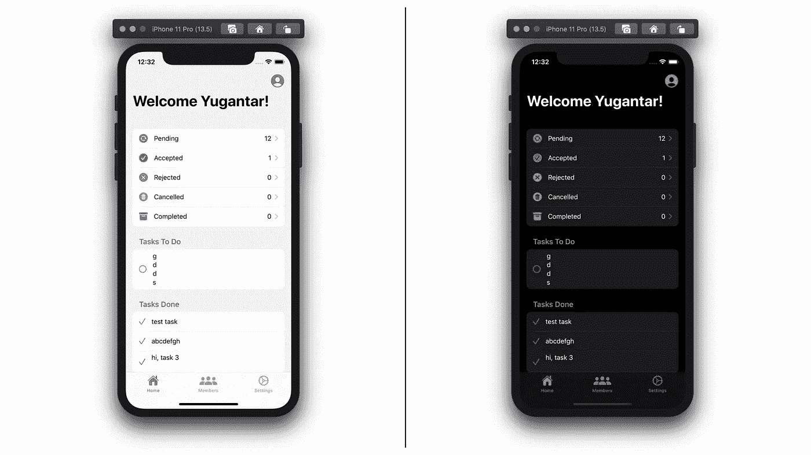
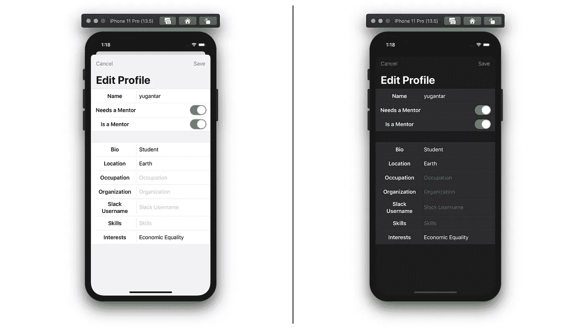
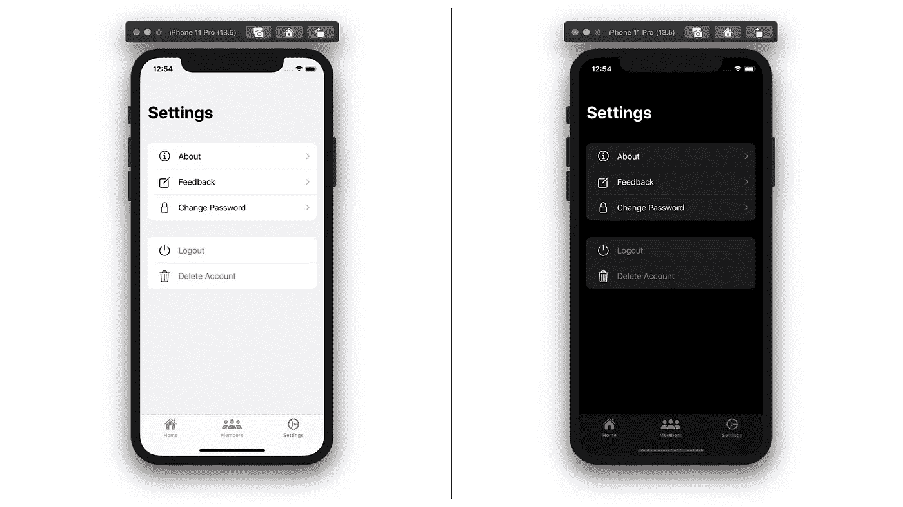
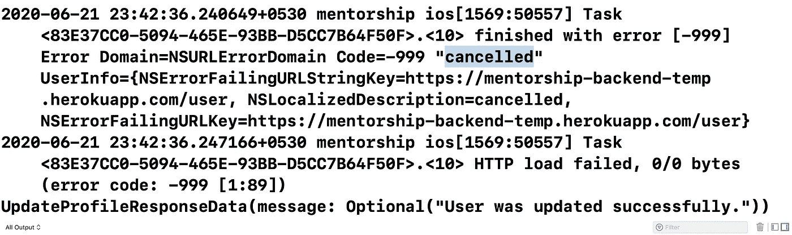
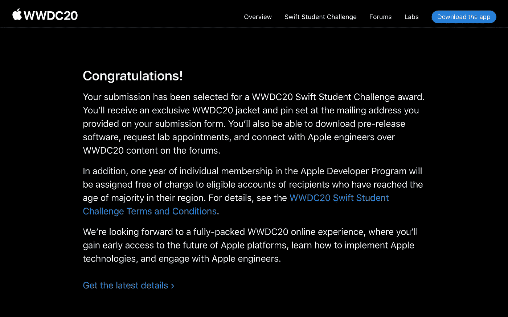

# 我在 GSoC'20 编码的第三周

> 原文：<https://blog.devgenius.io/my-third-week-of-coding-in-gsoc20-ee789109307f?source=collection_archive---------16----------------------->

照片由 [Fotis Fotopoulos](https://unsplash.com/@ffstop?utm_source=medium&utm_medium=referral) 在 [Unsplash](https://unsplash.com?utm_source=medium&utm_medium=referral) 上拍摄

大家好，

这是我 GSoC 编码期第三周的博文。在这篇文章中，我谈论了我们项目的发展，在 Combine 框架中内置取消的能力，并且分享了一个令人难以置信的消息！

我不得不说，真的很快。对我来说几乎难以置信的是，加入 GSoC 已经有七个星期了。WWDC 明天开球！
**结果于 5 月 4 日公布，社群结缘期即刻开始。*

# 项目的发展

本周，我们已经完成了导师 iOS 应用程序的一些主要任务，现在它已经开始成形。

## 主页

主屏幕

主屏幕为用户提供了所有导师关系请求的概述，以及对其任务的快速浏览。主屏幕也是用户访问其个人资料的源屏幕。

正如你可能从我第二周的帖子中知道的，主屏幕的当前设计是在整整一周的额外讨论后决定的。看起来不错:)(抱歉奇怪的任务 xD)

## 轮廓

配置文件编辑器

用户的个人资料存储在设备上，并与服务器同步，使其可以离线访问，同时保持最新。

更新配置文件是一个多步骤的过程，包括对服务器进行 HTTP 调用，在此过程中显示一个自定义微调器和文本，完成后显示一个带有适当消息的警告，以及将配置文件保存在脱机存储中。

由于绑定的使用，包含选项的用户配置文件的数据结构被改变，以便可以安全地在文本字段中展开进行编辑，然后在保存时再次改变。

此外，我们现在已经添加了协议，允许我们在很大程度上为成员个人资料和用户个人资料页面重用个人资料屏幕。这是一个非常优雅的解决方案，是泛型编程的实现。

## 设置

设置屏幕

我特别喜欢设置屏幕。真的很工整！没有任何颜色或背景的大而清晰的图标给人一种真正不受干扰的体验。

使用它真的是一种享受，尤其是在物理设备上。

# 联合框架中内置的取消功能！😄

Combine 是苹果去年在 WWDC19 上与 SwiftUI 一起推出的新框架。它是一个声明性的 Swift API，随着时间的推移处理值，并可用于处理异步事件。

Combine 实现了订阅者-发布者编程模式，对于与 SwiftUI 一起使用是非常必要的，并且在任何情况下都非常有用。

在我们的应用程序中，我们在多个地方使用了联合收割机。使用 URLSession 进行 HTTP 调用，在 UserDefaults、NotificationCenter 和我们的数据模型中发布随时间变化的值。

> Combine 内置了对取消的支持，这一点非常强大！

这意味着，我们可以随时取消订阅。此外，Combine 还提供了 AnyCancellable 类型，可以在很多地方自动取消。

我们已经在 Mentorship iOS 应用程序中自由利用了这一功能，尤其是在使用 URLSession.dataTaskPublisher 进行网络呼叫时。

> 网络请求本质上是一个昂贵的过程，不必要的重复不仅是沉重的，而且可能是危险的。

*例如，如果用户多次按下发送 OTP 按钮，这不仅会堵塞服务器和增加成本，还会导致错误和糟糕的用户体验。*

通过内置的取消功能，Combine 自动为我们解决了这个问题。它确保网络请求只发出一次，并取消任何在短时间内被重复覆盖的呼叫。另外，我们还可以使用去抖操作符来指定特定的时间间隔。

调试控制台(重复调用被取消，配置文件仅更新一次)

上图中，我们可以看到在配置文件编辑器中多次点击“保存”按钮时的调试控制台。除了一个呼叫之外，框架自动取消所有的呼叫，而不是进行 10 个呼叫。强大！

# 令人难以置信的消息

6 月 16 日，我得到了一个令人难以置信的消息，我成为了 WWDC20 Swift 学生挑战赛的获胜者之一！

我的项目名为“模拟股票，为了地球”，利用金融模拟交易来提高环保意识🌍并展望世界的未来。

你可以在这里查看项目:【https://github.com/yugantarjain/wwdc20】T3

自从我第一次看了 WWDC 的主题演讲，我已经等这一刻等了 6 年多了。有了这个，我也改正了 14 个月前犯的一个错误，这可能是我犯过的最不幸的错误；一个借参加 WWDC19 的机会远离我的。不过现在好了:)

# 结论

这一周非常令人惊奇，尤其是我的关于环境意识的项目被苹果公司选为 WWDC20 SSC 奖。

我要再次感谢我所有的导师(安娜、金妮、瓦萨和阿康沙)对我的帮助和指导。我要特别感谢 Vatsal 承担了重构我们代码库的工作，它看起来非常整洁！

## 非常感谢你的阅读！

*请随时与我联系并联系，查看我们的项目，或者加入我们的开源社区:* [*LinkedIn*](https://www.linkedin.com/in/yugantar-jain-1a7820158/)*，*[*GitHub*](http://github.com/yugantarjain)*，* [*导师 iOS*](https://github.com/anitab-org/mentorship-ios) *，*[*AnitaB.org 社区*](https://anitab-org.zulipchat.com)