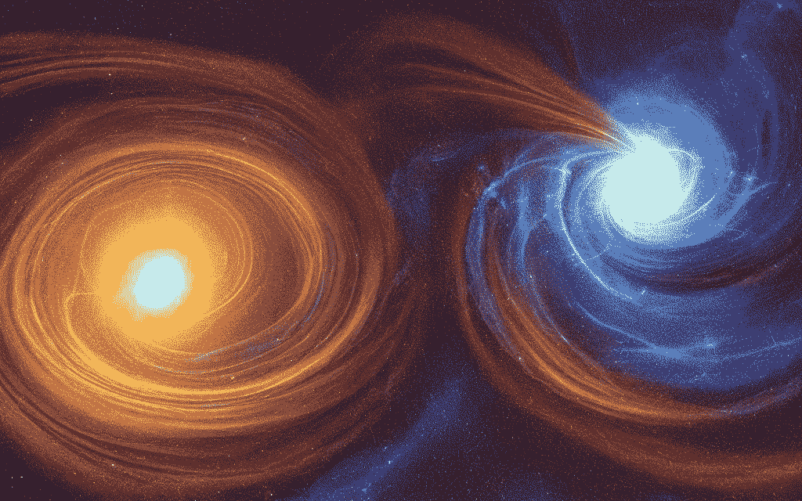
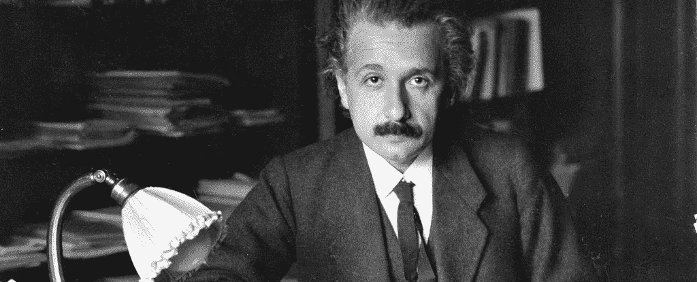
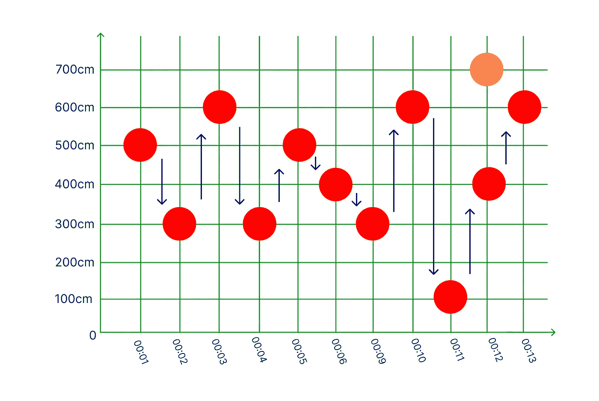

# 我对时间旅行的想法；这一定很奇怪。

> 原文：<https://blog.devgenius.io/my-thoughts-on-time-travel-it-must-be-pretty-weird-3bca4e1e5cf9?source=collection_archive---------15----------------------->

在你浏览了这篇文章的标题后，你可能会觉得很荒谬和奇怪。不过，绝对诚实地说，我似乎无论如何也帮不上忙，而且我对此也不感到抱歉🙂。

与 https://dreamstudio.ai/dream 的[一起生成](https://beta.dreamstudio.ai/dream)

毫无疑问，许多人以这样或那样的方式直接或间接地接触过“时间旅行”这个术语，并发现它令人震惊、灾难性或令人困惑(如不可理解)。从小到大，我一直觉得时间旅行是一种独特的现象。我花了很多个人时间来研究和理解这个概念；即使我可能永远也不会表演这个神秘的奇迹。

许多科幻电影展示了人物、人工制品、机器和更多描述时间旅行的元素，有许多假设的证据和指针来支持他们的想象，我们有时会迷失在表演中，失去对事物的跟踪(许多点在我们的大脑中也不倾向于连接)。对时间旅行的典型解释包括通过虫洞传送自己(虫洞是一种理论上穿越时空的通道，可以帮助在空间和/或时间的两点之间旅行)。

对一个非科学的人来说，时空可能很难解释，但它只是空间和时间的结合；一个可以让我们根据给定时间对事件进行分类的工具。把它当做一切运行的平台或者占位符。这种现象使我们能够说“史蒂夫在早上 9 点登上出租车，跋涉了几米来到他的家”。换句话说，它们携手创造了我们所谓的“存在”或“可能性”。

在过去的不同情况下，许多科学家，尤其是阿尔伯特·爱因斯坦，都试图从本质上理解时空，并围绕时空推出理论(其中一个著名的是[相对论](https://www.nbcnews.com/mach/science/what-relativity-einstein-s-mind-bending-theory-explained-ncna865496))。

图片来源:[https://careerkawan.com](https://careerkawan.com)(阿尔伯特·爱因斯坦)

尽管如此，在我看来，时间旅行是一个非常严重的事件，不应该被考虑或着手进行(如果有可能的话),因为过去事件中最轻微的改变都会导致后来事件中非常复杂的变化。

把它想象成一个移动的时间线，00:00 在 11:00 之前。00:00 发生的事情导致了 11:00 发生的事情，00:00 的任何变化都意味着 11:00 的变化。最简单的例子可以用我最谦卑的自我创造的“2D 时间图”来说明。这是一个限制性注释，描绘了相对于时间(x 轴)和一个点(对象)的仅 y 轴移动(垂直位移)。这是在纸上表达它的最简单的平面(二维)方式，它的特点是一个物体(用一个点表示)在一段时间内从一端移动到另一端。

x 轴的单位是“1 厘米代表 1 秒间隔”单位，如下所示:

一个球在 13 秒内从一点移动到另一点。

从上面的插图中，您可以注意到红色的球沿着线性路径随机移动，以秒为单位，而 00:12 处的橙色球是静止的。

蓝线代表平移(移动)的方向。

假设红色球与橙色球在 00:12 发生碰撞，如图所示。时间和相对论一起工作。过去决定现在，现在决定未来。基于此，我们所说的现在是时间的一个不断变化的实例，从宇宙的创造开始到无限。认为它是不断变化的。

使用线性方法，现在可以被视为一个不断变化和连续的具体时间线，调和的事件在其中流动。

如果红球的运动受到外力的影响呢？它是否修改了未来的碰撞事件？是啊！而且没有！是的，因为它最终还是会撞上橘色的球，不，因为碰撞力可能或多或少是初始力。在时间流动中有一个改变的场景会导致所谓的“另一个时间线”；一个红色的球没有击中橙色的球。“时间流”(时间和事件的流动)中的每一种可能性都被称为时间线，不幸的是还不能被任何人体验或观察到(除了上帝)。因此，未来总是不断变化的。

好吧，说够了吧？是:)

本质上，根据多年来几位科学家的研究和假设，很明显，时间旅行离成为现实还非常非常远，我的建议是，“永远不要回头看过去或试图让时间倒流”。即使成功了，也不值得。过去的微小变化可能会导致更糟糕的未来和/或现在。过去的就让它过去吧:)

图像来源:Adobe Stock

说了很多行话，觉得很值。我们生命中有一个美好的时刻，我们希望能回到过去体验。此外，还有一些我们不想经历或参与的事件。

让我们变好:)爱与光💚