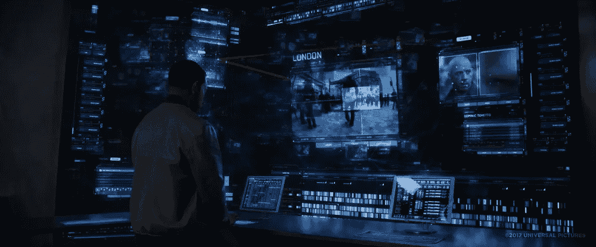

# 我的第一次研发经历

> 原文：<https://blog.devgenius.io/my-very-first-experience-with-research-development-f7bea98060fb?source=collection_archive---------3----------------------->

## R&D 在软件开发方面从一个二年级软件工程本科生的经验

研发—由 macrovector / Freepik 设计

想从事研究吗？想知道如何发表研究论文？我想我已经帮你搞定了。

[https://media.giphy.com/media/ZIzN7YWNuTUYg/giphy.mp4](https://giphy.com/gifs/the-lizzie-bennet-diaries-tlbd-thelbd-ZIzN7YWNuTUYg)

我在 R&D 的第一次软件开发经历是在我本科第二年，当时是一个 6 人小组的项目。

当做一个研究项目时，重要的是要明白它不是最终达到预期结果的必要条件。发现使用建议的解决方案无法解决问题也被认为是一项成功的研究。这也可以派上用场的原因是，尝试所提出的解决方案的发现可以为其他人铺平道路，让他们避免做以前失败的事情，或者甚至帮助一个人尝试尝试解决方案的替代路径。

# 项目启动时的关注点

从项目一开始，我们的重点就是想出一个令人兴奋的解决方案。

> "为了成功，你对成功的渴望应该大于对失败的恐惧."—比尔·科斯比

我很幸运地与同行中一些最有能力的程序员合作，这让我想到了无限的可能性，因为我知道我们的团队拥有构建我们想要的任何软件产品所需的技能。有了无限的可能性去思考&几乎不用担心失败，我们对成功的渴望每周都在增长。

[https://giphy . com/gifs/the Simpsons-the-Simpsons-14x 5-3 orieon 10 sqylb 27 HC](https://giphy.com/gifs/thesimpsons-the-simpsons-14x5-3orieONL0sQYlB27hC)

# 发展的积累

经过几天的头脑风暴，我们得出的结论是，我们希望让检测现场和预先录制的视频中的人的过程变得毫不费力。没过多久，我们就意识到，我们实际上是在试图从《速度与激情 7》中打造[“上帝之眼”。说说从票房中汲取灵感吧！](https://fastandfurious.fandom.com/wiki/God%27s_Eye)

《速度与激情 7》中的上帝之眼

就像任何其他研究项目一样，我们必须仔细检查以前在与我们的项目开发计划一致的领域中所做的研究。在背景研究之后，我们还在开发之前提出了其他需求和架构图。

# **咨询&市场分析**

我们咨询了许多不同领域的人，从不同的角度了解我们的想法和我们心中的愿景。我们将受访者的领域多元化。在各个领域中，我们采访了一名优秀的数据科学人员、一名 C 级人员、具有一般技术知识的讲师以及对一般用户需求有更广泛认识的讲师。除了来自专业领域的人之外，在开始开发之前，我们还得到了 100 多人的反馈。

所有这些观点都有助于我们拓宽思维领域，从而为系统引入了额外的特性。

# 范围细化

[https://giphy.com/gifs/friends-2OP9jbHFlFPW/media](https://giphy.com/gifs/friends-2OP9jbHFlFPW/media)

我们最初计划定制一个物联网摄像头，并在边缘运行深度学习模型。但是，我们最终细化了我们的范围，因为我们被建议尽量不要引入物联网，因为项目的允许时间框架很短且有限，事情可能会变得有点太复杂。因此，我们细化了我们的范围，提出了一个运行在云上的软件解决方案。我们在云中开发了从微服务架构到 Kubernetes 的所有东西。

# 初始原型和反馈

虽然这是一个基于研究的项目，但我们需要在最终提交中有一个完整的工作原型，以便获得高分，因为这影响了我们在大学的平均分数。因此，我们想出了一个后备计划&在项目的最开始，从已经存在的 ML 模型中得到一个原型，以避免因为试图触及星星而悲惨地失败。

手里拿着一个原型，我们面对反馈访谈，在访谈中，我们面临以下陈述的挑战:

> “这样做是不可能的，对不认识的面孔是行不通的”。

这个 ***让我们更有活力*** 来完成这个项目，因为我们非常清楚我们将如何解决这个问题！我们有计划的！事实上，这是我们在项目中遵循的过程中解决的一个问题，该项目帮助这项研究在 IEEE 研究论文会议上发表。

[https://gi phy . com/gifs/season-12-the-Simpsons-12x 11-3 riepberd 7 vbo 5 ADI](https://giphy.com/gifs/season-12-the-simpsons-12x11-3oriePBErD7vbo5Adi)

# 发展的最后阶段

这是 R&D 项目最关键的阶段，也是事情开始变糟的阶段。集成系统绝对是一场噩梦，尤其是当你没有太多经验的时候。对于其他人来说，在系统中挑选一个点并帮助调试或升级是极其困难的，因为系统是极其庞大和复杂的。它是如此的庞大，以至于直到项目结束我都没有看到大部分的后端代码。

就像每一个小组项目一样；当然，并不是每个人都在现场尽自己最大的努力。因此，我们中的一些人不得不付出额外的努力来填补项目中的所有缺口，因为如果一个地方失败了，所有的事情都会失败。

> “没有失败就没有创新和创造力。句号。”—布琳·布朗

更糟糕的是，我们的数据科学模型并没有像我们希望的那样工作。我仍然记得那些夜晚，当似乎没有解决方案时，我帮助策划提高模型精确度的计划。

[https://giphy.com/gifs/memecandy-hrRJ41JB2zlgZiYcCw](https://giphy.com/gifs/memecandy-hrRJ41JB2zlgZiYcCw)

有几天，我们失去了信心，并质疑自己是否真的有可能让我们的解决方案与我们选择遵循的方法一起工作。随着期限的临近和有限的计算能力，我们没有太多的选择，除了继续我们已经开始的工作。

让我在这里引用我们的项目报告的“限制和面临的问题”部分提到的几个问题，

> 主要从事项目数据科学部分工作的团队成员的笔记本电脑在插上电源充电时被雷击烧毁。由于电晕病毒封锁导致部件不可用，笔记本电脑在一周内无法修复。
> 
> 一个树莓派被用来在项目上工作到一个窗帘的程度。
> 
> 一些小组成员声称由于被软禁了一个多月，精神不稳定。有时，很难推动这些团队成员完成工作，因为保持团队成员的精神稳定很重要。
> 
> 由于 Corona 病毒锁定，团队成员不得不远程处理项目的所有部分。由于一个多月的在线工作消耗了分配的数据，在接近月底的时候网速下降，这给项目的工作带来了极大的困难。由于一些与技术相关的领域必须在实施时学习，这减慢了项目的进度。

正如你所看到的，在前进的道路上有许多障碍，但我们没有让这些障碍阻止我们实现我们的目标。

# 成功完成研究

[https://giphy . com/gifs/jeopardy-const estans-2 xf 9 pbh cede 1 x 059 I/media](https://giphy.com/gifs/jeopardy-constestants-2sXf9PbHcEdE1x059I/media)

完成这个项目后，我们获得了许多机会，通过潜在的外国投资将产品推向全球市场。我们暂时搁置了这个项目，因为我们觉得这个世界可能还不需要它。我们中的一些人不想为制造另一个炸药而感到内疚，因为在一天结束时，即使这个系统的预期目的是为了一个良好的事业，它也很容易被滥用，除非由适当的当局控制。如果你回顾一下 GitHub 存储库中 Readme 文件的提交历史，你实际上可以找到作为该项目的口号的*而不是 ***监视完成智能*** 。😂*

*尽管我们期望我们的项目被选中来展示国家最佳质量软件奖(NBQSA ),但由于不清楚的原因，我们被限制这样做。经过 5 个多小时不愉快的谈话后，这个团队比以往任何时候都更有精力和决心要发表一篇基于这个项目的研究论文。IEEE 会议上的全球认可对我们来说是一个很好的杠杆，因为它将我们的研究成果带到了一个我们甚至没有预料到的水平；作为二年级本科生。*

*请随意点击下面的链接，阅读我们在 IEEE INOCON 2020 上成功展示我们的发现后，在 IEEE Xplore 数字图书馆上发表的 [IEEE](https://www.ieee.org/) 研究论文。值得一提的是，我们的论文是在提交给研究会议的 963 篇论文中的 280 篇论文中被选中的。发表这篇研究论文几个月后，我们仍然收到电子邮件，要求在全球各种创新期刊上发表我们论文的扩展发现。*

* [## Speculo:使用深度卷积逆图形网络进行人脸索引的模式识别

### 镜头分析程序需要人工检查，这可能很耗时。作为上述方法的替代方法…

ieeexplore.ieee.org](https://ieeexplore.ieee.org/document/9298340?fbclid=IwAR2KuNgLuqUpq3N-4ISjHNV1Qvild30Xfr3IWVy033LpPF1Ceyk5AU9mnYg) 

# **这个项目的前景如何**

我们想尝试一些优化，希望能提高系统的性能和准确性。但是，为了做到这一点，我们需要花费时间&投入精力和投资来训练深度学习模型。

当有一天我们觉得世界的某个部分已经准备好了，我们将准备好推出系统即服务。在那之前，这个项目一直是开源的，你们可以在下面找到更多关于如何改进 GitHub 库的信息。软件解决方案的整个开发过程也记录在项目板上。

 [## MrSupiri/speculo

### Speculo 是一个开源平台，它利用深度卷积反图形网络来索引找到的人脸…

github.com](https://github.com/MrSupiri/speculo) 

# 从经验中获得个人成长

我已经能够反思通过这个项目在我的专业和技术生活的许多领域获得的经验。虽然在这里担任 Scrum-master 给了我项目经理的经验，但我在这里培养的创新思维在我今天接手的每个项目中都得到了培养。最后，技术经验&从这些经验中学到的东西使我在多个技术领域都很有能力。

今天，我作为实习生在斯里兰卡一家领先的软件开发公司的各种创新项目中工作，我很高兴地提到，我已经将在这个项目中创新获得的经验带到了我工作场所的下一个级别。在另一篇博客文章中有更多相关内容；)

# 确认

虽然我非常感谢我的队友:Isala Piyarisi、Visal Rajapakse、Akassharjun Shanmugarajah、Kushan sha mika&Nisal Samaranayake 分享了与我日复一日在这个项目上合作的经历，但如果我可能不准确地回忆了事件，我要道歉，因为这整个出轨事件已经发生了将近一年。没有他们的梦想、技能和奉献精神，这项研究肯定不会成功。

*在这个项目的过程中，我们得到了很多人的大力支持。我相信 John Sriskandarajah 先生对我们的项目比我们自己更有信心，如果没有 Guhanathan Poravi 先生的指导，我们肯定无法发表研究论文。Banu Athuraliya 先生给我们带来的指导和灵感鼓励我们在软件开发小组项目模块中尽最大努力。*

*我还要感谢 Sharmilan Somasundaram 先生、Chathura Sooriya-arachchi 女士、Ragu Sivaraman 先生和 Madu Ratnayake 先生，感谢他们在百忙之中，在我们项目的最初阶段向我们提供的见解和观点。*

*最后，我要感谢信息技术学院赞助我们参加 INOCON 2020 研究大会。*

我的一个同事在我们发表论文的同一个研究会议上提交了一篇综述论文，他写了一篇文章，介绍了他发表论文所遵循的程序。由于我们不得不遵循类似的程序，我认为这将有利于你们任何人有兴趣阅读他的博客帖子在下面的链接。

 [## 从研究到在 IEEE 会议上展示的旅程

### 在一个国际会议上发表我的关于各种推荐系统的综述论文绝对是…

medium.com](https://medium.com/@kushanbhareti/the-journey-from-researching-to-presenting-at-an-ieee-conference-b48380191b7)*