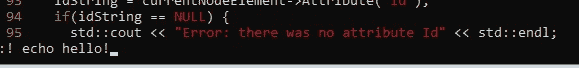
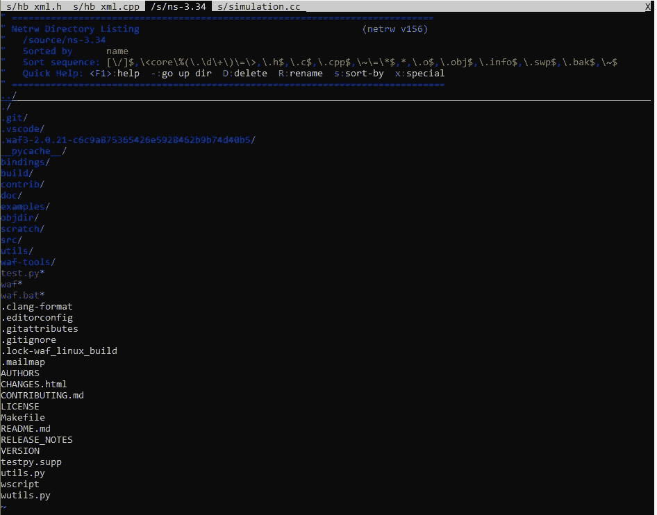
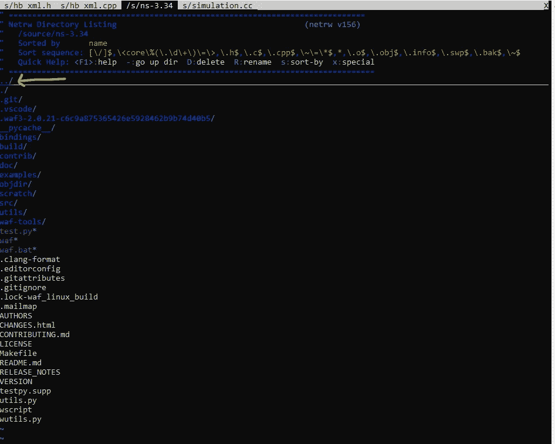
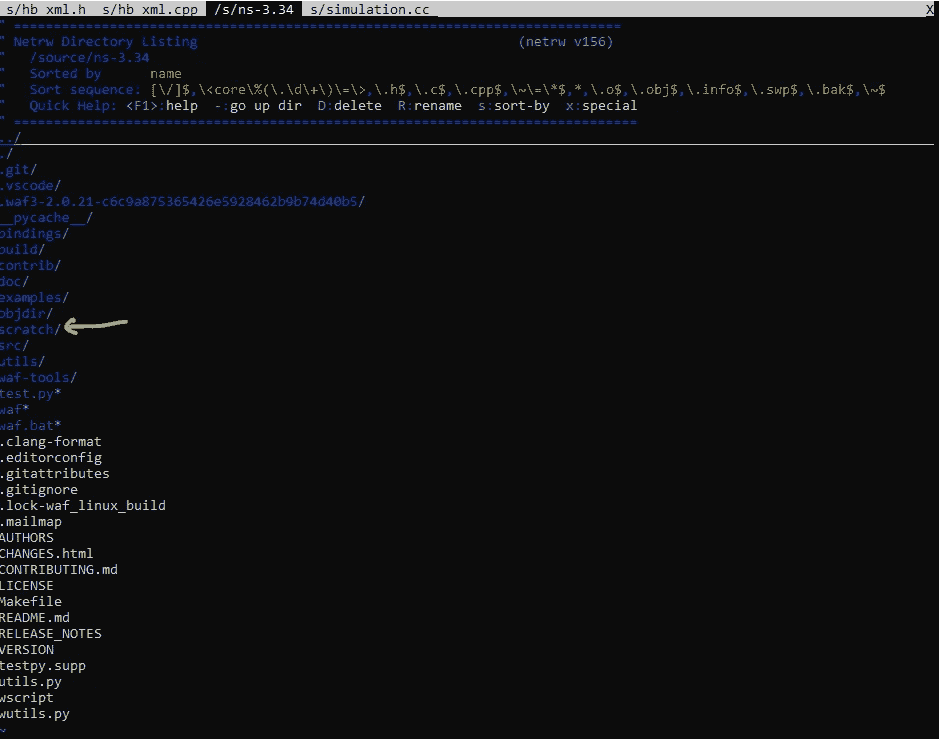
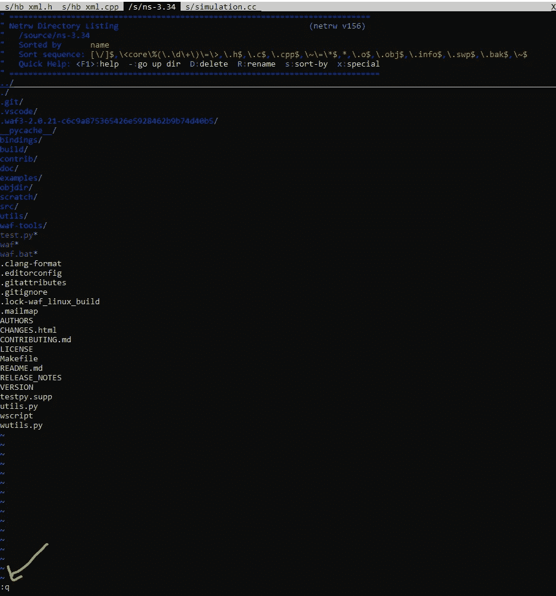
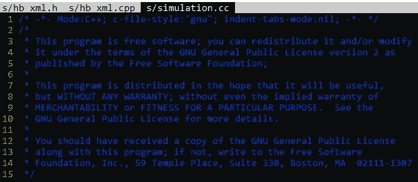

# 我的 VIM 工作流程

> 原文：<https://blog.devgenius.io/my-vim-workflow-7ea9ced8d48d?source=collection_archive---------7----------------------->

## 我实际使用的几个命令

## 在不退出 vim 的情况下执行一个命令！

使用:！在不退出 vim 的情况下在命令行上执行的命令。可能是我最喜欢的工具。

## 文件导航

用“ **gg** ”转到文件的顶部

用“ **G** 转到文件底部

用“ **:23** 转到第 23 行，插入你需要的行号。

用' **%** '在{}之间跳转

用' **w** 向前移动一个单词，用' **b** 向后移动一个单词

用' **$'** 移动到行尾，用' **^** 移动到行首

用“**显示行号:设置编号**

## 搜索

用“**设置搜索高亮:设置 hlsearch** ”我总是把它添加到我的 vimrc 中。

搜索带有“ **/”的字符串。**再次使用/清除你的搜索，搜索一个类似“alksnfdlkan”的随机字符串，你所有的亮点都会被清除。

## 使用:tabf 打开一个新标签

你可以做' **:tabf path/to/file.ext** '在一个新的标签页中打开指定的文件，或者你可以指定一个文件夹来打开一种“GUI”来找到你想要的文件。

使用' **:tabf。**'打开当前目录下的文件导航器

您可以使用向上和向下箭头键来导航要打开的文件。按回车键打开文件

你可以用..浏览目录

你可以在任何目录下按回车键进入该目录。目录由末尾的斜线表示:

如果你改变主意，想回去，你可以用'**:q【T27]'这样做**

您可以拥有任意数量的选项卡。用“ **gt** 向右移动下一个标签，用“ **gT** 向左移动下一个标签。"用 g + shift + t "

活动选项卡显示为黑色，其余选项卡为灰色

## 编辑

删除带有“ **dd** 的一行

删除几行用' **shift+v** '进入可视模式，箭头键上下移动。点击 **x** 删除高亮显示的行。顺便说一下，它们会在你的粘贴箱里，所以如果你点击' **p** '它们会粘贴到你光标所在的地方。