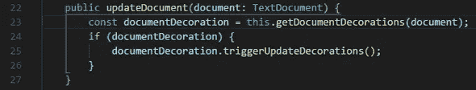
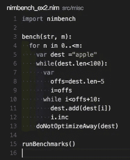
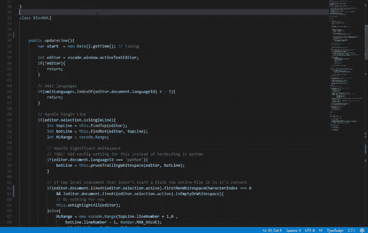
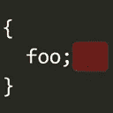
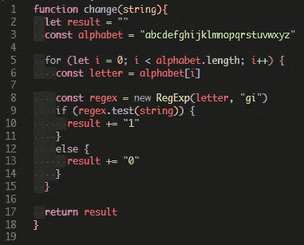
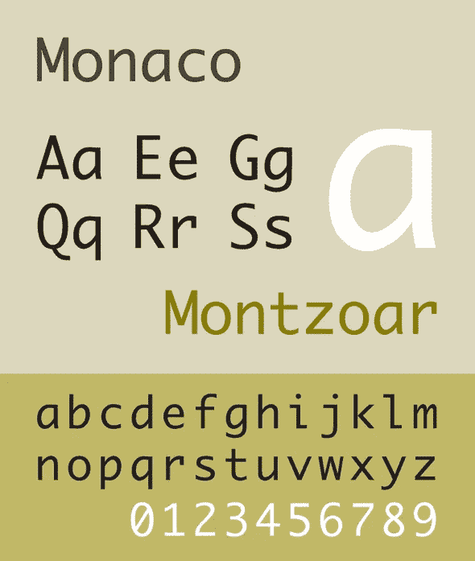

# 我的 VS 代码可视化设置

> 原文：<https://blog.devgenius.io/my-vs-code-visual-setup-76737fcb7c84?source=collection_archive---------17----------------------->

赏心悦目的界面加速开发

照片由[王思然·哈德森](https://unsplash.com/@hudsoncrafted)在 [Unsplash](https://unsplash.com/) 上拍摄

香草 VS 代码平淡。我寻找扩展来个性化外观，并发现一些是有帮助的。我把它们整理出来给你尝尝。

# 括号对着色机

括号对上色器(来源: [Visual Studio Marketplace](https://marketplace.visualstudio.com/items?itemName=CoenraadS.bracket-pair-colorizers)

把你的普通括号变得更易读！这种扩展使它们有了颜色，并显示了它们范围的细线。它还会告诉你什么时候有不成对的括号。第二版现在已经可以使用了，但是我坚持使用旧版本，因为到目前为止我还没有任何问题。在这里安装。

# 缩进-彩虹

缩进-彩虹(来源: [Visual Studio Marketplace](https://marketplace.visualstudio.com/items?itemName=oderwat.indent-rainbow) )

缩进-彩虹给缩进四种不同的颜色，取决于你的标签大小。在这里安装。

# 缩进块突出显示

缩进块突出显示(来源:[Visual Studio market place](https://marketplace.visualstudio.com/items?itemName=byi8220.indented-block-highlighting))

我用它作为支架上色器的支架。它突出显示光标所在的区域。在此处安装。

# 结尾空白

尾随空格(来源:[Visual Studio market place](https://marketplace.visualstudio.com/items?itemName=shardulm94.trailing-spaces)

看到被忽略的空白有时让我很痒。这个扩展突出显示并通过一个快捷方式删除它，从而使代码更加整洁。在这里安装[和](https://marketplace.visualstudio.com/items?itemName=shardulm94.trailing-spaces)。

# 统一的 Ubuntu 主题(来自 VS 代码的 Linux 主题)

统一 Ubuntu 主题

我在使用 VS 代码的早期就使用了这个主题，从那以后就没有换过其他的主题。它充满活力，对比鲜明。

我还想对 VS 代码首选项设置提出一些额外的建议:

1.  我将`Render Whitespace`设置为`boundary`,以显示代表空白的褪色点
2.  我把`Tab Size`设置为`2`。默认值`4`占用了太多的宽度，不适合垂直拆分的编辑器。
3.  我用摩纳哥字体。源于 macOS，Monaco 不太细，有更简单的小写字母“a”和“g ”,分别来源于*大法官手*和*黑体字母*。我们读的是代码，不是报纸。

字体摩纳哥的样本(来源:[维基百科](https://en.wikipedia.org/wiki/Monaco_(typeface)))

*原载于 2020 年 6 月 6 日*[*https://vyonizr . github . io*](https://vyonizr.github.io/blog/2020/06/06-my-vscode-visual-setup/)*。*