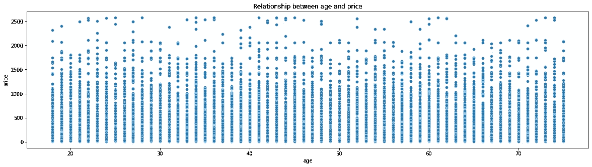

# MySkill 数据分析第 2 部分:用于数据可视化的 Python

> 原文：<https://blog.devgenius.io/myskill-data-analysis-part-2-python-for-data-visualization-a2c514a3a9c7?source=collection_archive---------2----------------------->


ython 是数据分析师和数据科学家世界中最流行的编程语言之一。Python 在用法上也非常灵活，你可以用它来做游戏开发，网页开发，甚至人工智能。对于编程新手来说，它也很容易学习。因此，学习 python 是一项非常好的技能，不管你是否对数据分析感兴趣，或者你只是一个普通的编程爱好者。

在本文中，我们将使用 python 来分析来自电子商务数据集的数据，并将它们可视化。我们将要使用的平台是 Google Collab。Google Collab 是一个支持 python 编程的免费在线平台。该平台还为我们提供了 13 GB 的 RAM，如果你对数据科学也感兴趣，这是一个非常好的功能。

在本文中，我们要做的是 MySkill 已经提供的练习，这样我们就可以在数据分析和数据可视化方面磨练我们的 python 技能。

本文是 MySkill 数据分析材料的第 2 部分，如果您想阅读其他部分，请点击此处:

*   [第 1 部分:SQL](https://medium.com/@miftahrafid/myskill-data-analysis-part-1-mysql-a8965e9f100)
*   第三部分:谷歌数据工作室

在本练习中，我们将使用一个电子商务数据集。这个数据集有两个表:*电子商务事件*和*用户资料。*如果您想自己尝试数据集，请从这个[下载链接](https://drive.google.com/file/d/1zSvtp3-iiw-ENwmZTZIY3JcWfumCNeeS/view?usp=sharing)下载。

如果你想看我的谷歌协作笔记本，你可以点击这个[链接](https://colab.research.google.com/drive/1kVS2t0J_A3IWdhMJPgMOFUkLfGhO-dj7?usp=sharing)。

# 导入库和数据框架

在我们解决练习任务之前，让我们先导入必要的库来做准备:

```
import pandas as pd
import matplotlib.pyplot as plt
import numpy as np
import seaborn as sns
```

让我们一行一行地分解我们正在做的事情:

*   **导入 pandas 作为 pd** ，我们导入 pandas 库并将变量缩短为‘PD’。Pandas 是一个用于分析数据的 python 库。
*   **导入 matplotlib.pyplot 作为 plt，**我们导入 Matplotlib.pyplot 库，将变量缩短为' plt '。Matplotlib 是一个用于 python 的数据可视化和图形绘图库。Pyplot 是使 Matplotlib 像 [MATLA](https://en.wikipedia.org/wiki/MATLAB) B 一样工作的函数集合
*   **导入 numpy 为 np，**我们导入 numpy 库，将变量缩短为‘NP’。Numpy 是一个 Python 库，可以执行各种数值计算。
*   **导入 seaborn 作为 sns，**我们导入 seaborn 库并将变量缩短为‘SNS’。Seaborn 也是一个 Python 库，用于借助 Matplotlib、Pandas 和 Numpy 绘制图形。但是使用 Seaborn 可视化数据更容易，因为它使用的语法更少。它专门研究统计可视化。

然后让我们将数据导入 python

```
df_ecomm = pd.read_csv("drive/MyDrive/MySkill/ecommerce_event.csv")
df_user = pd.read_csv("drive/MyDrive/MySkill/user_profile.csv")
```

在上面的 2 行代码中，我们使用 pandas 函数 **read_csv()** 读取 csv 文件，并将其转换成 data frame(python 中的 table)。该函数中的参数是 csv 文件的位置。我们将 ecommerce_event.csv 存储到 **df_ecomm** 变量，将 user_profile.csv 存储到 **df_user** 变量。

> 如果你也像我一样使用 google colab，建议将你的数据存储在你的 Google Drive 中。Google Collab 只能将你的数据暂时存储在你的笔记本中，所以如果你失去了与笔记本的连接，你的数据就没有了，你必须再次上传你的数据，这很麻烦。通过将您的数据存储在您的 google drive 中，Google Collab 可以访问您的 Google Drive，这样您的数据就不会从笔记本中消失(只需再次运行 read_csv)。

# 任务 1

使用条形图比较每个**类别**的**收入**，按最高收入排序

为了回答上面的问题，我们用下面的代码来回答:

```
df_ecomm_category_revenue = df_ecomm[df_ecomm['event_type'] == 'purchase'][['category', 'price']].groupby('category', as_index = False).sum().sort_values('price', ascending = False)plt.subplots(figsize=(10, 5))sns.barplot(data = df_ecomm_category_revenue, x='category', y = 'price').set_title("Category revenue")
```

我们来分解一下上面的代码:

*   **df _ ecomm _ category _ revenue**是我们用来存储新过滤数据帧的变量。
*   **df_ecomm[df _ ecomm[' event _ type ']= ' purchase '][[' category '，' price']]，**所以在这里我们调用我们的电子商务数据框架 df _ ecomm，并使用**first[]**来过滤我们想要的列中的值。在这种情况下，**[df_ecomm[' event_type ']= ' purchase ']**用于搜索 df _ ecomm 上 event _ type 列中的值，即“采购”。然后**第二个[]** 用来选择我们想要得到的列。在这种情况下， **[['category '，' price']]** 意味着我们只想选择类别和价格列。*记住，如果你想得到 1 个以上的值，就用[]把它们分组，否则你就没有向 python 明确表示你想要 1 个以上的值。*
*   **。groupby('category '，as_index = False)，**所以在这里我们使用 **groupby()** 函数使这个数据帧的聚集函数位于特定的列上。在这种情况下，**。groupby('category '，as_index = False)** 表示我们希望将此数据帧的聚合函数设置在类别列上(as_index = False 表示我们不想将列 id 设置为索引)。
*   **。sum()。sort_values('price '，ascending = False)，**所以在这里 sum()用于对数值型列上的值求和。 **sort_values()** 是根据特定列对数据帧进行升序或降序排序的函数。在本例中， **sort_values('price '，ascending = False)** 表示我们根据价格列以降序对值进行排序。
*   **plt.subplots(figsize=(10，5))** 用于设置可视化的宽度和高度
*   **SNS . bar plot(data = df _ ecomm _ category _ revenue，x='category '，y = 'price ')。set_title("类别收入")，**表示我们用 sns 做一个条形图(条形图)。我们使用 df_ecomm_category_revenue 作为数据，类别列为 x，和价格列为 y，我们还使用**将标题设置为“类别收入”。set_title(“类别收入”)。**

> sns 的语法很容易理解。它几乎总是遵循这样的语法:
> sns。“图形”(“数据”，“x”，“y”)

## 输出


通过可视化，我们可以看到电子产品在所有子类别中收入最高。

# 任务 2

使用条形图比较*智能手机* **子类别**中每个**品牌**的**收入**

为了回答上面的问题，我们用下面的代码来回答:

```
df_ecomm_phone_brand = df_ecomm.loc[(df_ecomm['event_type'] == 'purchase') & (df_ecomm['subcategory'] == 'smartphone')][['brand', 'price']].groupby('brand', as_index = False).sum().sort_values('price', ascending = False)plt.subplots(figsize=(10, 5))sns.barplot(data = df_ecomm_phone_brand, x = 'brand', y = 'price').set_title("Smartphone brand revenue")
```

我们来分解一下上面的代码:

*   **df_ecomm_phone_brand** 是我们用来存储新过滤数据帧的变量。
*   **df _ ecomm . loc[(df _ ecomm[' event _ type '] = ' purchase ')&(df _ ecomm['子类别']= '智能手机')][['品牌'，'价格']]，**所以在这里**。loc[]** 是一个 pandas 属性，拥有 1 个以上的过滤器(每个过滤器必须在()符号中)。在这种情况下，**df_ecomm . loc[(df _ ecomm[' event_type ']= ' purchase ')&(df _ ecomm[' subcategory ']= ' smartphone ')]**意味着我们搜索 df _ ecomm 上的 event _ type 列中的值，即' purchase '，我们还搜索子类别列中的值，即' smart phone '。我们还用 **['品牌'，'价格']]选择品牌和价格列。**
*   **plt.subplots(figsize=(10，5))** 用于设置可视化的宽度和高度
*   **SNS . bar plot(data = df _ ecomm _ phone _ brand，x = 'brand '，y = 'price ')。set_title("智能手机品牌收入")**，意思是我们用 sns 做一个柱状图(条形图)。我们使用 df_ecomm_phone_brand 作为数据，品牌列为 x，，价格列为 y. ，我们还使用**将标题设置为“智能手机品牌收入”。set_title(“智能手机品牌收入”)。**

## 输出


通过可视化，我们可以看到苹果在所有品牌中的收入最高。

# 任务 3

使用条形图比较每个**性别**的**总会话** *视图*，并将颜色更改为绿色

为了回答上面的问题，我们用下面的代码来回答:

```
df_merge = pd.merge(df_ecomm, df_user, how = 'inner', on = 'user_id')df_merge_view_gender = df_merge[df_merge['event_type'] == 'view'][['gender', 'user_session']].groupby('gender', as_index = False).nunique()df_merge_view_gender.columns = ['gender', 'total_session']plt.subplots(figsize=(10, 5))sns.barplot(data = df_merge_view_gender, x = 'gender', y = 'total_session', color = 'green').set_title("Total session per gender")plt.ylim(9000, 10000)
```

我们来分解一下上面的代码:

*   **df_merge** 是存储合并数据帧的变量
*   因为我们需要来自 df_user 的性别，所以需要将其与我们的 df_ecomm 合并。熊猫有一个 merge()函数来合并 2 个数据帧。在这种情况下， **pd.merge(df_ecomm，df_user，how = 'inner '，on = 'user_id ')，**意味着我们将合并 df_ecomm 和 df_user，并对两个表的 user_id 列进行内部连接。
*   **df_merge_view_gender** 是我们用来存储新过滤数据帧的变量。
*   **df _ merge[df_ecomm[' event_type ']= ' purchase ']，**表示我们在 df _ ecomm 上的 event _ type 列中搜索值，即' purchase '。
*   **[['category '，' price']]** 表示我们只想选择类别和价格列。
*   **。groupby('gender '，as_index = False)，**表示我们希望此数据帧的聚合函数位于性别列上(as_index = False 表示我们不想将列 id 设置为索引)。
*   **。nunique()，**表示我们希望计算每一列的唯一值
*   **df_merge_view_gender . columns =[' gender '，' total_session']，**表示我们在 df _ merge _ view _ gender 中更改列名
*   **plt.subplots(figsize=(10，5))** 用于设置可视化的宽度和高度。
*   **SNS . bar plot(data = df _ merge _ view _ gender，x = 'gender '，y = 'total_session '，color = 'green ')。set_title("每个性别的总会话数")，**表示我们用 sns 制作一个条形图。我们使用 df_ecomm_phone_brand 作为数据，brand 列作为 x，价格列作为 y，我们还将条形图的颜色设置为绿色。我们还使用**将标题设置为“每个性别的总会话数”。set_title("每个性别的总会话数")。**
*   **plt.ylim(9000，10000)，**表示我们将 y 范围自定义为 9000–10000，我们希望这样可以使数据可视化更容易阅读(如果您好奇，可以尝试不使用该代码行，这样会更难阅读数据)

## **输出**


# 任务 4

使用直方图显示*电子产品类别* **价格**的分布

为了回答上面的问题，我们用下面的代码来回答:

```
df_ecomm_elec_distprice = df_ecomm[df_ecomm['category'] == 'electronics']plt.subplots(figsize=(10, 5))sns.histplot(data = df_ecomm_elec_distprice, x = 'price', bins=10, linewidth=2, edgecolor="black").set_title("Electronic category price distribution")
```

我们来分解一下上面的代码:

*   **df_ecomm_elec_distprice** 是我们用来存储新过滤数据帧的变量。
*   **df_ecomm[df _ ecomm[' category ']= ' electronics ']，**表示我们在属于' electronics '的 df _ ecomm 上的类别列中搜索值。
*   **plt.subplots(figsize=(10，5))** 用于设置可视化的宽度和高度。
*   **SNS . histplot(data = df _ ecomm _ elec _ dist price，x = 'price '，bins=10，linewidth=2，edgecolor="black ")。set_title("电子品类价格分布")，**的意思是我们用 sns 做一个直方图。我们使用 df_ecomm_elec_distprice 作为数据，价格列作为 x，10 个箱，2 个线宽和黑色边缘颜色。我们也用**将标题设置为“电子品类价格分布”。set_title(“电子品类价格分布”)。**

## 输出


# 任务 5

使用直方图显示苹果价格的分布

为了回答上面的问题，我们用下面的代码来回答:

```
df_ecomm_apple_distprice = df_ecomm.loc[df_ecomm['brand'] == 'apple']plt.subplots(figsize=(10, 5))sns.histplot(data = df_ecomm_apple_distprice, x = 'price', bins=10, linewidth=2, edgecolor="black").set_title("Apple price distribution")
```

我们来分解一下上面的代码:

*   **df _ ecomm _ apple _ dist price**是我们用来存储新过滤数据帧的变量。
*   **df_ecomm . loc[df _ ecomm[' brand ']= ' apple ']，**表示我们在 df _ ecomm 上的 brand 列中搜索值，即' apple '。
*   **plt.subplots(figsize=(10，5))** 用于设置可视化的宽度和高度。
*   **SNS . histplot(data = df _ ecomm _ apple _ dist price，x = 'price '，bins=10，linewidth=2，edgecolor="black ")。set_title("苹果价格分布")，**的意思是我们用 sns 做一个直方图。我们使用 df_ecomm_apple_distprice 作为数据，价格列作为 x，10 个箱，2 个线宽，黑色边缘颜色。我们也用**将标题设置为“苹果价格分布”。set_title(“苹果价格分布”)。**

## **输出**


# 任务 6

使用箱线图比较智能手机子类别中每个品牌的价格分布

为了回答上面的问题，我们用下面的代码来回答:

```
df_brand_distprice = df_ecomm.loc[df_ecomm['subcategory'] == 'smartphone']plt.subplots(figsize=(25, 10))sns.boxplot(data = df_brand_distprice, x='brand', y = 'price').set_title('Price distribution by each phone brand')
```

我们来分解一下上面的代码:

*   **df_brand_distprice** 是我们用来存储新过滤数据帧的变量。
*   **df_ecomm.loc[df_ecomm['子类别'] = '智能手机']，**表示我们在 df_ecomm 上的子类别列中搜索值，df_ecomm 是一个'智能手机'。
*   **plt.subplots(figsize=(10，5))** 用于设置可视化的宽度和高度。
*   **SNS . box plot(data = df _ brand _ dist price，x='brand '，y = 'price ')。set_title('每个手机品牌的价格分布')，**表示我们用 sns 做一个箱线图。我们使用 df_brand_distprice 作为数据，品牌列为 x，和价格列为 y。我们还使用**将标题设置为每个手机品牌的价格分布。set_title(“各手机品牌的价格分布”)。**

## **输出**


# 任务 7

使用散点图显示年龄**和价格**之间的关系****

为了回答上面的问题，我们用下面的代码来回答:

```
plt.subplots(figsize=(20, 5))sns.scatterplot(data = df_merge, x = 'age', y = 'price').set_title('Relationship between age and price')
```

*   **plt.subplots(figsize=(10，5))** 用于设置可视化的宽度和高度。
*   **SNS . scatter plot(data = df _ merge，x='age '，y = 'price ')。set_title('年龄与价格的关系')，**表示我们用 sns 做散点图。我们使用 df_merge 作为数据，年龄列为 x，和价格列为 y。我们还使用**将标题设置为年龄和价格之间的关系。set_title(“年龄与价格的关系”)。**

## **输出**



# 任务 8

使用折线图显示每天的转换率(**总时段购买量/总时段查看量**)

为了回答上面的问题，我们用下面的代码来回答:

```
df_total_view = df_ecomm[df_ecomm['event_type'] == 'view'][['event_date', 'event_type']].groupby('event_date', as_index = False).count()
df_total_view.columns = ['event_date', 'total_view']df_total_purchase = df_ecomm[df_ecomm['event_type'] == 'purchase'][['event_date', 'event_type']].groupby('event_date', as_index = False).count()
df_total_purchase.columns = ['event_date', 'total_purchase']df_conversion = pd.merge(df_total_purchase, df_total_view, how = 'inner', on = 'event_date')
df_conversion['conversion_rate'] = df_conversion['total_purchase']/df_conversion['total_view']fig, ax = plt.subplots(figsize=(20, 5))
sns.lineplot(data = df_conversion, x = 'event_date', y = 'conversion_rate').set_title("Conversion rate daily")
ax.set_xticklabels(df_conversion['event_date'], rotation = 45, va = 'top')
```

首先，让我们制作一个每日总视图数据框架:

*   **df_total_view** 是我们用来存储新过滤数据帧(包含 total_view)的第一个变量。
*   **df_ecomm[df _ ecomm[' event_type ']= ' view ']，**表示我们在作为' view '的 df _ ecomm 上的 event _ type 列中搜索值。
*   **[['event_date '，' event_type']]** 表示我们只想选择 event_date 和 event_typ **e** 列。
*   **。groupby('event_date '，as_index = False)，**表示我们希望此数据帧的聚合函数位于 event_date 列上(as_index = False 表示我们不想将列 id 设置为索引)。
*   **。count()，**表示我们要对每一列的行数进行计数
*   **df _ total _ view . columns =[' event _ date '，' total_view']，**表示我们在df_total_view 中更改列名。

然后，让我们制作每日总购买量数据框架:

*   **df_total_purchase** 是第二个变量，我们用它来存储新的过滤数据帧(包含 total_purchase)。
*   **df _ ecomm[df _ ecomm[' event_type ']= ' purchase ']，**表示我们在 df_ecomm 上的 event _ type 列中搜索值，即' purchase。
*   **[['事件日期'，'事件类型']]** 表示我们只想选择事件日期和事件类型列。
*   **。groupby('event_date '，as_index = False)，**表示我们希望此数据帧的聚合函数位于 event_date 列上(as_index = False 表示我们不想将列 id 设置为索引)。
*   **。count()，**的意思是我们要对行列进行计数
*   **df _ total _ purchase . columns =[' event _ date '，' total_purchase']，**表示我们在df_total_view 中更改列名。

最后，我们合并两个数据帧，并将其可视化:

*   **df_conversion** 是我们用来存储新过滤数据帧的变量。
*   **pd.merge(df_total_purchase，df_total_view，how = 'inner '，on = 'event_date ')，**表示我们将使用两个表中的 user_id 列在内部联接上将 df_total_purchase 与 df_total_view 合并
*   **df _ conversion[' conversion_rate ']= df _ conversion[' total_purchase ']/df _ conversion[' total_view ']，**是指我们做一个新列叫做 conversion _ rate，计算是用 total _ purchase 列除以 total _ view 列。
*   **fig，ax = plt.subplots(figsize=(20，5))，**用于设置可视化的宽度和高度。
*   **SNS . line plot(data = df _ conversion，x = 'event_date '，y = 'conversion_rate ')。set_title("每日转化率")，**表示我们用 sns 做一个线图。我们使用 df _ coversion 作为数据，event_date 列作为 x，和 conversion_rate 列作为 y .我们还使用**将标题设置为“每日转换率”。set_title("每日兑换率")。**
*   **ax . set _ xticklabels(df _ conversion[' event _ date ']，rotation = 45，va = 'top')** ，所以在这里我们让 x 标签比使用这段代码行之前更加可见

# 输出


# 任务 9

显示有史以来转化率(**总购买量/总浏览量**)最高的**类别**

为了回答上面的问题，我们用下面的代码来回答:

```
df_total_purchase_category = df_ecomm[df_ecomm['event_type'] == 'purchase'][['category', 'event_type']].groupby('category', as_index = False).count()df_total_view_category = df_ecomm[df_ecomm['event_type'] == 'view'][['category', 'event_type']].groupby('category', as_index = False).count()df_conversion_category = pd.merge(df_total_purchase_category, df_total_view_category, how = 'inner', on = 'category')df_conversion_category.columns = ['category', 'total_purchase', 'total_view']df_conversion_category['conversion'] = df_conversion_category['total_purchase']/df_conversion_category['total_view']plt.subplots(figsize=(20, 5))sns.barplot(data = df_conversion_category, x = 'category', y = 'conversion').set_title('conversion rate per category')
```

首先，让我们制作一个总购买类别数据框架:

*   **df _ total_purchase _ category**是我们用来存储新过滤数据帧(包含 total _ purchase)的第一个变量。
*   **df_ecomm[df _ ecomm[' event_type ']= ' purchase ']，**表示我们在属于' purchase '的 df _ ecomm 上的 event _ type 列中搜索值。
*   **[['category '，' event_type']]** 表示我们只想选择类别和 event_type 列。
*   **。groupby('category '，as_index = False)，**表示我们希望将此数据帧的聚合函数设置在类别列上(as_index = False 表示我们不想将列 id 设置为索引)。
*   **。count()，**表示我们要对每一列的行数进行计数

然后，让我们制作一个总视图类别数据框架:

*   **df_total_view_category** 是第二个变量，用于存储新的过滤数据帧(包含 total_view)。
*   **df_ecomm[df _ ecomm[' event_type ']= ' view ']，**表示我们在作为' view '的 df _ ecomm 上的 event _ type 列中搜索值。
*   **[['category '，' event_type']]** 表示我们只想选择类别和 event_type 列。
*   **。groupby('category '，as_index = False)，**表示我们希望此数据帧的聚合函数位于类别列上(as_index = False 表示我们不想将列 id 设置为索引)。
*   **。count()，**意为我们要计算每列的行数

最后，我们合并两个数据帧，并将其可视化:

*   **df_conversion_category** 是我们用来存储新过滤数据帧的变量。
*   **PD . merge(df_total_purchase_category，df_total_view_category，how = 'inner '，on = 'category ')，**表示我们将使用两个表中的类别列在内部联接上将 df _ total _ purchase _ category 与 df_total_view_category 合并
*   **df _ conversion _ category . columns =[' category '，' total_purchase '，' total_view']，**表示我们将**df _ conversion _ category 中的列名改为' category '，' total_purchase '，' total_view '。**
*   ****df_conversion_category[' conversion ']= df _ conversion _ category[' total_purchase ']/df _ conversion _ category[' total_view ']，**是指我们在 df _ conversion _ category 上做一个名为 conversion 的新列，计算是用 total _ purchase 列除以 total _ view 列。**
*   ****fig，ax = plt.subplots(figsize=(20，5))，**用于设置可视化的宽度和高度。**
*   ****SNS . bar plot(data = df _ conversion _ category，x = 'category '，y = 'conversion ')。set_title('每个类别的转化率')，**的意思是我们用 sns 做一个柱状图(条形图)。我们使用 df_conversion_category 作为数据，类别列为 x，和转换列为 y。我们还使用**将标题设置为每个类别的转换率。set_title(“每个类别的转换率”)。****

## **输出**

****

## **任务 10**

**显示*智能手机* **子类别**中转化率(**总购买量/总浏览量**)最高的**品牌****

**为了回答上面的问题，我们用下面的代码来回答:**

```
df_total_purchase_phonebrand = df_ecomm.loc[(df_ecomm['event_type'] == 'purchase') & (df_ecomm['subcategory'] == 'smartphone')][['brand', 'event_type']].groupby('brand', as_index = False).count()df_total_view_phonebrand = df_ecomm.loc[(df_ecomm[‘event_type’] == ‘view’) & (df_ecomm[‘subcategory’] == ‘smartphone’)][[‘brand’, ‘event_type’]].groupby(‘brand’, as_index = False).count()df_conversion_phonebrand = pd.merge(df_total_view_phonebrand, df_total_purchase_phonebrand, on = 'brand', how = 'inner')df_conversion_phonebrand.columns = ['brand', 'total_view', 'total_purchase']df_conversion_phonebrand['conversion'] = df_conversion_phonebrand['total_purchase']/df_conversion_phonebrand['total_view']plt.subplots(figsize=(20, 5))sns.barplot(data = df_conversion_phonebrand, x = 'brand', y = 'conversion').set_title('conversion rate per phone brand')
```

**首先，我们来做一个总购买手机品牌的数据框架:**

*   ****df _ total_purchase _ phone brand**是我们用来存储新过滤数据框架(包含 total _ purchase)的第一个变量。**
*   ****df_ecomm . loc[(df_ecomm[' event_type ']= ' purchase ')&(df _ ecomm[' subcategory ']= ' smartphone ')]，**表示我们在作为' purchase '的 df _ ecomm 上的 event _ type 列中搜索值，并且我们还在作为' smart phone '的 df _ ecomm 上的子类别列中搜索值。**
*   ****[['brand '，' event_type']]** 表示我们只想选择品牌和事件类型列。**
*   ****。groupby('brand '，as_index = False)，**表示我们希望将此数据帧的聚合函数设置在类别列上(as_index = False 表示我们不想将列 id 设置为索引)。**
*   ****。count()，**意为我们要计算每列的行数**

**那我们就来做一个总观手机品牌数据框架:**

*   ****df _ total_view _ phone brand**是第二个变量，我们用它来存储新的过滤数据帧(包含 total _ view)。**
*   ****df_ecomm . loc[(df_ecomm[' event_type ']= ' view ')&(df _ ecomm[' subcategory ']= ' smartphone ')]，**表示我们在作为' view '的 df _ ecomm 上的 event _ type 列中搜索值，并且还在作为' smart phone '的 df _ ecomm 上的 subcategory 列中搜索值。**
*   ****[['brand '，' event_type']]** 表示我们只想选择品牌和事件类型列。**
*   ****。groupby('brand '，as_index = False)，**表示我们希望将此数据帧的聚合函数设置在类别列上(as_index = False 表示我们不想将列 id 设置为索引)。**
*   ****。count()，**表示我们要对每一列的行数进行计数**

**最后，我们合并两个数据帧，并将其可视化:**

*   ****df _ conversion _ phone brand**是我们用来存储新过滤数据帧的变量。**
*   ****PD . merge(df_total_view_phonebrand，df_total_purchase_phonebrand，on = 'brand '，how = 'inner ')，**表示我们将使用两个表中的 brand 列在内部联接上将 df _ total _ view _ phone brand 与 df_total_purchase_phonebrand 合并**
*   ****df _ conversion _ phone brand . columns =[' brand '，' total_view '，' total_purchase']，**表示我们将中的列名改为' brand '，' total_view '，' total_purchase '。**
*   ****df_conversion_phonebrand[' conversion ']= df _ conversion _ phone brand[' total_purchase ']/df _ conversion _ phone brand[' total_view ']，**表示我们在 df _ conversion _ phone brand 上生成名为 conversion 的新列，计算是用 total _ purchase 列除以 total _ view 列。**
*   ****fig，ax = plt.subplots(figsize=(20，5))，**用于设置可视化的宽度和高度。**
*   ****SNS . bar plot(data = df _ conversion _ phone brand，x = 'brand '，y = 'conversion ')。set_title('每个手机品牌的转化率')，**的意思是我们用 sns 做一个柱状图(条形图)。我们使用 df_conversion_phonebrand 作为数据，brand 列为 x，和conversion 列为 y，我们还使用**将标题设置为“每个手机品牌的转化率”。set_title(“每个手机品牌的转化率”)。****

## **输出**

****

**这样就结束了这个练习任务的讲解，它是由 MySkill 提供的，用来磨练 python 中数据分析和数据可视化的能力。谢谢，希望每个解释都有用。**